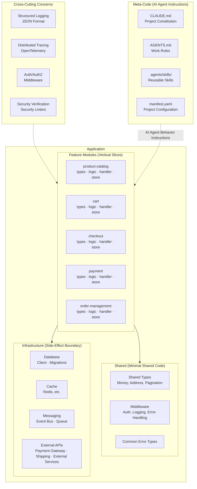
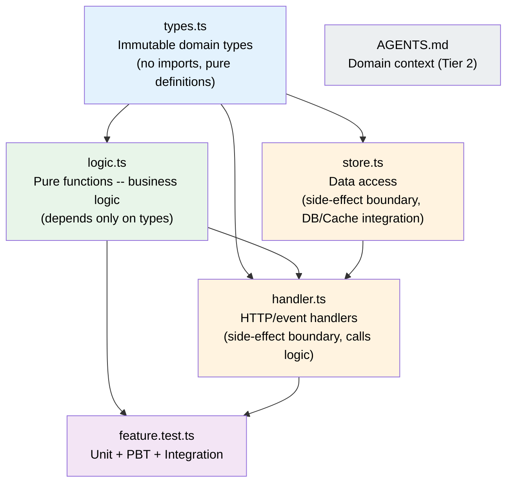
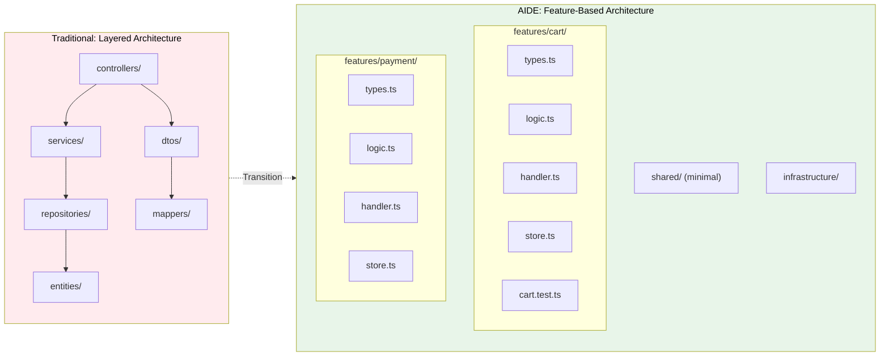

# AIDE (Agent-Informed Development Engineering) -- A Software Development Methodology for the Agentic Era v1.0

**Author**: CTO (20+ years of architecture experience, 3 years of hands-on AI agent experience)
**Based on**: GPT/Claude/Gemini triple deep research + Team Alpha (Integrationists) 2 reports + Team Beta (Radicals) 1 report
**Date**: 2026-02-18

---

## Part 2: AIDE Architecture Patterns

### Core Architecture Principles

AIDE adopts **Feature-Based Vertical Slice Architecture** as its default.
The traditional horizontal layer separation (Controller/Service/Repository) is replaced with vertical feature-unit separation,
while each Feature internally applies the Functional Core + Imperative Shell pattern.

### AIDE Architecture Overview



### Feature Internal Structure

Each Feature directory is **self-contained** and has a clear dependency direction internally:



**Dependency Rules:**
- `types.ts` depends on nothing (pure type definitions)
- `logic.ts` depends only on `types.ts` (pure functions, no side effects)
- `handler.ts` composes `logic.ts` and `store.ts` (side-effect boundary)
- `store.ts` depends on `types.ts` and accesses infrastructure (side-effect boundary)

### Domain-Specific Project Structure Examples

#### E-Commerce Backend (TypeScript/Node.js)

```
project/
├── CLAUDE.md                          # Project constitution
├── AGENTS.md                          # Work rules
├── manifest.yaml                      # Project configuration
│
├── src/
│   ├── features/
│   │   ├── product-catalog/
│   │   │   ├── types.ts               # Domain types: Product, Category, etc.
│   │   │   ├── logic.ts               # Pure functions: price calculation, stock check, filtering
│   │   │   ├── handler.ts             # GET /products, POST /products
│   │   │   ├── store.ts               # DB access (products table)
│   │   │   ├── product-catalog.test.ts
│   │   │   └── AGENTS.md              # Product domain business rules
│   │   ├── cart/
│   │   │   ├── types.ts
│   │   │   ├── logic.ts               # Cart total calculation, coupon application
│   │   │   ├── handler.ts
│   │   │   ├── store.ts
│   │   │   └── cart.test.ts
│   │   ├── checkout/
│   │   ├── payment/
│   │   ├── order-management/
│   │   ├── user-auth/
│   │   └── shipping/
│   │
│   ├── shared/
│   │   ├── types/                     # Shared domain types (Money, Address, etc.)
│   │   ├── middleware/                # Auth, logging, error handling
│   │   └── errors/                    # Common error types
│   │
│   └── infrastructure/
│       ├── database/                  # DB client, migrations
│       ├── cache/                     # Cache (Redis, etc.)
│       ├── messaging/                 # Event bus, queues
│       └── external-apis/             # Payment gateway, shipping provider integration
│
├── .agents/skills/                    # AI agent skills
├── evals/                             # Evaluation datasets
└── tests/
    ├── integration/
    └── e2e/
```

#### Fintech/Securities Backend (TypeScript/Node.js)

```
project/
├── CLAUDE.md
├── AGENTS.md
├── manifest.yaml
│
├── src/
│   ├── features/
│   │   ├── account/                   # Account management
│   │   ├── trading/                   # Order execution
│   │   │   ├── types.ts               # Order, Position, Quote
│   │   │   ├── logic.ts               # Order validation, fee calculation, margin check
│   │   │   ├── handler.ts             # POST /orders, GET /positions
│   │   │   ├── store.ts
│   │   │   ├── trading.test.ts
│   │   │   └── AGENTS.md              # Trading domain rules (including regulatory requirements)
│   │   ├── portfolio/                 # Portfolio analysis
│   │   ├── market-data/               # Market data
│   │   ├── risk-assessment/           # Risk management
│   │   ├── settlement/                # Settlement/clearing
│   │   └── compliance/                # Regulatory compliance
│   │
│   ├── shared/
│   │   ├── types/                     # Money, SecurityId, etc.
│   │   └── middleware/
│   │
│   └── infrastructure/
│       ├── database/
│       ├── market-feed/               # Real-time market data integration
│       └── regulatory-api/            # Financial regulatory API
│
├── .agents/skills/
├── evals/
└── tests/
    ├── integration/
    └── e2e/
```

#### Frontend (Next.js)

```
project/
├── CLAUDE.md
├── AGENTS.md
├── manifest.yaml
│
├── src/
│   ├── features/
│   │   ├── product-listing/
│   │   │   ├── types.ts
│   │   │   ├── hooks.ts               # useProducts, useFilters
│   │   │   ├── components/            # ProductCard, ProductGrid, FilterPanel
│   │   │   ├── api.ts                 # API call functions
│   │   │   ├── product-listing.test.ts
│   │   │   └── AGENTS.md
│   │   ├── cart/
│   │   ├── checkout/
│   │   └── user-profile/
│   │
│   ├── shared/
│   │   ├── components/                # Common UI: Button, Modal, Form, etc.
│   │   ├── hooks/                     # useAuth, useToast, etc.
│   │   └── types/
│   │
│   ├── app/                           # Next.js App Router
│   └── styles/
│
├── .agents/skills/
├── evals/
└── tests/
    └── e2e/
```

### TypeScript Code Pattern Examples

Using the e-commerce "cart" feature as an example, we demonstrate AIDE's intra-Feature code patterns.

```typescript
// features/cart/types.ts -- Immutable domain types
type CartItem = Readonly<{
  product_id: string
  product_name: string
  unit_price_in_krw: number
  quantity: number
  discount_rate_percent: number
}>

type Cart = Readonly<{
  id: string
  user_id: string
  items: ReadonlyArray<CartItem>
  coupon_code?: string
}>

type CartSummary = Readonly<{
  subtotal_in_krw: number
  discount_total_in_krw: number
  shipping_fee_in_krw: number
  total_in_krw: number
}>
```

```typescript
// features/cart/logic.ts -- Pure functions only
const calculate_item_price = (item: CartItem): number =>
  item.unit_price_in_krw * item.quantity * (1 - item.discount_rate_percent / 100)

const calculate_subtotal = (items: ReadonlyArray<CartItem>): number =>
  items.reduce((sum, item) => sum + calculate_item_price(item), 0)

const calculate_shipping_fee = (subtotal: number): number =>
  subtotal >= 50000 ? 0 : 3000  // Free shipping for orders of 50,000 KRW or more

const calculate_cart_summary = (cart: Cart): CartSummary => {
  const subtotal = calculate_subtotal(cart.items)
  const shipping = calculate_shipping_fee(subtotal)
  return {
    subtotal_in_krw: subtotal,
    discount_total_in_krw: 0, // Coupon logic handled separately
    shipping_fee_in_krw: shipping,
    total_in_krw: subtotal + shipping,
  }
}
```

```typescript
// features/cart/handler.ts -- Side-effect boundary
const handle_get_cart_summary = async (
  req: Request,
  deps: { db: Database; logger: Logger }
): Promise<Response<CartSummary>> => {
  const cart = await deps.db.find_cart_by_user(req.userId)
  if (!cart) return error_response(404, 'Cart not found')

  const summary = calculate_cart_summary(cart)
  deps.logger.info({ event: 'cart_summary_calculated', userId: req.userId })

  return ok_response(summary)
}
```

```typescript
// features/cart/store.ts -- Data access (side-effect boundary)
type CartStore = {
  readonly find_cart_by_user: (user_id: string) => Promise<Cart | null>
  readonly save_cart: (cart: Cart) => Promise<void>
  readonly delete_cart: (cart_id: string) => Promise<void>
}

const create_cart_store = (db: Database): CartStore => ({
  find_cart_by_user: async (user_id) => {
    const row = await db.query('SELECT * FROM carts WHERE user_id = $1', [user_id])
    return row ? map_row_to_cart(row) : null
  },
  save_cart: async (cart) => {
    await db.query(
      'INSERT INTO carts (id, user_id, items) VALUES ($1, $2, $3) ON CONFLICT (id) DO UPDATE SET items = $3',
      [cart.id, cart.user_id, JSON.stringify(cart.items)]
    )
  },
  delete_cart: async (cart_id) => {
    await db.query('DELETE FROM carts WHERE id = $1', [cart_id])
  },
})
```

```typescript
// features/cart/cart.test.ts -- Tests
import { describe, it, expect } from 'vitest'
import { fc } from '@fast-check/vitest'
import { calculate_item_price, calculate_cart_summary, calculate_shipping_fee } from './logic'

describe('calculate_item_price', () => {
  it('correctly calculates the price of a non-discounted item', () => {
    const item: CartItem = {
      product_id: 'p1',
      product_name: 'Test Product',
      unit_price_in_krw: 10000,
      quantity: 3,
      discount_rate_percent: 0,
    }
    expect(calculate_item_price(item)).toBe(30000)
  })

  it('correctly applies the discount rate', () => {
    const item: CartItem = {
      product_id: 'p1',
      product_name: 'Discounted Product',
      unit_price_in_krw: 10000,
      quantity: 2,
      discount_rate_percent: 10,
    }
    expect(calculate_item_price(item)).toBe(18000) // 20000 * 0.9
  })
})

describe('calculate_shipping_fee', () => {
  it('free shipping for 50,000 KRW or more', () => {
    expect(calculate_shipping_fee(50000)).toBe(0)
    expect(calculate_shipping_fee(100000)).toBe(0)
  })

  it('3,000 KRW shipping fee for less than 50,000 KRW', () => {
    expect(calculate_shipping_fee(49999)).toBe(3000)
    expect(calculate_shipping_fee(0)).toBe(3000)
  })
})

// Property-Based Test
describe('cart summary properties', () => {
  fc.test.prop([
    fc.array(fc.record({
      product_id: fc.string(),
      product_name: fc.string(),
      unit_price_in_krw: fc.nat({ max: 1000000 }),
      quantity: fc.integer({ min: 1, max: 100 }),
      discount_rate_percent: fc.integer({ min: 0, max: 100 }),
    }))
  ])('total must always be >= 0', (items) => {
    const cart: Cart = { id: 'c1', user_id: 'u1', items }
    const summary = calculate_cart_summary(cart)
    expect(summary.total_in_krw).toBeGreaterThanOrEqual(0)
  })
})
```

### Comparison with Existing Architectures



| Comparison Item | Traditional Layered Architecture | AIDE Feature-Based |
|-----------------|----------------------------------|-------------------|
| **File distribution** | 6-8 files per feature (across different directories) | 4-5 files per feature (same directory) |
| **Files loaded per feature modification** | 4-8 | 1-3 |
| **Indirection depth** | 3-4 levels | 1-2 levels |
| **Cost of adding a new feature** | 6+ files created, multiple directories modified | 1 directory created, 4 files written |
| **AI agent context efficiency** | Low (fragmentation) | High (locality) |
| **Dependency direction** | Vertical (upper -> lower layers) | Vertical (types -> logic -> handler) + Horizontal (Feature isolation) |

#### Detailed Comparisons with Other Architectures

For in-depth comparisons with other major architecture patterns, see the following documents:

- [AIDE vs Clean Architecture](./comparisons/AIDE-vs-Clean-Architecture.md) -- How AIDE preserves Clean Architecture core values while reducing physical layers
- [AIDE vs Hexagonal Architecture](./comparisons/AIDE-vs-Hexagonal-Architecture.md) -- How Ports & Adapters maps to AIDE Feature structure


### manifest.yaml Example

```yaml
spec_version: "1.0"
project_name: "my-ecommerce"
project_type: "backend"

tech_stack:
  language: "typescript"
  runtime: "node"
  framework: "express"  # or fastify, nestjs, etc.
  database: "postgresql"
  cache: "redis"

ai_development:
  primary_model: "claude-opus-4-6"
  instruction_files:
    tier1: ["CLAUDE.md", "AGENTS.md"]
    tier2_pattern: "src/features/*/AGENTS.md"

code_standards:
  max_file_lines: 300
  max_function_lines: 50
  paradigm: "functional-core"
  type_strictness: "strict"

testing:
  unit: "vitest"
  property: "fast-check"
  e2e: "playwright"

observability:
  logging: "structured_json"
  tracing: true

skills:
  - name: "add-api-endpoint"
    path: ".agents/skills/add-api-endpoint"
    version: "1.2.0"
  - name: "db-migration"
    path: ".agents/skills/db-migration"
    version: "2.1.0"

meta_files:
  tier1_max_lines: 300
  tier2_max_lines: 200
  enforce_eval_on_change: true
```

---


← Previous: [01-CORE-PRINCIPLES](./01-CORE-PRINCIPLES.md) | Next: [03-EXISTING-METHODOLOGIES](./03-EXISTING-METHODOLOGIES.md) →
