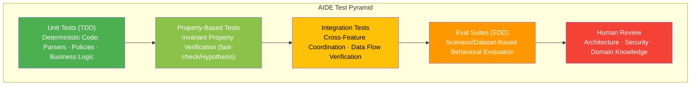

# AIDE (Agent-Informed Development Engineering) -- A Software Development Methodology for the Agentic Era v1.0

**Author**: CTO (20+ years of architecture experience, 3 years of hands-on AI agent experience)
**Based on**: GPT/Claude/Gemini triple deep research + Team Alpha (Integrationists) 2 reports + Team Beta (Radicals) 1 report
**Date**: 2026-02-18

---

## Part 4: AIDE Practical Guide

### File/Code Size Guidelines

| Category | Recommended | Upper Limit | Token Estimate | Notes |
|----------|-------------|-------------|----------------|-------|
| Feature logic (logic.ts) | 150-200 lines | 300 lines | ~5,400 | Core business logic |
| Handler (handler.ts) | 100-150 lines | 200 lines | ~3,600 | Each handler function within 30 lines |
| Type definitions (types.ts) | 50-100 lines | 150 lines | ~2,700 | Types are dense, so short is sufficient |
| Tests (*.test.ts) | 200-300 lines | 500 lines | ~9,000 | Repetitive structure, slightly longer is acceptable |
| Meta files (CLAUDE.md) | 100-200 lines | 300 lines | ~5,400 | Upper limit to maintain instruction compliance rate |
| Domain context (AGENTS.md, Tier 2) | 50-100 lines | 200 lines | ~3,600 | Compress to core business rules only |
| Function size | 20-30 lines | 50 lines | ~900 | Fully comprehensible within a single reasoning turn |

**"18 tokens/line" rule of thumb**: On average, 1 line of code = ~18 tokens (based on Cursor IDE research)

### Naming Convention Guide

Apply the **Semantic Verbosity** principle from the Gemini report, while maintaining practical balance.

#### Core Rule: Language-Native Convention First

AIDE does not prescribe a universal case style. **Always follow the target language's established naming convention** (e.g., PEP 8 for Python, ESLint camelcase for TypeScript, Kotlin Coding Conventions for Kotlin). Fighting the language ecosystem creates friction with linters, frameworks, and libraries — and confuses both human developers and AI agents whose training data reflects idiomatic code.

**What AIDE does prescribe** is the *semantic content* of names, regardless of case style:

| Rule | Description | Example (TS) | Example (Python) | Counter-Example |
|------|-------------|--------------|-------------------|-----------------|
| Verb-object for functions | Name describes action and target | `calculateOrderTotalInKrw()` | `calculate_order_total_in_krw()` | `calc(d)` |
| Meaningful variables | Name conveys purpose | `activeUserIdList` | `active_user_id_list` | `ids` |
| Explicit side effects | Prefix indicates side effect | `persistUserToDatabase()` | `persist_user_to_database()` | `save()` |
| Nouns for types | Type names are descriptive nouns | `OrderItem` | `OrderItem` | `OI` |
| Source in constants | Constant names include origin | `MAX_LOGIN_ATTEMPTS_PER_POLICY` | `MAX_LOGIN_ATTEMPTS_PER_POLICY` | `MAX` |
| File names | Follow language convention | `user-auth.ts` | `user_auth.py` | `ua.ts` |

**Core Principle**: Variable and function names are **inputs to the agent's reasoning**. The more specific a name is, the exponentially lower the probability of the agent misusing it. This principle applies identically across all case styles. However, extreme verbosity like `calculatedTotalPriceWithDiscountAppliedInKrw` conflicts with line length limits, so maintain a practical range.

### CLAUDE.md Writing Guide (Template)

```markdown
# Project: [Project Name]

## Identity
- Type: [Project type, e.g. Next.js 14 Monorepo]
- Language: TypeScript (Strict Mode)
- Paradigm: Functional core, classes only for infrastructure
- State: [State management tool, e.g. Zustand]

## Absolute Rules (MUST FOLLOW)
- Do not use classes for business logic
- Explicitly type all function parameters and return values
- Do not use the any type
- Do not directly import from features/ outside of features/
- Must get approval before adding new npm packages
- [Add project-specific rules]

## Architecture Map
features/: Independent modules per feature (types + logic + handler + store + test)
shared/:   Global types, infrastructure clients, common errors (keep minimal)
evals/:    Evaluation datasets and scenarios
.agents/:  Skill packages

## Code Style
- Naming: Follow language-native convention (e.g., camelCase for TS, snake_case for Python)
- Naming content: verb_object for functions, meaningful nouns for variables, explicit side-effect prefixes
- Type names: PascalCase
- Files: kebab-case (or language convention, e.g., snake_case.py for Python)
- Max file length: 300 lines (warning), 500 lines (prohibited)
- Functions: within 50 lines

## Workflow
1. Define/modify types.ts first
2. Implement pure functions in logic.ts
3. Write tests in *.test.ts
4. Integrate side effects in handler.ts
5. Verify lint + test + type check pass

## Domain Glossary
- [Domain term 1]: [Definition]
- [Domain term 2]: [Definition]

## Examples
- Good pattern: src/features/user-auth/logic.ts
- Anti-pattern: (omit if none)
```

### Integrating AIDE-REFERENCE.md into Your Project

[AIDE-REFERENCE.md](https://github.com/Dokkabei97/aide-methodology/blob/master/AIDE-REFERENCE.md) is a standalone quick reference (~240 lines) that summarizes the 10 core principles, feature architecture, code style, and workflow in a single file. Use it to ensure AI agents follow AIDE consistently.

#### Option A: Dedicated Reference File (Recommended)

Copy `AIDE-REFERENCE.md` to your project root and reference it from `CLAUDE.md`:

```markdown
# CLAUDE.md

## Methodology
This project follows the AIDE methodology. See AIDE-REFERENCE.md for the full reference.

## Project-Specific Rules
- [Your project's additional rules here]
```

**Why this works**: AI agents (Claude, Cursor, etc.) automatically load files referenced in CLAUDE.md. Keeping AIDE rules in a separate file preserves your CLAUDE.md budget for project-specific context. AIDE-REFERENCE.md (~240 lines) fits within the Tier 1 limit (300 lines) on its own.

#### Option B: Inline in CLAUDE.md

For smaller projects, copy the relevant sections directly into CLAUDE.md:

```markdown
# CLAUDE.md

## Methodology: AIDE

### Core Principles
[Paste selected principles from AIDE-REFERENCE.md]

### Code Style
[Paste code style section from AIDE-REFERENCE.md]

## Project-Specific Rules
- [Your rules here]
```

**Trade-off**: Simpler setup, but consumes CLAUDE.md line budget. Best when you only need a subset of AIDE principles.

#### Option C: Feature-Level AGENTS.md

For large projects, reference AIDE at the root level and add feature-specific context in each feature's `AGENTS.md`:

```
project-root/
  CLAUDE.md            → "Follow AIDE. See AIDE-REFERENCE.md."
  AIDE-REFERENCE.md    → Full AIDE quick reference
  src/features/
    user-auth/
      AGENTS.md        → Domain-specific rules for this feature
    payment/
      AGENTS.md        → Domain-specific rules for this feature
```

This leverages AIDE's **Progressive Disclosure (P6)**: Tier 1 (root CLAUDE.md + AIDE-REFERENCE.md) is always loaded, while Tier 2 (feature AGENTS.md) is loaded only when the agent works in that directory.

#### Context Budget Considerations

| Setup | CLAUDE.md | AIDE-REFERENCE.md | Total Tier 1 |
|-------|-----------|-------------------|--------------|
| Option A | ~60 lines (project rules) | ~240 lines | ~300 lines |
| Option B | ~200-300 lines (merged) | N/A | ~200-300 lines |
| Option C | ~60 lines (project rules) | ~240 lines | ~300 lines + Tier 2 per feature |

### AGENTS.md Writing Guide (Feature Tier 2 Template)

```markdown
# [Feature Name] Domain Context

## Business Rules
- [Rule 1: Specific and clear]
- [Rule 2: Understandable by agents without needing inference]
- [Rule 3: Include exception cases]

## Data Flow
[Main flow]: Request -> validate -> [pure logic] -> [side effects] -> Response

## Known Edge Cases
- [Edge case 1]: [Handling method]
- [Edge case 2]: [Handling method]

## Dependencies
- shared/ modules this Feature depends on: [list]
- Other Features that reference this Feature: [list]
```

### Skills Management Guide

```
.agents/skills/
  {skill-name}/
    SKILL.md          # YAML frontmatter (name, description, tags) + execution guide
    scripts/           # Automation scripts (optional)
    examples/          # Example inputs/outputs (optional)
    tests/             # Eval scenarios for skill verification
```

**SKILL.md Example:**

```markdown
---
name: add-api-endpoint
description: "Add a new REST API endpoint to the features/ directory"
tags: [api, feature, crud]
version: "1.2.0"
---

## Steps
1. Check features/{feature-name}/ directory (create if it doesn't exist)
2. Define Request/Response types in types.ts
3. Implement business logic pure functions in logic.ts
4. Add HTTP handler in handler.ts
5. Add tests in {feature-name}.test.ts
6. Document business rules in Tier 2 AGENTS.md
7. Run lint + test + type check

## Guardrails
- Do not modify shared/ (define new types inside the feature if needed)
- Do not change signatures of existing handlers
- Do not commit code without tests
```

**Skill Loading Protocol:**
1. **Discovery**: Read only the YAML frontmatter of SKILL.md (~50 tokens)
2. **Selection**: Select the skill relevant to the task
3. **Loading**: Inject the full content of the selected skill into context
4. **Execution**: Perform work according to the skill guide
5. **Unloading**: Release from context after task completion

### Test Strategy Guide



**Role of Each Layer:**

| Layer | Frequency | Execution Timing | Blocking Authority |
|-------|-----------|-------------------|-------------------|
| Unit Tests | Every commit | Pre-commit + CI | Merge blocking |
| Property-Based | Every commit | CI | Merge blocking |
| Integration | Every PR | CI | Merge blocking |
| Eval Suites | Every PR + on meta file changes | CI | Warning (blocking if below threshold) |
| Human Review | Every PR | PR review | Merge blocking |
| Security Tests | Daily + on meta file/policy changes | CI + scheduled execution | Merge blocking |

---


← Previous: [03-EXISTING-METHODOLOGIES](./03-EXISTING-METHODOLOGIES.md) | Next: [05-CICD-PIPELINE](./05-CICD-PIPELINE.md) →
