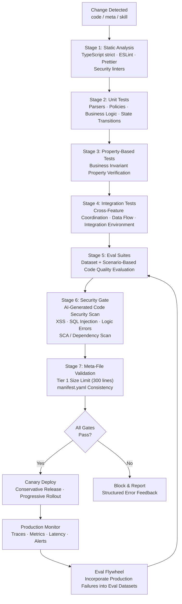

# AIDE (Agent-Informed Development Engineering) -- A Software Development Methodology for the Agentic Era v1.0

**Author**: CTO (20+ years of architecture experience, 3 years of hands-on AI agent experience)
**Based on**: GPT/Claude/Gemini triple deep research + Team Alpha (Integrationists) 2 reports + Team Beta (Radicals) 1 report
**Date**: 2026-02-18

---

## Part 5: CI/CD Pipeline

### AIDE CI/CD Diagram



### Eval Flywheel Concept

The Eval Flywheel is a continuous improvement loop that **automatically incorporates failures discovered in production into eval datasets to prevent regressions**:

1. **Production Monitoring**: Detect errors/anomalous behavior from logs/metrics
2. **Failure Case Collection**: Structure the relevant input/context/expected results
3. **Eval Dataset Incorporation**: Add new test cases to `evals/datasets/`
4. **Automatic CI Execution**: The case is included in gates from the next deployment
5. **Progressive Quality Improvement**: Eval datasets become richer over time, strengthening regression prevention

```yaml
# evals/datasets/production-failures.yaml
- id: "PF-2026-0218-001"
  source: "production_log_abc123"
  discovered_at: "2026-02-18T10:30:00Z"
  scenario:
    feature: "cart"
    action: "Discount rate application error in cart total calculation"
    input:
      items:
        - unit_price: 10000
          quantity: 2
          discount_rate: 15
  expected_behavior:
    - "Amount after discount: 17,000 KRW"
    - "Total must not be negative"
  actual_behavior: "Amount error due to processing discount rate as decimal instead of percentage"
  severity: "high"
  fix_applied: "Fixed calculate_item_price function in logic.ts"
```

### Security Gate

The Security Gate runs at **Stage 6** of CI/CD and includes the following:

1. **AI-generated code security scan**: Detect XSS, SQL Injection, and logic error patterns (ESLint security plugins, Semgrep, etc.)
2. **Auth/AuthZ verification**: Confirm that appropriate authentication middleware is applied to all API endpoints
3. **SCA (Software Composition Analysis)**: Scan npm packages and external dependencies for vulnerabilities
4. **Sensitive data exposure check**: Verify that sensitive information (passwords, tokens, personal data) is not included in logs or responses

---


← Previous: [04-PRACTICAL-GUIDE](./04-PRACTICAL-GUIDE.md) | Next: [06-ADOPTION-GUIDE](./06-ADOPTION-GUIDE.md) →
