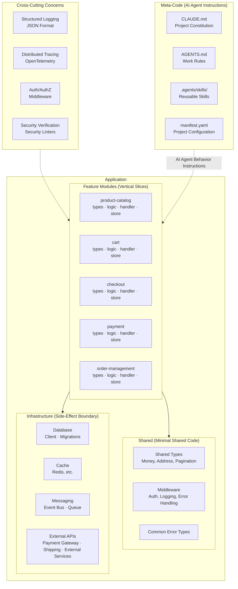
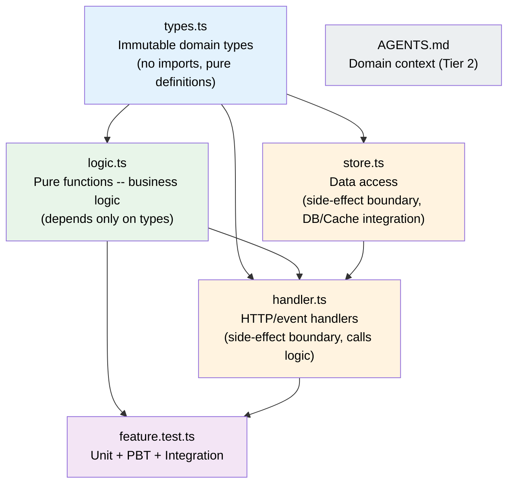
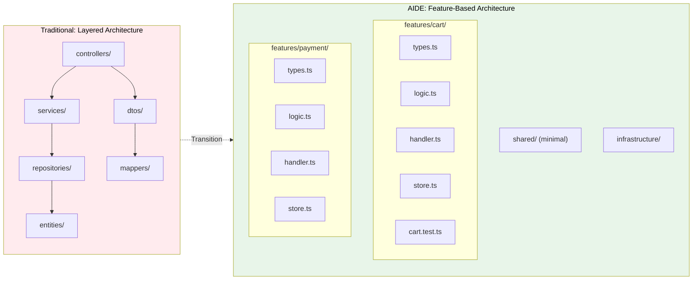
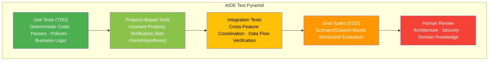
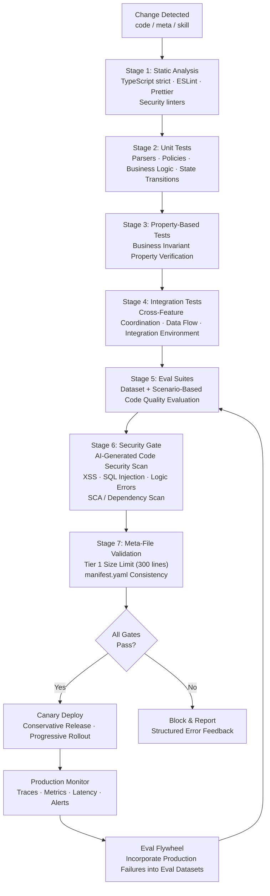

# AIDE (Agent-Informed Development Engineering) -- A Software Development Methodology for the Agentic Era v1.0

**Author**: CTO (20+ years of architecture experience, 3 years of hands-on AI agent experience)
**Based on**: GPT/Claude/Gemini triple deep research + Team Alpha (Integrationists) 2 reports + Team Beta (Radicals) 1 report
**Date**: 2026-02-18

---

## Preface: Why AIDE Is Needed

### The Limitations of Existing Methodologies and the New Constraints of the AI Agent Era

The last 50 years of software engineering have been a struggle to manage **human cognitive limitations**. The constraints of working memory, exemplified by Miller's "7 +/- 2" law, gave rise to modularization, abstraction, separation of concerns, and the DRY principle. DDD, Clean Architecture, SOLID, TDD -- everything we call "good software engineering" has been a defense mechanism against these biological constraints.

In 2025-2026, as AI agents have emerged as the primary producers of code, the constraints have fundamentally changed:

| Constraint Dimension | Human Developer | AI Agent |
|----------------------|-----------------|----------|
| Memory Capacity | Extremely small working memory (7+/-2 chunks) | Large context window (hundreds of thousands to millions of tokens), but **Lost in the Middle** phenomenon causes information loss in the middle |
| Repetitive Tasks | Fatigue, prone to errors | No fatigue, high-speed parallel processing |
| Reasoning Style | Deep logic, causal reasoning, gestalt perception | Probabilistic pattern matching, **performance degradation in multi-hop reasoning** |
| Vulnerabilities | Complexity, boredom | Hallucination, attention diffusion in long contexts, failure to infer implicit context |
| Cost Model | Labor cost (monthly basis) | Token cost (per-call basis), proportional to context size |

Existing methodologies do not address these new constraints:
- **Context window cost**: Clean Architecture code spread across 8 files causes context fragmentation for agents
- **Non-deterministic execution**: The same input can produce different outputs, shaking the premises of traditional TDD
- **New artifacts**: AGENTS.md, CLAUDE.md, and Skills files govern system behavior, but existing methodologies have no management framework for them
- **New threats**: Security flaws in AI-generated code (XSS, SQL Injection, logic errors) can infiltrate the codebase at rapid speed

### AIDE's Positioning: "Evolution," Not "Replacement"

To write this document, we reviewed reports from two teams: Team Alpha (Integrationists) and Team Beta (Radicals). The core disagreement between the two teams was as follows:

- **Team Alpha**: "Existing methodologies represent decades of proven engineering wisdom. We just need to reinterpret and extend them for the new participant: AI agents."
- **Team Beta**: "Existing methodologies were built for human cognitive limitations. They actually hinder AI agents. We need a new foundation."

**CTO's Final Judgment: AIDE is an "evolution."** The detailed rationale is covered in Part 7, but the core logic is this:

1. **The fundamental problems have not disappeared.** Complexity management, changeability, quality assurance -- these challenges remain valid in the AI agent era. In fact, as AI generates code faster, the rate of technical debt accumulation has also accelerated (24% increase in incidents per PR, 30% increase in change failure rate).
2. **However, the constraints have fundamentally changed.** Context windows, probabilistic generation, hallucination, and security vulnerabilities cannot be addressed with "minor adjustments." The data from Factory.ai showing that excessive abstraction and indirection increase agent hallucination probability cannot be ignored.
3. **Therefore, AIDE preserves the core values of existing principles while realigning implementation approaches and priorities to match the cognitive characteristics of AI agents.** This is not a "compromise" but a rational adaptation to changed constraints.

Tweag's controlled experiment supports this: an AI-assisted team using a spec-first approach (core of existing methodologies) with strong review discipline achieved **45% faster development speed**. Teams that applied existing principles well achieved better results with AI. At the same time, the fact that Karpathy abandoned "Vibe Coding" after just one year and pivoted to "Agentic Engineering" demonstrates that undisciplined AI usage quickly hits its limits.

---

## Part 1: AIDE Core Principles (10)

### Principle 1: Context Budget Principle -- The Context Budget Is a First-Class Design Constraint

> **"Just as memory determined programming languages, the context window determines architecture."**

#### Background and Rationale

This is the only Tier-1 principle on which all three research reports reached **complete consensus**:
- GPT report: "Context budget as a design input" (Core Principle #2, P0 requirement)
- Claude report: "The context window is the new CPU"
- Gemini report: "Context engineering is the new scarce resource"

Even with a 1-million-token context window, performance does not scale linearly. In Chroma's study measuring 18 LLMs, performance became unstable as input length increased, and the **Lost in the Middle** phenomenon caused information loss at middle positions. Tool definitions alone consume tens of thousands of tokens, degrading both reasoning quality and cost.

#### Specific Guidelines

| Item | Recommended | Upper Limit | Rationale |
|------|-------------|-------------|-----------|
| File size | 200-300 lines | 500 lines | 300 lines = ~5,400 tokens, safe even combined with system prompt + conversation history |
| Function size | 30 lines (parsers/policies/wrappers) | 50 lines | Fully comprehensible within a single reasoning turn |
| Line length | 100 characters | 120 characters | Diff review convenience |
| Meta files (CLAUDE.md) | 200 lines | 300 lines | Instruction compliance rate decreases linearly as instruction count increases |
| Files loaded per feature modification | 1-2 | 3 | Minimize indirection cost |

#### Team Alpha/Beta Discussion

Both teams reached **complete consensus** on this principle. The only difference was in implementation intensity:
- **Team Alpha**: "This is an extension of existing SRP and cohesion concepts. The quantitative basis of token cost has simply been added."
- **Team Beta**: "This should be the starting point for all architectural decisions. Maximum 3 files loaded per feature modification, maximum 1 level of indirection."

**CTO Judgment**: Team Beta's specific metrics (file load count, indirection depth) are adopted as **recommended guidelines**, but not enforced as **upper limits**. This is because infrastructure-layer DIP implementations may require up to 2 levels of indirection in some cases.

---

### Principle 2: Locality of Behavior -- Locality of Behavior Takes Priority Over Abstraction

> **"All code related to a single feature should be physically co-located."**

#### Background and Rationale

The traditional layered structure where an agent must navigate 8 files (Controller, Service, Repository, Entity, DTO, Mapper, Interface, Validator) to modify a single feature causes context fragmentation. Factory.ai's research shows that AI agents experience **dramatic performance degradation in multi-hop reasoning** (reasoning that follows references across multiple files).

This principle does not abolish "Separation of Concerns." It **changes the axis of separation**:
- Traditional: Separation by technical role (presentation / business / data)
- AIDE: Separation by feature/domain (user-auth / payment / order)

#### Specific Guidelines

```
// AIDE Pattern: Feature-Based Structure
features/
  user-auth/
    types.ts          -- Feature-specific type/schema definitions
    logic.ts          -- Pure function business logic
    handler.ts        -- HTTP/event handlers (side-effect boundary)
    store.ts          -- Data store access (side-effect boundary)
    user-auth.test.ts -- All tests for this feature
    AGENTS.md         -- Domain context for agents (Tier 2)
```

- Each Feature directory is **self-contained**: an agent can understand the entire feature by reading only that folder
- Code shared across Features goes in `shared/`, kept to a **minimum**
- Logical layers within a Feature (pure logic / side-effect boundaries) are separated at the file level

#### Team Alpha/Beta Discussion

- **Team Alpha**: "Feature-based structure is compatible with Clean Architecture's Vertical Slice Architecture. Keep the dependency rule but reduce the physical layers."
- **Team Beta**: "A fat file is better than beautiful abstraction. The moment you separate interface from implementation, the agent must load two files."

**CTO Judgment**: Feature-based structure is adopted as the **default**. As Team Alpha pointed out, this does not conflict with Clean Architecture and is a natural extension of Vertical Slice Architecture. However, the file separation of types/logic/handler/store within a Feature is maintained -- three 100-line files with distinct roles are clearer for agents than a single 300-line file containing everything. The key is to **minimize indirection crossing Feature boundaries**.

---

### Principle 3: Functional Core, Structural Shell -- Pure Function Core + Structural Shell

> **"Business logic in pure functions, side effects handled at explicit boundaries."**

#### Background and Rationale

All three reports agreed that the functional paradigm provides structural advantages for AI agents:
- **Pure functions** always produce the same output for the same input, enabling agents to reason perfectly from a single function block
- **Immutable data** allows understanding data flow as a chain without tracking state
- **Strong type systems** serve as guardrails that catch agent hallucinations at compile time

```typescript
// [1] Data: Defined as immutable structs
type User = Readonly<{
  id: string
  email: string
  name: string
  role: 'admin' | 'member' | 'viewer'
}>

// [2] Pure logic: Input -> Output, no side effects
const promote_user_to_admin = (user: User): User => ({
  ...user,
  role: 'admin'
})

// [3] Side-effect boundary: Dependency injection, explicit error handling
const handle_promote_user = async (
  userId: string,
  deps: { db: Database; logger: Logger }
): Promise<Result<User, Error>> => {
  const user = await deps.db.findUser(userId)
  if (!user) return err(new UserNotFoundError(userId))

  const promoted = promote_user_to_admin(user)
  await deps.db.saveUser(promoted)
  deps.logger.info({ event: 'user_promoted', userId })

  return ok(promoted)
}
```

#### Specific Guidelines

| Area | Recommended Paradigm | Class Usage |
|------|---------------------|-------------|
| Business logic | Pure functions | Prohibited |
| Domain model | Immutable data structures + types | Replaced with immutable Record/Type |
| Infrastructure/IO layer | Functions first, classes when necessary | Allowed (DB connections, sockets, resource management) |
| Policies/Validation | Functional pipelines | Prohibited |
| Domain boundary definition | DDD Bounded Context (type + function composition) | Not needed |

#### Team Alpha/Beta Discussion

This principle was the point of **most heated debate** between the two teams:

- **Team Alpha**: "Functional Core + OOP Shell + DDD. DDD's Aggregate, Entity, and Value Object are still valid for structuring domain knowledge. Implement them as immutable, but keep the OOP concepts."
- **Team Beta**: "FP-only. Classes hide state and increase agent cognitive load. Do not use classes for business logic."

**CTO Judgment**: The practical difference is smaller than it seems. Both teams agree that "business logic should be pure functions, data should be immutable." The difference lies in whether DDD concepts like Aggregate Root are expressed as classes or as type+function compositions. **AIDE recommends the type+function composition approach**. DDD's domain modeling **concepts** (Bounded Context, Aggregate, Value Object) are preserved, but the **implementation** is shifted to immutable types + pure functions. This satisfies both Alpha's DDD values and Beta's FP values.

Inheritance is limited to a maximum of 1 level, and deep inheritance trees are not allowed under any circumstances. Composition over Inheritance applies even more strongly in the AI era.

---

### Principle 4: Knowledge DRY, Code WET-tolerant -- Knowledge Is DRY, Code Trades Off with Locality

> **"Business rules must live in exactly one place. Duplication of utility code is tolerated for the sake of locality."**

#### Background and Rationale

The reinterpretation of the DRY principle showed the widest spectrum of opinions across the three reports:
- GPT: Manage duplication through structural solutions (cataloging)
- Claude: "DRY is not dead but transformed" -- Apply AHA (Avoid Hasty Abstractions) principle
- Gemini: Actively embrace WET/DAMP, "5 lines of logic repeated in 10 places is OK"

The self-contradiction discovered by the Claude report is the key insight: "Allow duplication -> AI generates more code -> Context window exceeded -> DRY is needed after all." Unlimited duplication tolerance is self-defeating.

#### Specific Guidelines

| Level | Strategy | Example | Duplication Tolerance |
|-------|----------|---------|-----------------------|
| **Business rules** | Strict DRY | "Discount rate calculation formula," "pricing policy" | 0 (must have a single source of truth) |
| **Domain types** | Allow re-declaration at Feature boundaries | Feature-local subset of shared User type | Reference via interface or partial re-declaration |
| **Utility code** | AHA principle | Email validation, date formatting | 2-3 duplications allowed; review extraction at 4+ |
| **Boilerplate** | Structured duplication allowed | try-catch patterns, logging patterns | Unlimited (serves as pattern anchors) |

**Duplication Management Framework**:
- Conscious Duplication: When duplicating, **state the reason in a comment**
- Drift Detection: Automate agent-based duplicate code drift detection in CI
- Periodic Review: Verify consistency of duplicate code on a quarterly basis

#### Team Alpha/Beta Discussion

- **Team Alpha**: "Knowledge DRY + Code AHA. Duplication is consciously allowed, but visible management is a prerequisite. Gemini's '5-line duplication in 10 places is OK' is extreme."
- **Team Beta**: "Aggressively WET/DAMP. Self-containment of each file is the top priority. Sharing through abstraction carries indirection costs that should be minimized."

**CTO Judgment**: Team Alpha's "Knowledge DRY + Code AHA" is adopted. Key arguments:
1. Beta effectively acknowledges that unlimited code duplication eventually exceeds the context window, creating a self-contradiction
2. However, as Alpha also acknowledges, excessive abstraction (extracting every 3-line utility into a shared module) creates harmful indirection for agents
3. Therefore, "Business knowledge is DRY, utility code allows conscious duplication under AHA guidelines" is the balance point

---

### Principle 5: Test as Specification -- Tests Are a Specification Language

> **"Tests are not verification tools but specification documents that communicate intent to agents. Apply the triple framework of TDG + PBT + EDD."**

#### Background and Rationale

Key insight from the Claude report: "TDD becomes more important in the AI era. Tests become prompt engineering." Academic validation by Matthews & Nagappan confirmed that presenting problems alongside tests improves code generation quality for both GPT-4 and Llama 3.

The revolutionary effect of Property-Based Testing (PBT) (Claude report):
- 23.1-37.3% relative improvement over TDD
- On Hard tasks: direct code generation 1.1% accuracy vs. property-based verification 48.9% accuracy
- LLMs are **far better at defining correctness properties than generating correct code**

#### Specific Guidelines

**Triple Test Framework:**

```
                     +------------------+
                     |   Human Review   |  Architecture, security, domain knowledge
                     +------------------+
                    +--------------------+
                    |  Eval Suites (EDD) |  Scenario/dataset-based behavioral evaluation
                    +--------------------+
                  +------------------------+
                  | Integration Tests      |  Integration verification of AI-generated code
                  +------------------------+
                +----------------------------+
                | Property-Based Tests (PBT) |  Invariant property verification
                +----------------------------+
              +--------------------------------+
              | Unit Tests (TDD)               |  Deterministic code: parsers, policies, tool wrappers
              +--------------------------------+
```

| Test Type | Target | Tools | Author |
|-----------|--------|-------|--------|
| **Unit (TDD)** | Deterministic code -- parsers, policies, state transitions, tool wrappers | Jest/Vitest/pytest | Human spec -> AI implementation |
| **PBT** | Business invariant properties -- "total is always >= 0," "order preserved after sort" | fast-check/Hypothesis | Humans define properties, AI generates |
| **Integration** | Integration scenarios of AI-generated code -- cross-Feature coordination, data flow verification | Custom test framework | AI-generated, human-reviewed |
| **Eval (EDD)** | Model output quality -- accuracy, safety, usefulness | Custom eval framework | Human-designed + production failure incorporation |
| **Security** | Security vulnerabilities in AI-generated code (XSS, SQL Injection, logic errors) | OWASP-based scenarios + Security linters | Security team designs, automated execution |

**Confirmation Bias Prevention Is Mandatory**: When AI writes both tests and implementation, there is a risk of creating "tests that verify bugs." Use **different models for test writing and code writing**, or have **humans review the test specifications**.

#### Team Alpha/Beta Discussion

- **Team Alpha**: "TDG (Test-Driven Generation) + PBT + EDD extension. Don't discard TDD; extend it for the AI era."
- **Team Beta**: "Dual framework -- Traditional TDD for deterministic code, EDD for probabilistic behavior. Actively adopt PBT."

**CTO Judgment**: These are **practically identical proposals**. The test strategies from both teams are merged into the triple framework above. The only difference was in naming.

---

### Principle 6: Progressive Disclosure -- Progressive Disclosure of Information

> **"Do not give agents all information at once. Provide only what is needed, when it is needed."**

#### Background and Rationale

GPT report's progressive skill loading, Claude report's 3-Tier Progressive Disclosure, and Gemini report's dynamic information loading all express the same principle: **Like virtual memory in an operating system, do not load everything into physical memory; load it when needed.**

#### Specific Guidelines

**Meta File 3-Tier System:**

| Tier | File | Role | Size Limit | Loading Method |
|------|------|------|------------|----------------|
| **Tier 1: Constitution** | `CLAUDE.md` / `AGENTS.md` (root) | Project identity, absolute rules, architecture map | 300 lines max | Always loaded |
| **Tier 2: Local Laws** | `AGENTS.md` in subdirectories | Component-specific patterns, domain context | 200 lines max | Lazy loaded when working in that directory |
| **Tier 3: Technical Manuals** | `.agents/skills/*/SKILL.md` | Procedural knowledge, workflow guides | YAML frontmatter + body | On-demand loading |

**Progressive Provision of Dependency/Library Information:**

When conveying information about external libraries and internal shared modules used in the project to agents, a progressive approach is also needed:

| Level | Information Provided | Purpose |
|-------|---------------------|---------|
| **Summary** | Library name + version + one-line purpose description | Agent grasps the overall technology stack |
| **API Signatures** | Only signatures of functions/types in use | Agent writes code that integrates with the library |
| **Detailed Documentation** | Example code, configuration methods, caveats | Agent builds new integrations or troubleshoots |

The key is to "never load the full documentation of every library into the context." Providing only the needed depth of information at the needed time allows efficient use of the context budget.

#### Team Alpha/Beta Discussion

**Both teams reached complete consensus.** Implementation details were also nearly identical. The 3-Tier meta file system and the progressive information provision principle were combined to establish the system above.

---

### Principle 7: Deterministic Guardrails -- Deterministic Guardrails for Probabilistic Generation

> **"Trust the AI agent, but verify. And verification must be deterministic."**

#### Background and Rationale

Security status of AI-generated code (Claude report, Veracode 2025):
- **Approximately 45% of generated code contains security flaws**
- Logic error rate **1.75x** that of humans
- XSS vulnerabilities **2.74x**
- **Independent of model size** -- smarter models do not produce safer code

This data clearly demonstrates that "prompting agents to 'do well'" is insufficient. Deterministic tools must verify agent output.

#### Specific Guidelines

```
Probabilistic Generation (AI)  -->  Deterministic Verification  -->  Pass/Fail
                                      |
                                      +-- TypeScript strict mode (type verification)
                                      +-- ESLint/Prettier (style enforcement)
                                      +-- Zod/io-ts (runtime type verification)
                                      +-- Pre-commit hooks (automatic execution)
                                      +-- Security linters (security verification)
                                      +-- CI test suite (regression prevention)
```

**Absolute Rule**: "Never send an LLM to do a linter's job" (Claude report). Style enforcement, type verification, and security pattern detection are all delegated to deterministic tools.

**Self-Healing Loop** (Gemini report's Reflexion Pattern):
```
Generate -> Compile/Lint -> Test -> Analyze Errors -> Regenerate -> ...
```

For this loop to work effectively, error messages must be provided in a **machine-readable structured format (JSON)**.

#### Team Alpha/Beta Discussion

**Both teams reached complete consensus.** Team Beta emphasized this principle most strongly, presenting the intuitive expression "trust me but verify," and Team Alpha agreed.

---

### Principle 8: Observability as Structure -- Observability Is Part of the Structure

> **"AI-generated code must include structured logging and tracing by default. Observability is a first-class citizen."**

#### Background and Rationale

All three reports reached **complete consensus**: If you cannot trace "why this behaves this way" for code that AI generates rapidly, operations and debugging become impossible. AI agents must structurally embed observability when generating code.

- GPT report: Include Observability as a cross-cutting concern in architecture
- Claude report: Tracing ON by default, traces mandatory from development stage
- Gemini report: Adopt semantic logging (JSON-LD) standard

#### Specific Guidelines

```typescript
// Structured log format -- Must be included in all code generated by AI
type StructuredLog = {
  level: 'info' | 'warning' | 'error' | 'critical'
  timestamp: string       // ISO 8601
  service: string         // Service/Feature identifier
  event: string           // Business event name
  trace_id: string        // Distributed tracing ID
  span_id: string         // Current work unit ID
  data: Record<string, unknown>  // Structured supplementary data
}

// Usage example: E-commerce payment processing
const handle_payment = async (
  order_id: string,
  deps: { db: Database; pg: PaymentGateway; logger: Logger }
): Promise<Result<PaymentResult, Error>> => {
  deps.logger.info({
    event: 'payment_initiated',
    data: { order_id }
  })

  const result = await deps.pg.charge(order_id)

  if (result.success) {
    deps.logger.info({
      event: 'payment_completed',
      data: { order_id, transaction_id: result.transaction_id }
    })
  } else {
    deps.logger.error({
      event: 'payment_failed',
      data: { order_id, reason: result.error }
    })
  }

  return result
}
```

**Key Guidelines:**
- **Distributed tracing by default**: Track request flow with `trace_id` -> `span_id`. Leverage standards such as OpenTelemetry
- **ON by default from the development stage**: Activate structured logging not only in production but also in local development
- **Cost/performance metrics**: Track API response time, DB query count, and external API call count in real time
- **Mandate observability in AI-generated code**: When requesting code from agents, specify in CLAUDE.md: "Include structured logging in all handlers"

#### Team Alpha/Beta Discussion

**Both teams reached complete consensus.** There was no disagreement that observability is fundamental to software operations and becomes even more critical in AI-generated code.

---

### Principle 9: Security by Structure -- Structural Security Verification

> **"45% of AI-generated code has security flaws. Security verification must be structurally embedded."**

#### Background and Rationale

As AI has become the primary producer of code, the nature of security threats has changed. Security vulnerabilities in AI-generated code itself are the core threat:

- Veracode 2025: Approximately 45% of AI-generated code contains security flaws
- XSS vulnerabilities 2.74x humans, logic errors 1.75x
- Model size does not correlate with security quality

#### Specific Guidelines

**Threat-Control Mapping:**

| Threat | Representative Scenario | Defense Point | Recommended Control |
|--------|------------------------|---------------|---------------------|
| SQL Injection | AI generates string concatenation instead of parameterized queries | Security linter + Code review | Linter rules to detect raw query usage, enforce ORM/Query Builder |
| XSS | AI omits user input escaping | Security linter + Template engine | Enforce auto-escaping frameworks, DOMPurify, etc. |
| Logic errors | Missing authorization checks, unhandled boundary conditions | PBT + Integration test | Verify invariant properties with Property-Based Testing |
| Auth/AuthZ flaws | AI omits authentication middleware | Architecture enforcement | Apply authentication middleware by default at router level, allow explicit opt-out only |
| Dependency vulnerabilities | AI adds packages with vulnerable versions | SCA (Software Composition Analysis) | Automated scanning with npm audit, Snyk, etc. |

**Three Security Principles:**
1. **Automated security verification**: Automatically run security linters in CI for all AI-generated code
2. **Mandatory security review**: Code changes involving authentication, payments, and personal data must undergo security review
3. **Audit trail**: All sensitive data access and state changes are recorded in structured logs

#### Team Alpha/Beta Discussion

**Both teams reached complete consensus.** Security is an area with no room for compromise.

---

### Principle 10: Meta-Code as First-Class -- Meta-Code as a First-Class Citizen

> **"AGENTS.md, CLAUDE.md, and Skills files are version-controlled and tested with the same rigor as source code."**

#### Background and Rationale

- AGENTS.md is used in **60,000+ open-source projects** (managed by the Agentic AI Foundation under the Linux Foundation)
- Research shows that practices failing to preserve prompts/context weaken reproducibility
- A single-line change in a meta file can alter the agent's entire behavior, meaning it can have **higher impact than code**

#### Specific Guidelines

**Meta-Code Management Principles:**
1. **Version control**: Same workflow as code in Git -- PR, code review, changelogs, release tags
2. **Run evals on change**: Meta file changes automatically trigger eval suite execution in CI (behavioral regression detection)
3. **Size monitoring**: CI warns/blocks when Tier 1 files exceed 300 lines
4. **Use negative instructions**: "Do not do X" is often clearer and easier to detect violations
5. **Example-based instructions**: Concrete code examples dramatically improve agent output quality over abstract principles

**Lock Down Full Configuration with manifest.yaml:**

```yaml
# manifest.yaml
spec_version: "1.0"
project_name: "my-ecommerce"
project_type: "backend"

tech_stack:
  language: "typescript"
  runtime: "node"
  framework: "express"
  database: "postgresql"
  cache: "redis"

ai_development:
  primary_model: "claude-opus-4-6"
  instruction_files:
    tier1: ["CLAUDE.md", "AGENTS.md"]
    tier2_pattern: "src/features/*/AGENTS.md"

code_standards:
  max_file_lines: 300
  max_function_lines: 50
  paradigm: "functional-core"
  type_strictness: "strict"

testing:
  unit: "vitest"
  property: "fast-check"
  e2e: "playwright"

observability:
  logging: "structured_json"
  tracing: true
```

#### Team Alpha/Beta Discussion

**Both teams reached complete consensus.** Both teams accepted Gemini's "Meta-Control Plane" concept.

---

## Part 2: AIDE Architecture Patterns

### Core Architecture Principles

AIDE adopts **Feature-Based Vertical Slice Architecture** as its default.
The traditional horizontal layer separation (Controller/Service/Repository) is replaced with vertical feature-unit separation,
while each Feature internally applies the Functional Core + Imperative Shell pattern.

### AIDE Architecture Overview



### Feature Internal Structure

Each Feature directory is **self-contained** and has a clear dependency direction internally:



**Dependency Rules:**
- `types.ts` depends on nothing (pure type definitions)
- `logic.ts` depends only on `types.ts` (pure functions, no side effects)
- `handler.ts` composes `logic.ts` and `store.ts` (side-effect boundary)
- `store.ts` depends on `types.ts` and accesses infrastructure (side-effect boundary)

### Domain-Specific Project Structure Examples

#### E-Commerce Backend (TypeScript/Node.js)

```
project/
├── CLAUDE.md                          # Project constitution
├── AGENTS.md                          # Work rules
├── manifest.yaml                      # Project configuration
│
├── src/
│   ├── features/
│   │   ├── product-catalog/
│   │   │   ├── types.ts               # Domain types: Product, Category, etc.
│   │   │   ├── logic.ts               # Pure functions: price calculation, stock check, filtering
│   │   │   ├── handler.ts             # GET /products, POST /products
│   │   │   ├── store.ts               # DB access (products table)
│   │   │   ├── product-catalog.test.ts
│   │   │   └── AGENTS.md              # Product domain business rules
│   │   ├── cart/
│   │   │   ├── types.ts
│   │   │   ├── logic.ts               # Cart total calculation, coupon application
│   │   │   ├── handler.ts
│   │   │   ├── store.ts
│   │   │   └── cart.test.ts
│   │   ├── checkout/
│   │   ├── payment/
│   │   ├── order-management/
│   │   ├── user-auth/
│   │   └── shipping/
│   │
│   ├── shared/
│   │   ├── types/                     # Shared domain types (Money, Address, etc.)
│   │   ├── middleware/                # Auth, logging, error handling
│   │   └── errors/                    # Common error types
│   │
│   └── infrastructure/
│       ├── database/                  # DB client, migrations
│       ├── cache/                     # Cache (Redis, etc.)
│       ├── messaging/                 # Event bus, queues
│       └── external-apis/             # Payment gateway, shipping provider integration
│
├── .agents/skills/                    # AI agent skills
├── evals/                             # Evaluation datasets
└── tests/
    ├── integration/
    └── e2e/
```

#### Fintech/Securities Backend (TypeScript/Node.js)

```
project/
├── CLAUDE.md
├── AGENTS.md
├── manifest.yaml
│
├── src/
│   ├── features/
│   │   ├── account/                   # Account management
│   │   ├── trading/                   # Order execution
│   │   │   ├── types.ts               # Order, Position, Quote
│   │   │   ├── logic.ts               # Order validation, fee calculation, margin check
│   │   │   ├── handler.ts             # POST /orders, GET /positions
│   │   │   ├── store.ts
│   │   │   ├── trading.test.ts
│   │   │   └── AGENTS.md              # Trading domain rules (including regulatory requirements)
│   │   ├── portfolio/                 # Portfolio analysis
│   │   ├── market-data/               # Market data
│   │   ├── risk-assessment/           # Risk management
│   │   ├── settlement/                # Settlement/clearing
│   │   └── compliance/                # Regulatory compliance
│   │
│   ├── shared/
│   │   ├── types/                     # Money, SecurityId, etc.
│   │   └── middleware/
│   │
│   └── infrastructure/
│       ├── database/
│       ├── market-feed/               # Real-time market data integration
│       └── regulatory-api/            # Financial regulatory API
│
├── .agents/skills/
├── evals/
└── tests/
    ├── integration/
    └── e2e/
```

#### Frontend (Next.js)

```
project/
├── CLAUDE.md
├── AGENTS.md
├── manifest.yaml
│
├── src/
│   ├── features/
│   │   ├── product-listing/
│   │   │   ├── types.ts
│   │   │   ├── hooks.ts               # useProducts, useFilters
│   │   │   ├── components/            # ProductCard, ProductGrid, FilterPanel
│   │   │   ├── api.ts                 # API call functions
│   │   │   ├── product-listing.test.ts
│   │   │   └── AGENTS.md
│   │   ├── cart/
│   │   ├── checkout/
│   │   └── user-profile/
│   │
│   ├── shared/
│   │   ├── components/                # Common UI: Button, Modal, Form, etc.
│   │   ├── hooks/                     # useAuth, useToast, etc.
│   │   └── types/
│   │
│   ├── app/                           # Next.js App Router
│   └── styles/
│
├── .agents/skills/
├── evals/
└── tests/
    └── e2e/
```

### TypeScript Code Pattern Examples

Using the e-commerce "cart" feature as an example, we demonstrate AIDE's intra-Feature code patterns.

```typescript
// features/cart/types.ts -- Immutable domain types
type CartItem = Readonly<{
  product_id: string
  product_name: string
  unit_price_in_krw: number
  quantity: number
  discount_rate_percent: number
}>

type Cart = Readonly<{
  id: string
  user_id: string
  items: ReadonlyArray<CartItem>
  coupon_code?: string
}>

type CartSummary = Readonly<{
  subtotal_in_krw: number
  discount_total_in_krw: number
  shipping_fee_in_krw: number
  total_in_krw: number
}>
```

```typescript
// features/cart/logic.ts -- Pure functions only
const calculate_item_price = (item: CartItem): number =>
  item.unit_price_in_krw * item.quantity * (1 - item.discount_rate_percent / 100)

const calculate_subtotal = (items: ReadonlyArray<CartItem>): number =>
  items.reduce((sum, item) => sum + calculate_item_price(item), 0)

const calculate_shipping_fee = (subtotal: number): number =>
  subtotal >= 50000 ? 0 : 3000  // Free shipping for orders of 50,000 KRW or more

const calculate_cart_summary = (cart: Cart): CartSummary => {
  const subtotal = calculate_subtotal(cart.items)
  const shipping = calculate_shipping_fee(subtotal)
  return {
    subtotal_in_krw: subtotal,
    discount_total_in_krw: 0, // Coupon logic handled separately
    shipping_fee_in_krw: shipping,
    total_in_krw: subtotal + shipping,
  }
}
```

```typescript
// features/cart/handler.ts -- Side-effect boundary
const handle_get_cart_summary = async (
  req: Request,
  deps: { db: Database; logger: Logger }
): Promise<Response<CartSummary>> => {
  const cart = await deps.db.find_cart_by_user(req.userId)
  if (!cart) return error_response(404, 'Cart not found')

  const summary = calculate_cart_summary(cart)
  deps.logger.info({ event: 'cart_summary_calculated', userId: req.userId })

  return ok_response(summary)
}
```

```typescript
// features/cart/store.ts -- Data access (side-effect boundary)
type CartStore = {
  readonly find_cart_by_user: (user_id: string) => Promise<Cart | null>
  readonly save_cart: (cart: Cart) => Promise<void>
  readonly delete_cart: (cart_id: string) => Promise<void>
}

const create_cart_store = (db: Database): CartStore => ({
  find_cart_by_user: async (user_id) => {
    const row = await db.query('SELECT * FROM carts WHERE user_id = $1', [user_id])
    return row ? map_row_to_cart(row) : null
  },
  save_cart: async (cart) => {
    await db.query(
      'INSERT INTO carts (id, user_id, items) VALUES ($1, $2, $3) ON CONFLICT (id) DO UPDATE SET items = $3',
      [cart.id, cart.user_id, JSON.stringify(cart.items)]
    )
  },
  delete_cart: async (cart_id) => {
    await db.query('DELETE FROM carts WHERE id = $1', [cart_id])
  },
})
```

```typescript
// features/cart/cart.test.ts -- Tests
import { describe, it, expect } from 'vitest'
import { fc } from '@fast-check/vitest'
import { calculate_item_price, calculate_cart_summary, calculate_shipping_fee } from './logic'

describe('calculate_item_price', () => {
  it('correctly calculates the price of a non-discounted item', () => {
    const item: CartItem = {
      product_id: 'p1',
      product_name: 'Test Product',
      unit_price_in_krw: 10000,
      quantity: 3,
      discount_rate_percent: 0,
    }
    expect(calculate_item_price(item)).toBe(30000)
  })

  it('correctly applies the discount rate', () => {
    const item: CartItem = {
      product_id: 'p1',
      product_name: 'Discounted Product',
      unit_price_in_krw: 10000,
      quantity: 2,
      discount_rate_percent: 10,
    }
    expect(calculate_item_price(item)).toBe(18000) // 20000 * 0.9
  })
})

describe('calculate_shipping_fee', () => {
  it('free shipping for 50,000 KRW or more', () => {
    expect(calculate_shipping_fee(50000)).toBe(0)
    expect(calculate_shipping_fee(100000)).toBe(0)
  })

  it('3,000 KRW shipping fee for less than 50,000 KRW', () => {
    expect(calculate_shipping_fee(49999)).toBe(3000)
    expect(calculate_shipping_fee(0)).toBe(3000)
  })
})

// Property-Based Test
describe('cart summary properties', () => {
  fc.test.prop([
    fc.array(fc.record({
      product_id: fc.string(),
      product_name: fc.string(),
      unit_price_in_krw: fc.nat({ max: 1000000 }),
      quantity: fc.integer({ min: 1, max: 100 }),
      discount_rate_percent: fc.integer({ min: 0, max: 100 }),
    }))
  ])('total must always be >= 0', (items) => {
    const cart: Cart = { id: 'c1', user_id: 'u1', items }
    const summary = calculate_cart_summary(cart)
    expect(summary.total_in_krw).toBeGreaterThanOrEqual(0)
  })
})
```

### Comparison with Existing Architectures



| Comparison Item | Traditional Layered Architecture | AIDE Feature-Based |
|-----------------|----------------------------------|-------------------|
| **File distribution** | 6-8 files per feature (across different directories) | 4-5 files per feature (same directory) |
| **Files loaded per feature modification** | 4-8 | 1-3 |
| **Indirection depth** | 3-4 levels | 1-2 levels |
| **Cost of adding a new feature** | 6+ files created, multiple directories modified | 1 directory created, 4 files written |
| **AI agent context efficiency** | Low (fragmentation) | High (locality) |
| **Dependency direction** | Vertical (upper -> lower layers) | Vertical (types -> logic -> handler) + Horizontal (Feature isolation) |

### manifest.yaml Example

```yaml
spec_version: "1.0"
project_name: "my-ecommerce"
project_type: "backend"

tech_stack:
  language: "typescript"
  runtime: "node"
  framework: "express"  # or fastify, nestjs, etc.
  database: "postgresql"
  cache: "redis"

ai_development:
  primary_model: "claude-opus-4-6"
  instruction_files:
    tier1: ["CLAUDE.md", "AGENTS.md"]
    tier2_pattern: "src/features/*/AGENTS.md"

code_standards:
  max_file_lines: 300
  max_function_lines: 50
  paradigm: "functional-core"
  type_strictness: "strict"

testing:
  unit: "vitest"
  property: "fast-check"
  e2e: "playwright"

observability:
  logging: "structured_json"
  tracing: true

skills:
  - name: "add-api-endpoint"
    path: ".agents/skills/add-api-endpoint"
    version: "1.2.0"
  - name: "db-migration"
    path: ".agents/skills/db-migration"
    version: "2.1.0"

meta_files:
  tier1_max_lines: 300
  tier2_max_lines: 200
  enforce_eval_on_change: true
```

---

## Part 3: Relationship with Existing Methodologies

### Preserve/Modify/Deprecate Classification Table

Based on Team Alpha senior developer's analysis, with CTO's final judgment added:

#### Architecture Patterns

| Principle | Core Value | Verdict | Reinterpretation in AIDE |
|-----------|-----------|---------|------------------------|
| **DDD - Bounded Context** | Managing complexity through domain boundaries | **Preserve (Strengthen)** | Each Feature directory corresponds to a Bounded Context. AGENTS.md includes a domain glossary. |
| **DDD - Ubiquitous Language** | Common language for the domain | **Preserve (Strengthen)** | Explicit documentation in AGENTS.md is mandatory. Agents have no implicit knowledge. |
| **DDD - Domain Events** | Loose coupling between domains | **Preserve (Strengthen)** | Foundation for cross-Feature communication and observability. |
| **DDD - Aggregate** | Transactional consistency boundary | **Modify** | Reimplemented with immutable data structures + event sourcing. |
| **Clean Architecture** | Dependency Rule | **Modify** | Dependency rule maintained, physical layers reduced to 2-3, transitioned to Feature-based structure. |
| **Hexagonal Architecture** | Ports & Adapters | **Modify** | Adapter value increases for external service/DB replacement. Minimize Port/Adapter file count. |
| **Layered Architecture** | Horizontal layer separation | **Modify (Reduce)** | Transitioned to Vertical Slices. Keep only the logical layer concept; remove physical layer folders. |

#### SOLID Principle Reprioritization

SOLID priorities in the AI agent era: **DIP > SRP > ISP > LSP > OCP**

| Principle | Traditional Rank | AIDE Rank | Reason |
|-----------|-----------------|----------|--------|
| **DIP (Dependency Inversion)** | 5th (last) | **1st** | LLMs/tools/infrastructure change on a months-long cycle. Depending on abstractions is necessary for survival. Inter-Feature interfaces are direct implementations of DIP. |
| **SRP (Single Responsibility)** | 1st | **2nd** | Limits the blast radius of AI modifications. Unit expands from file-level to Feature/Module-level. |
| **ISP (Interface Segregation)** | 4th | **3rd** | AI works better with focused, minimal interfaces. Preventing unnecessary interface exposure also contributes to security. |
| **LSP (Liskov Substitution)** | 3rd | **4th** | Foundation of type safety. Strong type systems serve as guardrails against hallucination. |
| **OCP (Open/Closed)** | 2nd | **5th** | Since AI can freely modify code, the premise of "closed to modification" is weakened. Still valid for Plugin/Strategy patterns. |

#### GoF Pattern Classification

| Classification | Patterns | Reason |
|---------------|----------|--------|
| **AI-Friendly (Actively Use)** | Strategy, Observer, Factory Method, Adapter, Command, Repository | Single responsibility, clear interfaces, easy replacement |
| **Situational (Use with Caution)** | Singleton, Template Method, State, Builder | Requires sufficient documentation in agent context when used |
| **AI-Unfriendly (Avoid)** | Visitor, deep Abstract Factory hierarchies, long Decorator chains, complex Mediator | Complex dispatch, implicit relationships across multiple files, forces multi-hop reasoning |

#### DDD Reinterpreted

DDD becomes **more important** in the AIDE era. However, the implementation approach changes:

| DDD Concept | Traditional Implementation | AIDE Implementation |
|-------------|--------------------------|-------------------|
| **Bounded Context** | Package/module boundaries | Feature directory + Tier 2 AGENTS.md |
| **Aggregate Root** | Class (mutable state) | Immutable type + pure functions (state transitions) |
| **Entity** | Class + ID | Immutable Record + ID field |
| **Value Object** | Immutable class | Immutable type literal |
| **Domain Event** | Event class | Type literal + Observability integration |
| **Ubiquitous Language** | Verbal + code | Explicit glossary included in AGENTS.md |
| **Repository** | Interface + implementation | Feature-internal store.ts (side-effect boundary) |

---

## Part 4: AIDE Practical Guide

### File/Code Size Guidelines

| Category | Recommended | Upper Limit | Token Estimate | Notes |
|----------|-------------|-------------|----------------|-------|
| Feature logic (logic.ts) | 150-200 lines | 300 lines | ~5,400 | Core business logic |
| Handler (handler.ts) | 100-150 lines | 200 lines | ~3,600 | Each handler function within 30 lines |
| Type definitions (types.ts) | 50-100 lines | 150 lines | ~2,700 | Types are dense, so short is sufficient |
| Tests (*.test.ts) | 200-300 lines | 500 lines | ~9,000 | Repetitive structure, slightly longer is acceptable |
| Meta files (CLAUDE.md) | 100-200 lines | 300 lines | ~5,400 | Upper limit to maintain instruction compliance rate |
| Domain context (AGENTS.md, Tier 2) | 50-100 lines | 200 lines | ~3,600 | Compress to core business rules only |
| Function size | 20-30 lines | 50 lines | ~900 | Fully comprehensible within a single reasoning turn |

**"18 tokens/line" rule of thumb**: On average, 1 line of code = ~18 tokens (based on Cursor IDE research)

### Naming Convention Guide

Apply the **Semantic Verbosity** principle from the Gemini report, while maintaining practical balance:

| Category | Convention | Example | Counter-Example |
|----------|-----------|---------|-----------------|
| File names | kebab-case | `user-auth.ts` | `ua.ts` |
| Function names | snake_case, verb_object | `calculate_order_total_in_krw` | `calc(d)` |
| Type names | PascalCase, nouns | `OrderItem` | `OI` |
| Variable names | snake_case, include meaning | `active_user_id_list` | `ids` |
| Constant names | UPPER_SNAKE, include source | `MAX_LOGIN_ATTEMPTS_PER_POLICY` | `MAX` |
| Side-effect functions | Prefix to indicate side effect | `persist_user_to_database` | `save` |

**Core Principle**: Variable and function names are **inputs to the agent's reasoning**. The more specific a name is, the exponentially lower the probability of the agent misusing it. However, extreme verbosity like `calculated_total_price_with_discount_applied_in_krw` conflicts with line length limits, so maintain a practical range.

### CLAUDE.md Writing Guide (Template)

```markdown
# Project: [Project Name]

## Identity
- Type: [Project type, e.g. Next.js 14 Monorepo]
- Language: TypeScript (Strict Mode)
- Paradigm: Functional core, classes only for infrastructure
- State: [State management tool, e.g. Zustand]

## Absolute Rules (MUST FOLLOW)
- Do not use classes for business logic
- Explicitly type all function parameters and return values
- Do not use the any type
- Do not directly import from features/ outside of features/
- Must get approval before adding new npm packages
- [Add project-specific rules]

## Architecture Map
features/: Independent modules per feature (types + logic + handler + store + test)
shared/:   Global types, infrastructure clients, common errors (keep minimal)
evals/:    Evaluation datasets and scenarios
.agents/:  Skill packages

## Code Style
- Function names: snake_case, verb_object form
- Type names: PascalCase
- Variable names: snake_case, include meaning
- Files: kebab-case
- Max file length: 300 lines (warning), 500 lines (prohibited)
- Functions: within 50 lines

## Workflow
1. Define/modify types.ts first
2. Implement pure functions in logic.ts
3. Write tests in *.test.ts
4. Integrate side effects in handler.ts
5. Verify lint + test + type check pass

## Domain Glossary
- [Domain term 1]: [Definition]
- [Domain term 2]: [Definition]

## Examples
- Good pattern: src/features/user-auth/logic.ts
- Anti-pattern: (omit if none)
```

### AGENTS.md Writing Guide (Feature Tier 2 Template)

```markdown
# [Feature Name] Domain Context

## Business Rules
- [Rule 1: Specific and clear]
- [Rule 2: Understandable by agents without needing inference]
- [Rule 3: Include exception cases]

## Data Flow
[Main flow]: Request -> validate -> [pure logic] -> [side effects] -> Response

## Known Edge Cases
- [Edge case 1]: [Handling method]
- [Edge case 2]: [Handling method]

## Dependencies
- shared/ modules this Feature depends on: [list]
- Other Features that reference this Feature: [list]
```

### Skills Management Guide

```
.agents/skills/
  {skill-name}/
    SKILL.md          # YAML frontmatter (name, description, tags) + execution guide
    scripts/           # Automation scripts (optional)
    examples/          # Example inputs/outputs (optional)
    tests/             # Eval scenarios for skill verification
```

**SKILL.md Example:**

```markdown
---
name: add-api-endpoint
description: "Add a new REST API endpoint to the features/ directory"
tags: [api, feature, crud]
version: "1.2.0"
---

## Steps
1. Check features/{feature-name}/ directory (create if it doesn't exist)
2. Define Request/Response types in types.ts
3. Implement business logic pure functions in logic.ts
4. Add HTTP handler in handler.ts
5. Add tests in {feature-name}.test.ts
6. Document business rules in Tier 2 AGENTS.md
7. Run lint + test + type check

## Guardrails
- Do not modify shared/ (define new types inside the feature if needed)
- Do not change signatures of existing handlers
- Do not commit code without tests
```

**Skill Loading Protocol:**
1. **Discovery**: Read only the YAML frontmatter of SKILL.md (~50 tokens)
2. **Selection**: Select the skill relevant to the task
3. **Loading**: Inject the full content of the selected skill into context
4. **Execution**: Perform work according to the skill guide
5. **Unloading**: Release from context after task completion

### Test Strategy Guide



**Role of Each Layer:**

| Layer | Frequency | Execution Timing | Blocking Authority |
|-------|-----------|-------------------|-------------------|
| Unit Tests | Every commit | Pre-commit + CI | Merge blocking |
| Property-Based | Every commit | CI | Merge blocking |
| Integration | Every PR | CI | Merge blocking |
| Eval Suites | Every PR + on meta file changes | CI | Warning (blocking if below threshold) |
| Human Review | Every PR | PR review | Merge blocking |
| Security Tests | Daily + on meta file/policy changes | CI + scheduled execution | Merge blocking |

---

## Part 5: CI/CD Pipeline

### AIDE CI/CD Diagram



### Eval Flywheel Concept

The Eval Flywheel is a continuous improvement loop that **automatically incorporates failures discovered in production into eval datasets to prevent regressions**:

1. **Production Monitoring**: Detect errors/anomalous behavior from logs/metrics
2. **Failure Case Collection**: Structure the relevant input/context/expected results
3. **Eval Dataset Incorporation**: Add new test cases to `evals/datasets/`
4. **Automatic CI Execution**: The case is included in gates from the next deployment
5. **Progressive Quality Improvement**: Eval datasets become richer over time, strengthening regression prevention

```yaml
# evals/datasets/production-failures.yaml
- id: "PF-2026-0218-001"
  source: "production_log_abc123"
  discovered_at: "2026-02-18T10:30:00Z"
  scenario:
    feature: "cart"
    action: "Discount rate application error in cart total calculation"
    input:
      items:
        - unit_price: 10000
          quantity: 2
          discount_rate: 15
  expected_behavior:
    - "Amount after discount: 17,000 KRW"
    - "Total must not be negative"
  actual_behavior: "Amount error due to processing discount rate as decimal instead of percentage"
  severity: "high"
  fix_applied: "Fixed calculate_item_price function in logic.ts"
```

### Security Gate

The Security Gate runs at **Stage 6** of CI/CD and includes the following:

1. **AI-generated code security scan**: Detect XSS, SQL Injection, and logic error patterns (ESLint security plugins, Semgrep, etc.)
2. **Auth/AuthZ verification**: Confirm that appropriate authentication middleware is applied to all API endpoints
3. **SCA (Software Composition Analysis)**: Scan npm packages and external dependencies for vulnerabilities
4. **Sensitive data exposure check**: Verify that sensitive information (passwords, tokens, personal data) is not included in logs or responses

---

## Part 6: AIDE Adoption Guide

### When to Adopt AIDE (Decision Matrix)

| Project Characteristics | Adoption Level | Core Principles |
|------------------------|---------------|-----------------|
| Projects where AI agents are the primary code producers | **Full Adoption** | All 10 principles |
| AI-assisted development + mid-size projects | **Core Adoption** | Principles 1 (Context Budget), 2 (Locality), 5 (Test), 7 (Guardrails), 10 (Meta-Code) |
| Simple Q&A chatbot / LLM-based projects | **Partial Adoption** | Principles 7 (Guardrails), 8 (Observability), 9 (Security) |
| Traditional software (no AI usage) | **Not Needed** | Maintain existing methodologies |

### New Projects vs. Existing Project Migration

#### New Projects: Clean Start

New projects **start with AIDE principles from the beginning**:

1. Define manifest.yaml (technology stack, code standards, testing tools)
2. Write CLAUDE.md + AGENTS.md (within 300 lines)
3. Set up Feature-based directory structure
4. Include Eval + Security Gate in CI/CD pipeline
5. Develop the first Feature in types -> logic -> test -> handler order

#### Existing Projects: Progressive Migration

Existing projects **transition progressively on a Feature-by-Feature basis**:

1. **Phase 1 (Immediately)**: Add CLAUDE.md + manifest.yaml, strengthen linting/type checking in CI
2. **Phase 2 (1-2 weeks)**: Begin developing new Features with AIDE structure (features/ directory)
3. **Phase 3 (Progressive)**: When modifying existing code, refactor that portion to Feature-based structure
4. **Phase 4 (Quarterly)**: Build Eval datasets, add Security Gate
5. **Phase 5 (Ongoing)**: Minimize shared/ code, simplify layer structure

**Key**: "Do not rewrite existing code all at once." By applying AIDE principles only to new and modified code, the transition happens naturally over time.

### Checklists

#### AIDE Minimum Requirements Checklist

- [ ] **Meta files**: CLAUDE.md/AGENTS.md exist at root and are within 300 lines
- [ ] **manifest.yaml**: Technology stack, code standards, and test configuration are locked down
- [ ] **Feature-based structure**: Independent directories per feature exist
- [ ] **Type safety**: TypeScript strict mode or equivalent type checking enabled
- [ ] **Deterministic guardrails**: Linter + type checker + pre-commit hook configured
- [ ] **Observability**: Structured log format, tracing enabled
- [ ] **Security verification**: Security linter configured, automated execution in CI
- [ ] **Testing**: Unit + PBT minimum, Eval Suite recommended
- [ ] **CI gates**: Automatic eval execution on meta file/code changes

#### AIDE Full Compliance Checklist (above items + the following)

- [ ] **Eval Flywheel**: Production failures automatically incorporated into eval datasets
- [ ] **Security Gate**: AI-generated code security scan + SCA automated execution
- [ ] **Cost Tracking**: Real-time monitoring of token usage, API response times
- [ ] **Skill packages**: Reusable skills defined in .agents/skills/
- [ ] **Duplication detection**: Automated detection of business-knowledge-level duplication in CI
- [ ] **Human Review PR Contract**: Intent explanation, proof of operation, risk rating, AI usage disclosure

---

## Part 7: Discussion Records -- Scientific Debate and Consensus Process Between Teams

### Issue 1: OOP vs FP

#### Team Alpha (Integrationists) Position

"Functional Core + OOP Shell + DDD Boundaries. DDD's Aggregate, Entity, and Value Object are still valid for structuring domain knowledge. However, implementing them as immutable and transforming through functions (pure functions) rather than methods is more agent-friendly. Gemini's 'do not use classes for business logic' is too extreme."

Key arguments:
1. DDD's domain modeling is awkward to express with pure functions alone
2. Criticism of deep inheritance trees is already an anti-pattern in modern OOP -- OOP is not synonymous with inheritance
3. Clean Architecture's dependency inversion is the most important SOLID principle in the AI era

#### Team Beta (Radicals) Position

"FP-only. Classes are restricted to infrastructure resource management only. I (the AI agent) am fundamentally stateless. Pure functions are the code form closest to my nature. Class state management is a high-cost operation for agents. Code with no hidden state and no inheritance chains gives me perfect readability."

Key arguments:
1. Separating interface `IUserRepository` from implementation forces loading two files -- eliminating this indirection means it's no longer Clean Architecture
2. Factory.ai research: AI agents experience dramatic performance degradation in multi-hop reasoning
3. Implicit state tracking is fuel for hallucination

#### CTO's Final Judgment

**The practical difference is smaller than both teams think.** Both teams agree that "business logic should be pure functions, data should be immutable." The actual difference is merely whether DDD concepts are expressed as classes or as type+function compositions.

**AIDE's Conclusion: Preserve DDD's modeling concepts; shift implementation to types+functions.**

```typescript
// Both what Alpha wants (DDD concept preservation) and
// what Beta wants (class exclusion) are satisfied

// Aggregate: Immutable type + state transition pure function
type Order = Readonly<{ id: string; status: OrderStatus; items: ReadonlyArray<OrderItem> }>
const transition_order_status = (order: Order, newStatus: OrderStatus): Result<Order, Error> => { /* ... */ }

// Value Object: Type literal
type Money = Readonly<{ amount: number; currency: 'KRW' | 'USD' }>

// Repository: Feature-internal store.ts (side-effect boundary)
// Replaceability secured through dependency injection, without separating interface and implementation files
type UserStore = {
  readonly find_by_id: (id: string) => Promise<User | null>
  readonly save: (user: User) => Promise<void>
}
```

This approach satisfies both Alpha's DDD values (domain boundaries, Ubiquitous Language, Aggregate concepts) and Beta's FP values (pure functions, immutable data, no state tracking needed).

---

### Issue 2: DRY Principle

#### Team Alpha's Position

"Knowledge DRY + Code AHA. Duplication is consciously allowed, but visible management is a prerequisite. '5-line duplication in 10 places is OK' is extreme. Drift of duplicate code is a real risk, and prevention is better than detection."

#### Team Beta's Position

"Aggressively WET/DAMP. Self-containment of each file is the top priority. If you import `validateEmail` from another file, the agent has to guess the actual implementation when it's not in context. This is a breeding ground for subtle bugs."

#### CTO's Final Judgment

**Team Alpha's "Knowledge DRY + Code AHA" is adopted.** Key rationale:

1. **Self-contradiction of unlimited duplication**: This is a problem that Beta effectively acknowledges. Allow duplication -> AI generates more code -> Context window exceeded -> DRY is needed after all. This cycle is inescapable.
2. **However, Beta's locality argument is valid**: Situations where agents must guess the implementation of a utility function from another file are genuinely risky. Therefore, **utility-level code duplication is allowed up to 2-3 instances**.
3. **Duplication of business rules is absolutely prohibited**: If the discount rate calculation formula exists in 3 places, inconsistencies arise during policy changes. This is equally dangerous for both agents and humans.

---

### Issue 3: Existing Architecture (Clean Architecture)

#### Team Alpha's Position

"Restructure Clean Architecture into Feature-based organization. Maintain the Dependency Rule and reduce the physical layers. Feature-based structure is compatible with Clean Architecture."

#### Team Beta's Position

"Discard Clean Architecture. Separating interface from implementation inherently forces indirection. 'Adjusting Clean Architecture for AI' ultimately amounts to abandoning Clean Architecture. It's more honest to start with new principles from the beginning."

#### CTO's Final Judgment

**Adopting Feature-based structure makes them practically similar.** The key is whether the Dependency Rule is preserved.

1. **Agree on abolishing physical layers**: The 4+ layer separation of Controller -> Service -> Repository -> Entity is deprecated. Transition to Feature-based Vertical Slices.
2. **Logical dependency rules are preserved**: Even within a Feature, the dependency direction of `types -> logic -> handler -> store` is maintained. Pure logic (logic.ts) does not depend on infrastructure (store.ts).
3. **Beta's core argument is accepted**: Physical separation of interface files and implementation files is not done. Instead, replaceability is secured through type-level dependency injection (`type UserStore = { ... }`).

In conclusion, **the name is not Clean Architecture, but the core values (dependency direction, pure logic isolation) are preserved**. The answer to Beta's question "Can you call this Clean Architecture?" is "No. This is AIDE." But the answer to "Does it inherit the core insights of Clean Architecture?" is "Yes."

---

### Issue 4: Transition Strategy

#### Team Alpha's Position

"Progressive transition. We cannot ignore hundreds of thousands of lines of code in existing projects and the existing knowledge of millions of developers. An extension/reinterpretation approach lowers the adoption barrier."

#### Team Beta's Position

"Clean Break. 'Progressive transition' is the trap of inertia. Organizations familiar with existing approaches will delay the transition, and during that time technical debt accumulates on top of the existing architecture. New projects should use AIDE from the start."

#### CTO's Final Judgment

**Consensus is achievable by distinguishing between new and existing projects.**

- **New projects**: As Beta advocates, **Clean Start**. Begin with AIDE principles from the start.
- **Existing projects**: As Alpha advocates, **progressive migration**. Transition to AIDE on a Feature-by-Feature basis. Apply AIDE only to new and modified code.

Beta's warning about the "trap of inertia" is valid. Therefore, even for existing projects, **migration roadmaps and milestones must be clearly defined**. "We'll transition someday" is the same as "We won't transition."

---

### Issue 5: Testing

#### Team Alpha's Position

"TDG (Test-Driven Generation) + PBT + EDD extension. Don't discard TDD; extend it for the AI era."

#### Team Beta's Position

"Dual framework -- Traditional TDD for deterministic code, EDD for probabilistic behavior. Actively adopt PBT."

#### CTO's Final Judgment

**These are practically identical proposals.** The test strategies from both teams are integrated into the following framework:

1. **Deterministic code** (parsers, policies, state transitions, business logic): **TDD + PBT**
2. **Model behavior** (code generation quality, prompt change impact): **EDD (Eval Suites)**
3. **System integration** (cross-Feature coordination, data flow, external service integration): **Integration Tests**
4. **Security** (security vulnerabilities in AI-generated code, auth/authz verification): **Security Scenario Tests**

Both teams agreed on aggressive adoption of PBT, supported by the data: "Hard tasks: direct generation 1.1% vs. property-based verification 48.9%." To prevent confirmation bias, using **different models or different sessions** for test writing and code writing is recommended.

---

### Additional Issue: Fundamental Attitude Toward Existing Methodologies

#### Team Alpha's Core Position

"The core values of existing principles are universal. Single responsibility, separation of concerns, dependency inversion, testability -- these exist not only because of human cognitive limitations but for managing system complexity itself. 'Don't throw the baby out with the bathwater.'"

**Chesterton's Fence argument**: Existing principles are the result of learning from real project failures. Before tearing down the fence, understand why it was built.

#### Team Beta's Core Position

"When the primary reader of code changes, the optimal code structure changes too. 1960s: machines -> 1980s: humans -> 2000s: teams -> 2025+: AI agents. When the constraints are different, the optimal solution is different. You cannot 'adjust' Newtonian mechanics to explain quantum mechanics."

**METR data argument**: When experienced developers maintain existing quality standards while working with AI, they are actually 19% slower. This is direct evidence that existing methodology quality standards create friction with AI workflows.

#### CTO's Final Judgment

Both teams are partially right.

**Where Alpha is right**: The **fundamental problems** of complexity management, changeability, and quality assurance have not disappeared. The data showing 45% security flaws in AI-generated code proves this. Completely discarding existing principles would collapse these defenses.

**Where Beta is right**: When constraints fundamentally change, **implementation approaches** must also fundamentally change. 8-file distribution, deep inheritance trees, and excessive indirection are structural problems that cannot be resolved with "minor adjustments." METR's 19% productivity decline data demonstrates the friction of existing approaches.

**Conclusion**: AIDE **preserves the core values of existing methodologies while fundamentally realigning implementation approaches and priorities**. We use the term "evolution," but this is not "minor modification" -- it is evolution into "the same species but a significantly different form." Just as the evolution from fish to amphibians was an adaptation to the environmental change from water to land, AIDE is an adaptation to the environmental change from human-centric to agent-centric development.

---

*This document is AIDE v1.0. Since AI agent capabilities are evolving rapidly, it is recommended that this methodology be revised on a semi-annual basis. As context windows grow larger and model reasoning capabilities improve, some specific guidelines (file size limits, indirection depth, etc.) may be adjusted. However, the core principles -- context budget, locality, functional core, deterministic guardrails, observability, structural security -- will remain as enduring values of the agentic era.*
