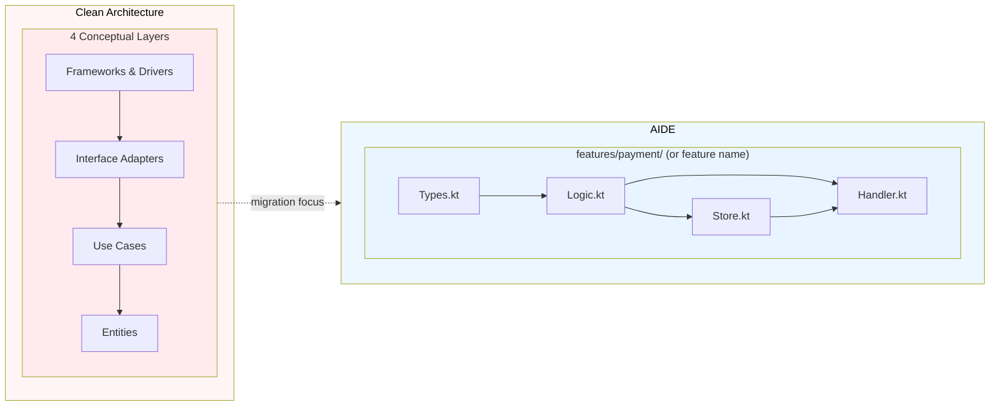
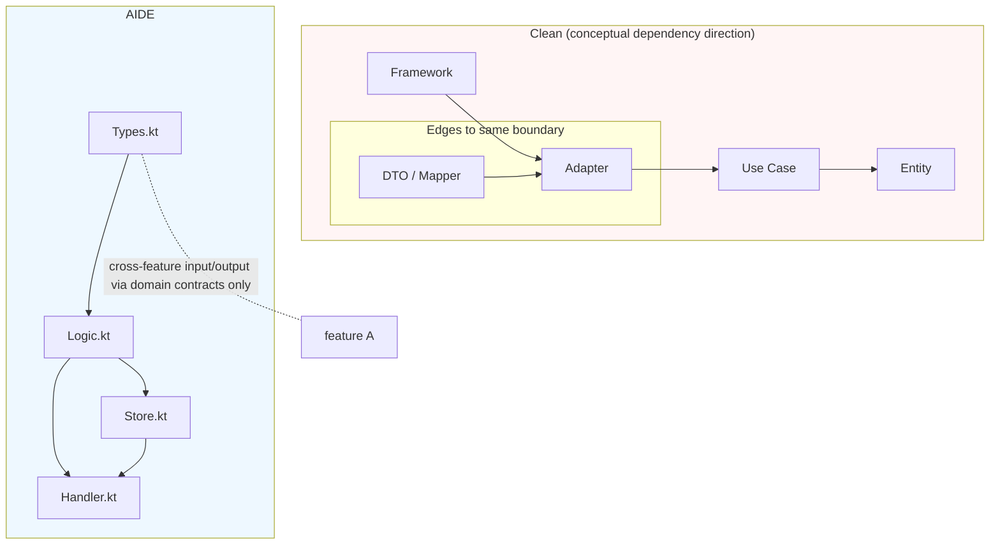

# AIDE vs Clean Architecture

## 1) Overview

Clean Architecture and AIDE both aim to make complex systems easier to reason about over time, but they optimize different kinds of complexity.

- Clean Architecture separates concerns into conceptual layers and enforces that high-level policy code never depends on low-level infrastructure details.
- AIDE keeps the same policy-first mindset, but collapses physical layers into a Feature slice so teams and AI agents can work inside one concise context.

This document compares them through AIDE's 10 principles, with explicit emphasis on:

- `Context Budget Principle`
- `Locality of Behavior`


## 2) Core Philosophy Comparison

| Axis | Clean Architecture | AIDE |
|---|---|---|
| Primary boundary | Clear architectural layers (`entities`, `use-cases`, `interface-adapters`, `frameworks`) | Feature ownership boundary (`features/<domain>/`) |
| Dependency rule | Mandatory inward dependency direction across 4 major layers | Mandatory inward dependency direction inside each feature + strict minimization of cross-feature edges |
| Unit of cognition | Layer + use case | Feature slice + behavior group |
| Cost of change | Change may involve multiple directories at different layer levels | Change usually stays inside one feature directory and few adjacent files |
| AI/agent context | More files and indirection to absorb one change | Reduced file surface for one operation, faster context loading |
| Principle pressure | Prevent leakage from frameworks into business logic | Prevent leakage and further reduce context switches |
| Core value | Decouple business rules from infrastructure | Preserve AIDE: decouple, then restructure physically |

### Context Budget Principle as the first comparison axis

- Clean Architecture already avoids coupling but does not optimize *where* that decoupling is physically distributed.
- AIDE adds an explicit distribution rule: for one feature behavior, keep the files you must inspect as small as possible.
- In practice: when implementing a use case in AIDE, the expected loaded set is often `Types.kt`, `Logic.kt`, and optionally `Store.kt` / `Handler.kt`, instead of spreading across 4+ directories.

### Locality of Behavior as the second comparison axis

- Clean Architecture usually achieves behavior locality conceptually (use-case grouping), but a use-case can still be fragmented across adapter layers.
- AIDE treats locality as a physical property: the behavior, transformation, and edge mapping of one feature are co-located.
- This directly supports AI editing: fewer context jumps and fewer accidental dependencies.

## 3) Structural Comparison



- In Clean, the layering is explicit and excellent for policy integrity, but path-based navigation becomes longer.
- In AIDE, the policy files are still separable, but placed in one feature folder where the cost of discovering related behavior is lower.

## 4) Dependency Direction Comparison



### Why AIDE is still compatible with Clean's dependency rule

- **Rule in AIDE terms**: outer code (`handler`, transport glue, framework utilities) depends on business logic, not vice versa.
- `Logic.kt` never imports framework/DB client directly in canonical usage.
- `Store.kt` holds implementation details and boundary calls; logic remains testable and stable.

### Practical difference

- Clean requires explicit layer boundaries by naming convention and architectural discipline.
- AIDE enforces a similar direction by making feature-local files the shortest legal dependency path.

## 5) Advantages & Trade-offs

| Topic | AIDE Strengths | AIDE Trade-offs |
|---|---|---|
| Dependency integrity | Keeps dependency direction clear while reducing layer count | Requires team discipline on naming and feature contracts |
| Core logic isolation | Logic remains testable and framework-agnostic | Additional migration overhead if existing files are heavily coupled to controller/service terms |
| Development speed | Faster local edits and quicker AI context switching | New contributors need new mental model for feature internals |
| Evolution | Good for vertical feature growth | Harder to enforce strict, enterprise-level layer review checks |
| Refactoring at scale | Low-friction for feature-level rewrites | Global architectural rules must be documented in AGENTS / review templates |

### Mapping table: Clean 4-layer names to AIDE roles

| Clean name | AIDE mapping |
|---|---|
| Frameworks & Drivers | `Handler.kt` (HTTP or event boundary), minimal runtime wiring |
| Interface Adapters | `Store.kt` plus tiny adapter helpers inside feature |
| Use Cases | `Logic.kt` (pure domain use-case logic) |
| Entities | `Types.kt` + immutable domain objects and business rule helpers |

## 6) Kotlin Example

### Clean Architecture style (traditional)

```kotlin
// src/main/kotlin/com/example/clean/cart/domain/model/CartAggregate.kt
package com.example.clean.cart.domain.model

data class CartLineItem(
  val productId: String,
  val name: String,
  val unitPriceKRW: Long,
  val quantity: Int,
)

data class Cart(
  val id: String,
  val userId: String,
  val items: List<CartLineItem>,
) {
  fun totalInKRW(): Long = items.sumOf { it.unitPriceKRW * it.quantity.toLong() }
}

data class PricePolicy(
  val discountRatePercent: Int,
)

data class CartFinalPriceResult(
  val cartId: String,
  val totalInKRW: Long,
)

// src/main/kotlin/com/example/clean/cart/application/port/CartRepository.kt
package com.example.clean.cart.application.port

import com.example.clean.cart.domain.model.Cart

interface CartRepository {
  fun findById(cartId: String): Cart?
  fun save(cart: Cart)
}

// src/main/kotlin/com/example/clean/cart/application/usecase/CalculateFinalPriceUseCase.kt
package com.example.clean.cart.application.usecase

import com.example.clean.cart.application.port.CartRepository
import com.example.clean.cart.domain.model.Cart
import com.example.clean.cart.domain.model.CartFinalPriceResult
import com.example.clean.cart.domain.model.PricePolicy

interface CalculateFinalPriceUseCase {
  fun calculate(cartId: String, pricePolicy: PricePolicy): CartFinalPriceResult
}

class CalculateFinalPriceService(
  private val cartRepository: CartRepository,
) : CalculateFinalPriceUseCase {
  override fun calculate(cartId: String, pricePolicy: PricePolicy): CartFinalPriceResult {
    val cart: Cart = cartRepository.findById(cartId)
      ?: throw IllegalArgumentException("Cart not found: $cartId")

    val subtotal = cart.totalInKRW()
    val discount = subtotal * pricePolicy.discountRatePercent / 100
    val totalInKRW = maxOf(0L, subtotal - discount)

    return CartFinalPriceResult(
      cartId = cart.id,
      totalInKRW = totalInKRW,
    )
  }
}

// src/main/kotlin/com/example/clean/cart/adapter/out/persistence/JdbcCartRepository.kt
package com.example.clean.cart.adapter.out.persistence

import com.example.clean.cart.application.port.CartRepository
import com.example.clean.cart.domain.model.Cart
import org.springframework.stereotype.Repository

@Repository
class JdbcCartRepository : CartRepository {
  override fun findById(cartId: String): Cart? {
    // TODO: replace with Jpa/JdbcTemplate implementation
    return null
  }

  override fun save(cart: Cart) {
    // TODO: implement persistence write
  }
}

// src/main/kotlin/com/example/clean/cart/adapter/in/web/CartController.kt
package com.example.clean.cart.adapter.`in`.web

import com.example.clean.cart.application.usecase.CalculateFinalPriceService
import com.example.clean.cart.domain.model.CartFinalPriceResult
import com.example.clean.cart.domain.model.PricePolicy
import jakarta.validation.constraints.Max
import jakarta.validation.constraints.Min
import org.springframework.http.ResponseEntity
import org.springframework.validation.annotation.Validated
import org.springframework.web.bind.annotation.GetMapping
import org.springframework.web.bind.annotation.PathVariable
import org.springframework.web.bind.annotation.RequestMapping
import org.springframework.web.bind.annotation.RequestParam
import org.springframework.web.bind.annotation.RestController

@RestController
@RequestMapping("/carts")
@Validated
class CartController(
  private val calculateFinalPriceService: CalculateFinalPriceService,
) {
  @GetMapping("/{cartId}/final-price")
  fun handle(
    @PathVariable cartId: String,
    @RequestParam(defaultValue = "15")
    @Min(0)
    @Max(100)
    discountRatePercent: Int,
  ): ResponseEntity<CartFinalPriceResult> {
    val response = calculateFinalPriceService.calculate(
      cartId = cartId,
      pricePolicy = PricePolicy(discountRatePercent),
    )
    return ResponseEntity.ok(response)
  }
}
```

### AIDE Feature slice equivalent

```kotlin
// src/main/kotlin/com/example/aaa/cart/features/cart/types.kt
package com.example.aaa.cart.features.cart

import jakarta.validation.constraints.Max
import jakarta.validation.constraints.Min
import jakarta.validation.constraints.NotBlank

data class CartLineItem(
  val productId: String,
  val name: String,
  val unitPriceKRW: Long,
  val quantity: Int,
)

data class Cart(
  val id: String,
  val userId: String,
  val items: List<CartLineItem>,
)

data class PricePolicy(
  val discountRatePercent: Int,
)

data class CalculateFinalPriceRequest(
  @field:NotBlank
  val cartId: String,
  @Min(0)
  @Max(100)
  val discountRatePercent: Int = 15,
)

data class FinalPriceResponse(
  val cartId: String,
  val totalInKRW: Long,
)

data class FinalPriceEnvelope(
  val requestId: String,
  val result: FinalPriceResponse,
)

sealed interface CartError {
  data class CartNotFound(val cartId: String) : CartError
  data class InvalidPolicy(val discountRatePercent: Int) : CartError
}

interface CartStorePort {
  fun findById(cartId: String): Cart
  fun save(cart: Cart)
}

fun cartTotal(cart: Cart): Long = cart.items.sumOf { it.unitPriceKRW * it.quantity.toLong() }

fun calculateFinalPrice(cart: Cart, policy: PricePolicy): Long {
  val subtotal = cartTotal(cart)
  val discount = subtotal * policy.discountRatePercent / 100
  return maxOf(0L, subtotal - discount)
}

fun buildFinalPrice(
  cartId: String,
  policy: PricePolicy,
  store: CartStorePort,
): FinalPriceResponse {
  val cart = store.findById(cartId)
  return FinalPriceResponse(
    cartId = cart.id,
    totalInKRW = calculateFinalPrice(cart, policy),
  )
}

// src/main/kotlin/com/example/aaa/cart/features/cart/store.kt
package com.example.aaa.cart.features.cart

import org.springframework.stereotype.Repository
import java.util.concurrent.ConcurrentHashMap

@Repository
class CartStore : CartStorePort {
  private val carts = ConcurrentHashMap<String, Cart>()

  override fun findById(cartId: String): Cart {
    return carts[cartId] ?: throw IllegalArgumentException("cart not found: $cartId")
  }

  override fun save(cart: Cart) {
    carts[cart.id] = cart
  }
}

// src/main/kotlin/com/example/aaa/cart/features/cart/handler.kt
package com.example.aaa.cart.features.cart

import jakarta.validation.Valid
import org.springframework.http.ResponseEntity
import org.springframework.validation.annotation.Validated
import org.springframework.web.bind.annotation.GetMapping
import org.springframework.web.bind.annotation.PathVariable
import org.springframework.web.bind.annotation.RequestMapping
import org.springframework.web.bind.annotation.RequestParam
import org.springframework.web.bind.annotation.RestController

@RestController
@RequestMapping("/features/cart")
@Validated
class CartHandler(
  private val cartStore: CartStore,
) {
  @GetMapping("/{cartId}/final-price")
  fun handle(
    @PathVariable cartId: String,
    @RequestParam(defaultValue = "15")
    @Valid
    request: CalculateFinalPriceRequest,
  ): ResponseEntity<FinalPriceEnvelope> {
    val command = request.copy(cartId = cartId)
    val result = buildFinalPrice(
      cartId = command.cartId,
      policy = PricePolicy(command.discountRatePercent),
      store = cartStore,
    )

    val response = FinalPriceEnvelope(
      requestId = "req-$cartId",
      result = result,
    )
    return ResponseEntity.ok(response)
  }
}
```

## 7) Migration Guide from Clean to AIDE

This sequence works well in real migrations:

1. Keep Clean layers intact and map every feature to an explicit boundary list.
2. Create feature directories one by one (`features/<name>/`) and copy use-case code into `Logic.kt` first.
3. Move entity DTOs and shared domain types into `Types.kt`.
4. Keep adapters thin: move repository/controller adaptation into `Store.kt` and `Handler.kt`.
5. Collapse duplicated mapping code from different features into shared utility only when it increases locality.
6. Add tests for `Logic.kt` first, then integration tests around `Handler.kt`.
7. Introduce CI checks that detect cross-feature imports outside shared contracts.
8. Remove old per-layer directories only after all feature slices pass parity checks.
9. Update AGENTS / instruction docs to codify the new dependency and locality rules.

### Migration checkpoints

- **Checkpoint A (safe)**: Read/write one feature via AIDE while preserving old endpoints.
- **Checkpoint B (stable)**: Feature uses unchanged contracts and same runtime behavior.
- **Checkpoint C (optimized)**: Old service/controller/repository folders removed for that domain.
- **Checkpoint D (complete)**: New projects start from feature-first layout.

## 8) Conclusion

AIDE is not a replacement for Clean Architecture's core value system. It is an implementation strategy that keeps the essential invariants (isolation of domain logic, inward dependency direction, explicit contracts) and reduces physical layer overhead.

For teams and AI agents, this usually means lower context switching overhead while still preserving the long-term maintainability objectives Clean Architecture was created for.
