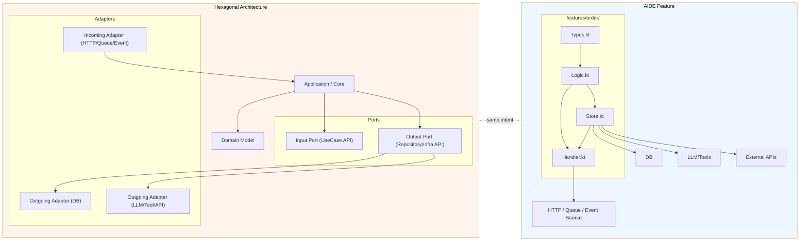

# AIDE vs Hexagonal Architecture (Ports & Adapters)

## 1) Overview

Hexagonal Architecture describes business logic as the center, connected to outside systems through Ports and Adapters.

AIDE is aligned with this pattern, but it usually places the port/adapter behavior inside each Feature boundary using two concrete files:
- `Store.kt` (state persistence and external service execution)
- `Handler.kt` (event/input boundary, route/command adaptation)

This makes the architecture easier to apply in AI-oriented teams where tooling and third-party interfaces change fast.

## 2) Core Philosophy Comparison

| Axis | Hexagonal Architecture | AIDE |
|---|---|---|
| Core idea | Domain core independent from external systems | Domain logic independent and colocated by feature boundary |
| Port concept | Explicit interfaces for input/output
| Input/Output mapping | Dedicated adapter layers | `Handler.kt` + small adapters embedded in feature |
| Dependency direction | Ports and use cases isolate infrastructure | Feature-local dependency graph with explicit boundary files |
| AI-era volatility handling | Strong if ports are well-defined | Stronger because volatile adapters are physically centralized in fewer files |

### Context Budget and Locality as shared axis

- AIDE keeps port-like contracts close to behavior, reducing the number of files needed to understand one change.
- For AI/agent workflows, context budget is consumed mainly by `Types.kt` and `Logic.kt`; adapters are moved to feature edges.
- This is a direct fit with hexagonal intent: outside world can change without affecting core behavior.

### Where they differ

- Hexagonal often keeps adapters as separate folders (`adapters/in`, `adapters/out`).
- AIDE keeps adapter semantics explicit but merges many external touchpoints into `Handler.kt` and `Store.kt` near the feature domain.

## 3) Structural Comparison



## 4) Port/Adapter vs AIDE Internal Structure

### In Hexagonal terms

- **Input port** = interface used by external callers to trigger use case.
- **Output port** = interface used by use case to reach side effects.
- **Adapter** = concrete bridge between port and runtime tech.

### In AIDE terms

- **Input boundary (input adaptation)** → `Handler.kt`
  - Parses request/input payload
  - Maps to feature command / value objects
  - Performs protocol-specific status/error mapping
- **Output boundary (output adaptation)** → `Store.kt`
  - Converts pure outputs into persistence or integration operations
  - Contains anti-corruption mapping with DB, LLM, and tool interfaces

### Why this matters for AI-era systems

`LLM`, `tool`, and `DB` integrations are now frequently replaceable.

In AIDE, because all external bindings are pushed into `Store.kt` and `Handler.kt`:

- A provider swap changes a small number of files.
- The feature's core logic stays untouched.
- Test strategy stays stable because `Logic.kt` remains unit-testable.

This means Port/Adapter value is not reduced; it is amplified under volatility.

## 5) Kotlin Example

### Hexagonal (classic)

```kotlin
// src/main/kotlin/com/example/hexagonal/order/domain/model/Order.kt
package com.example.hexagonal.order.domain.model

data class PlaceOrderCommand(
  val orderId: String,
  val cartId: String,
)

data class PlaceOrderResult(
  val invoiceId: String,
)

data class OrderSnapshot(
  val orderId: String,
  val cartId: String,
  val summary: String,
)

// src/main/kotlin/com/example/hexagonal/order/application/port/OrderPorts.kt
package com.example.hexagonal.order.application.port

import com.example.hexagonal.order.domain.model.OrderSnapshot

interface LLMPort {
  fun summarize(text: String): String
}

interface OrderRepositoryPort {
  fun save(order: OrderSnapshot)
}

interface PlaceOrderUseCase {
  fun execute(command: com.example.hexagonal.order.domain.model.PlaceOrderCommand): com.example.hexagonal.order.domain.model.PlaceOrderResult
}

// src/main/kotlin/com/example/hexagonal/order/application/usecase/PlaceOrderService.kt
package com.example.hexagonal.order.application.usecase

import com.example.hexagonal.order.application.port.LLMPort
import com.example.hexagonal.order.application.port.OrderRepositoryPort
import com.example.hexagonal.order.application.port.PlaceOrderUseCase
import com.example.hexagonal.order.domain.model.OrderSnapshot
import com.example.hexagonal.order.domain.model.PlaceOrderCommand
import com.example.hexagonal.order.domain.model.PlaceOrderResult
import org.springframework.stereotype.Service

@Service
class PlaceOrderService(
  private val llmPort: LLMPort,
  private val orderRepository: OrderRepositoryPort,
) : PlaceOrderUseCase {
  override fun execute(command: PlaceOrderCommand): PlaceOrderResult {
    val summary = llmPort.summarize("order=${command.orderId}")
    orderRepository.save(
      OrderSnapshot(
        orderId = command.orderId,
        cartId = command.cartId,
        summary = summary,
      ),
    )
    return PlaceOrderResult(invoiceId = "inv-${command.orderId}")
  }
}

// src/main/kotlin/com/example/hexagonal/order/adapter/out/db/OrderRepositoryAdapter.kt
package com.example.hexagonal.order.adapter.out.db

import com.example.hexagonal.order.application.port.OrderRepositoryPort
import com.example.hexagonal.order.domain.model.OrderSnapshot
import org.springframework.stereotype.Repository

@Repository
class OrderRepositoryAdapter : OrderRepositoryPort {
  override fun save(order: OrderSnapshot) {
    // TODO: replace with persistence logic
  }
}

// src/main/kotlin/com/example/hexagonal/order/adapter/out/llm/OpenAILLMAdapter.kt
package com.example.hexagonal.order.adapter.out.llm

import com.example.hexagonal.order.application.port.LLMPort
import org.springframework.stereotype.Component

@Component
class OpenAILLMAdapter : LLMPort {
  override fun summarize(text: String): String {
    return "summary: $text"
  }
}

// src/main/kotlin/com/example/hexagonal/order/adapter/in/web/PlaceOrderController.kt
package com.example.hexagonal.order.adapter.`in`.web

import com.example.hexagonal.order.application.usecase.PlaceOrderService
import com.example.hexagonal.order.domain.model.PlaceOrderCommand
import com.example.hexagonal.order.domain.model.PlaceOrderResult
import jakarta.validation.constraints.NotBlank
import org.springframework.http.ResponseEntity
import org.springframework.web.bind.annotation.PostMapping
import org.springframework.web.bind.annotation.RequestBody
import org.springframework.web.bind.annotation.RequestMapping
import org.springframework.web.bind.annotation.RestController

@RestController
@RequestMapping("/orders")
class PlaceOrderController(
  private val placeOrderService: PlaceOrderService,
) {
  @PostMapping
  fun placeOrder(@RequestBody request: PlaceOrderRequest): ResponseEntity<PlaceOrderResult> {
    return ResponseEntity.ok(placeOrderService.execute(request.toCommand()))
  }
}

data class PlaceOrderRequest(
  @field:NotBlank
  val orderId: String,
  @field:NotBlank
  val cartId: String,
) {
  fun toCommand() = PlaceOrderCommand(orderId = orderId, cartId = cartId)
}
```

### AIDE equivalent

```kotlin
// src/main/kotlin/com/example/aaa/order/features/order/types.kt
package com.example.aaa.order.features.order

import jakarta.validation.constraints.NotBlank

data class OrderCommand(
  val orderId: String,
  val cartId: String,
)

data class PlaceOrderInvoice(
  val invoiceId: String,
)

data class PersistedOrder(
  val orderId: String,
  val cartId: String,
  val summary: String,
)

sealed interface OrderPortError {
  data class InvalidInput(val reason: String) : OrderPortError
}

interface OrderPorts {
  fun summarize(text: String): String
  fun save(input: PersistedOrder)
}

fun placeOrderUseCase(command: OrderCommand, ports: OrderPorts): PlaceOrderInvoice {
  val summary = ports.summarize("order=${command.orderId}")
  ports.save(
    PersistedOrder(
      orderId = command.orderId,
      cartId = command.cartId,
      summary = summary,
    ),
  )
  return PlaceOrderInvoice(invoiceId = "inv-${command.orderId}")
}

// src/main/kotlin/com/example/aaa/order/features/order/store.kt
package com.example.aaa.order.features.order

import org.springframework.stereotype.Repository
import java.time.Instant

@Repository
class OrderStore : OrderPorts {
  private val rows = mutableListOf<PersistedOrder>()

  override fun summarize(text: String): String = "summary: $text"

  override fun save(input: PersistedOrder) {
    rows.add(input.copy(summary = "${input.summary} @ ${Instant.now()}"))
  }
}

// src/main/kotlin/com/example/aaa/order/features/order/handler.kt
package com.example.aaa.order.features.order

import org.springframework.http.ResponseEntity
import org.springframework.web.bind.annotation.PostMapping
import org.springframework.web.bind.annotation.RequestBody
import org.springframework.web.bind.annotation.RequestMapping
import org.springframework.web.bind.annotation.RestController
import jakarta.validation.Valid

@RestController
@RequestMapping("/features/orders")
class OrderHandler(
  private val orderStore: OrderStore,
) {
  @PostMapping
  fun handle(@Valid @RequestBody request: PlaceOrderRequest): ResponseEntity<PlaceOrderInvoice> {
    val invoice = placeOrderUseCase(
      request.toDomainCommand(),
      orderStore,
    )
    return ResponseEntity.ok(invoice)
  }
}

data class PlaceOrderRequest(
  @field:NotBlank
  val orderId: String,
  @field:NotBlank
  val cartId: String,
) {
  fun toDomainCommand() = OrderCommand(orderId = orderId, cartId = cartId)
}
```

## 6) Migration Guide

For existing hexagonal codebases, migrate with these steps:

1. Inventory ports first: list all input/output interfaces and consumers.
2. Identify one vertical slice with low coupling and move it to `features/<name>/`.
3. Place all core invariants in `Logic.kt` and remove framework references.
4. Move output adapters into `Store.kt` (DB, LLM, tools, queues).
5. Move inbound adaptation into `Handler.kt`.
6. Replace cross-feature port module imports with explicit feature boundary contracts.
7. Keep shared infra contracts in `shared/` only when truly common.
8. Add contract tests around handlers and store, then migrate other features.

### AI replacement scenarios

- New LLM provider: only adapter construction in feature `Store.kt` + handler config changes.
- New tool contract: update tool wrapper inside `Store.kt`.
- New DB driver: swap DB adapter in feature store or shared adapter and keep all logic tests intact.

## 7) Conclusion

Hexagonal Architecture remains philosophically compatible with AIDE.
The practical AIDE interpretation is **feature-embedded ports/adapters**.
That is why in volatile AI systems, AIDE often reduces migration and replacement cost: change points stay feature-local and dependency direction remains stable.
