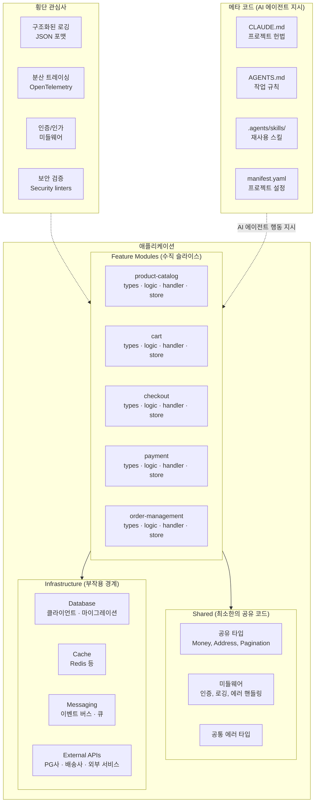
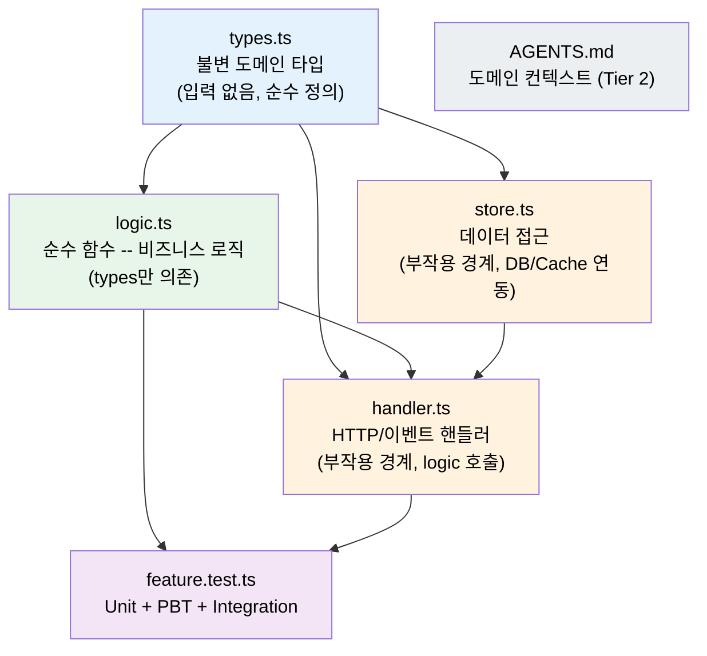
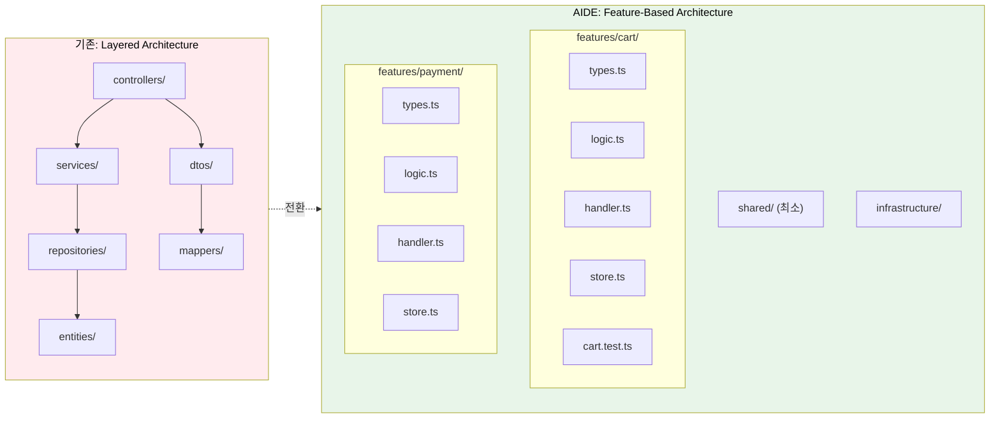

# AIDE (Agent-Informed Development Engineering) -- 에이전트 시대의 소프트웨어 개발론 v1.0

**작성**: CTO (20년+ 아키텍처 경험, 3년 AI 에이전트 실전 경험)
**기반**: GPT/Claude/Gemini 3종 딥리서치 + Team Alpha(통합파) 보고서 2종 + Team Beta(급진파) 보고서 1종
**날짜**: 2026-02-18

---

## Part 2: AIDE 아키텍처 패턴

### 핵심 아키텍처 원칙

AIDE는 **Feature-Based Vertical Slice Architecture**를 기본으로 채택한다.
기존의 수평적 계층 분리(Controller/Service/Repository)를 수직적 기능 단위 분리로 전환하되,
각 Feature 내부에서는 Functional Core + Imperative Shell 패턴을 적용한다.

### AIDE 아키텍처 개요



### Feature 내부 구조

각 Feature 디렉토리는 **자가 완결적**이며, 내부에서 명확한 의존성 방향을 가진다:



**의존성 규칙:**
- `types.ts`는 어디에도 의존하지 않는다 (순수 타입 정의)
- `logic.ts`는 `types.ts`에만 의존한다 (순수 함수, 부작용 없음)
- `handler.ts`는 `logic.ts`와 `store.ts`를 조합한다 (부작용 경계)
- `store.ts`는 `types.ts`에 의존하고, infrastructure에 접근한다 (부작용 경계)

### 도메인별 프로젝트 구조 예시

#### 이커머스 백엔드 (TypeScript/Node.js)

```
project/
├── CLAUDE.md                          # 프로젝트 헌법
├── AGENTS.md                          # 작업 규칙
├── manifest.yaml                      # 프로젝트 설정
│
├── src/
│   ├── features/
│   │   ├── product-catalog/
│   │   │   ├── types.ts               # Product, Category 등 도메인 타입
│   │   │   ├── logic.ts               # 가격 계산, 재고 확인, 필터링 순수 함수
│   │   │   ├── handler.ts             # GET /products, POST /products
│   │   │   ├── store.ts               # DB 접근 (products 테이블)
│   │   │   ├── product-catalog.test.ts
│   │   │   └── AGENTS.md              # 상품 도메인 비즈니스 규칙
│   │   ├── cart/
│   │   │   ├── types.ts
│   │   │   ├── logic.ts               # 장바구니 합계 계산, 쿠폰 적용
│   │   │   ├── handler.ts
│   │   │   ├── store.ts
│   │   │   └── cart.test.ts
│   │   ├── checkout/
│   │   ├── payment/
│   │   ├── order-management/
│   │   ├── user-auth/
│   │   └── shipping/
│   │
│   ├── shared/
│   │   ├── types/                     # 공유 도메인 타입 (Money, Address 등)
│   │   ├── middleware/                # 인증, 로깅, 에러 핸들링
│   │   └── errors/                    # 공통 에러 타입
│   │
│   └── infrastructure/
│       ├── database/                  # DB 클라이언트, 마이그레이션
│       ├── cache/                     # Redis 등 캐시
│       ├── messaging/                 # 이벤트 버스, 큐
│       └── external-apis/             # PG사, 배송사 연동
│
├── .agents/skills/                    # AI 에이전트 스킬
├── evals/                             # 평가 데이터셋
└── tests/
    ├── integration/
    └── e2e/
```

#### 금융/증권 백엔드 (TypeScript/Node.js)

```
project/
├── CLAUDE.md
├── AGENTS.md
├── manifest.yaml
│
├── src/
│   ├── features/
│   │   ├── account/                   # 계좌 관리
│   │   ├── trading/                   # 주문 체결
│   │   │   ├── types.ts               # Order, Position, Quote
│   │   │   ├── logic.ts               # 주문 검증, 수수료 계산, 증거금 확인
│   │   │   ├── handler.ts             # POST /orders, GET /positions
│   │   │   ├── store.ts
│   │   │   ├── trading.test.ts
│   │   │   └── AGENTS.md              # 트레이딩 도메인 규칙 (규제 요건 포함)
│   │   ├── portfolio/                 # 포트폴리오 분석
│   │   ├── market-data/               # 시세 데이터
│   │   ├── risk-assessment/           # 리스크 관리
│   │   ├── settlement/                # 결제/정산
│   │   └── compliance/                # 규정 준수
│   │
│   ├── shared/
│   │   ├── types/                     # Money, SecurityId 등
│   │   └── middleware/
│   │
│   └── infrastructure/
│       ├── database/
│       ├── market-feed/               # 실시간 시세 연동
│       └── regulatory-api/            # 금융 규제 API
│
├── .agents/skills/
├── evals/
└── tests/
    ├── integration/
    └── e2e/
```

#### 프론트엔드 (Next.js)

```
project/
├── CLAUDE.md
├── AGENTS.md
├── manifest.yaml
│
├── src/
│   ├── features/
│   │   ├── product-listing/
│   │   │   ├── types.ts
│   │   │   ├── hooks.ts               # useProducts, useFilters
│   │   │   ├── components/            # ProductCard, ProductGrid, FilterPanel
│   │   │   ├── api.ts                 # API 호출 함수
│   │   │   ├── product-listing.test.ts
│   │   │   └── AGENTS.md
│   │   ├── cart/
│   │   ├── checkout/
│   │   └── user-profile/
│   │
│   ├── shared/
│   │   ├── components/                # Button, Modal, Form 등 공통 UI
│   │   ├── hooks/                     # useAuth, useToast 등
│   │   └── types/
│   │
│   ├── app/                           # Next.js App Router
│   └── styles/
│
├── .agents/skills/
├── evals/
└── tests/
    └── e2e/
```

### TypeScript 코드 패턴 예시

이커머스의 "장바구니" 기능을 예시로, AIDE의 Feature 내부 코드 패턴을 보여준다.

```typescript
// features/cart/types.ts -- 불변 도메인 타입
type CartItem = Readonly<{
  product_id: string
  product_name: string
  unit_price_in_krw: number
  quantity: number
  discount_rate_percent: number
}>

type Cart = Readonly<{
  id: string
  user_id: string
  items: ReadonlyArray<CartItem>
  coupon_code?: string
}>

type CartSummary = Readonly<{
  subtotal_in_krw: number
  discount_total_in_krw: number
  shipping_fee_in_krw: number
  total_in_krw: number
}>
```

```typescript
// features/cart/logic.ts -- 순수 함수만
const calculate_item_price = (item: CartItem): number =>
  item.unit_price_in_krw * item.quantity * (1 - item.discount_rate_percent / 100)

const calculate_subtotal = (items: ReadonlyArray<CartItem>): number =>
  items.reduce((sum, item) => sum + calculate_item_price(item), 0)

const calculate_shipping_fee = (subtotal: number): number =>
  subtotal >= 50000 ? 0 : 3000  // 5만원 이상 무료배송

const calculate_cart_summary = (cart: Cart): CartSummary => {
  const subtotal = calculate_subtotal(cart.items)
  const shipping = calculate_shipping_fee(subtotal)
  return {
    subtotal_in_krw: subtotal,
    discount_total_in_krw: 0, // 쿠폰 로직은 별도
    shipping_fee_in_krw: shipping,
    total_in_krw: subtotal + shipping,
  }
}
```

```typescript
// features/cart/handler.ts -- 부작용 경계
const handle_get_cart_summary = async (
  req: Request,
  deps: { db: Database; logger: Logger }
): Promise<Response<CartSummary>> => {
  const cart = await deps.db.find_cart_by_user(req.userId)
  if (!cart) return error_response(404, 'Cart not found')

  const summary = calculate_cart_summary(cart)
  deps.logger.info({ event: 'cart_summary_calculated', userId: req.userId })

  return ok_response(summary)
}
```

```typescript
// features/cart/store.ts -- 데이터 접근 (부작용 경계)
type CartStore = {
  readonly find_cart_by_user: (user_id: string) => Promise<Cart | null>
  readonly save_cart: (cart: Cart) => Promise<void>
  readonly delete_cart: (cart_id: string) => Promise<void>
}

const create_cart_store = (db: Database): CartStore => ({
  find_cart_by_user: async (user_id) => {
    const row = await db.query('SELECT * FROM carts WHERE user_id = $1', [user_id])
    return row ? map_row_to_cart(row) : null
  },
  save_cart: async (cart) => {
    await db.query(
      'INSERT INTO carts (id, user_id, items) VALUES ($1, $2, $3) ON CONFLICT (id) DO UPDATE SET items = $3',
      [cart.id, cart.user_id, JSON.stringify(cart.items)]
    )
  },
  delete_cart: async (cart_id) => {
    await db.query('DELETE FROM carts WHERE id = $1', [cart_id])
  },
})
```

```typescript
// features/cart/cart.test.ts -- 테스트
import { describe, it, expect } from 'vitest'
import { fc } from '@fast-check/vitest'
import { calculate_item_price, calculate_cart_summary, calculate_shipping_fee } from './logic'

describe('calculate_item_price', () => {
  it('할인 없는 상품의 가격을 올바르게 계산한다', () => {
    const item: CartItem = {
      product_id: 'p1',
      product_name: '테스트 상품',
      unit_price_in_krw: 10000,
      quantity: 3,
      discount_rate_percent: 0,
    }
    expect(calculate_item_price(item)).toBe(30000)
  })

  it('할인율을 올바르게 적용한다', () => {
    const item: CartItem = {
      product_id: 'p1',
      product_name: '할인 상품',
      unit_price_in_krw: 10000,
      quantity: 2,
      discount_rate_percent: 10,
    }
    expect(calculate_item_price(item)).toBe(18000) // 20000 * 0.9
  })
})

describe('calculate_shipping_fee', () => {
  it('5만원 이상이면 무료배송', () => {
    expect(calculate_shipping_fee(50000)).toBe(0)
    expect(calculate_shipping_fee(100000)).toBe(0)
  })

  it('5만원 미만이면 3000원 배송비', () => {
    expect(calculate_shipping_fee(49999)).toBe(3000)
    expect(calculate_shipping_fee(0)).toBe(3000)
  })
})

// Property-Based Test
describe('cart summary properties', () => {
  fc.test.prop([
    fc.array(fc.record({
      product_id: fc.string(),
      product_name: fc.string(),
      unit_price_in_krw: fc.nat({ max: 1000000 }),
      quantity: fc.integer({ min: 1, max: 100 }),
      discount_rate_percent: fc.integer({ min: 0, max: 100 }),
    }))
  ])('총액은 항상 0 이상이어야 한다', (items) => {
    const cart: Cart = { id: 'c1', user_id: 'u1', items }
    const summary = calculate_cart_summary(cart)
    expect(summary.total_in_krw).toBeGreaterThanOrEqual(0)
  })
})
```

### 기존 아키텍처와의 비교



| 비교 항목 | 기존 Layered Architecture | AIDE Feature-Based |
|-----------|--------------------------|-------------------|
| **파일 분산** | 1기능에 6~8파일 (서로 다른 디렉토리) | 1기능에 4~5파일 (같은 디렉토리) |
| **기능 수정 시 로드 파일** | 4~8개 | 1~3개 |
| **간접 참조 깊이** | 3~4단계 | 1~2단계 |
| **새 기능 추가 비용** | 6+ 파일 생성, 여러 디렉토리 수정 | 1 디렉토리 생성, 4파일 작성 |
| **AI 에이전트 컨텍스트 효율** | 낮음 (파편화) | 높음 (지역성) |
| **의존성 방향** | 수직적 (상위→하위 계층) | 수직적 (types→logic→handler) + 수평적 (Feature 간 격리) |

#### 다른 아키텍처와의 상세 비교

주요 아키텍처 패턴과의 심층 비교는 다음 문서를 참조하세요:

- [AIDE vs Clean Architecture](./comparisons/AIDE-vs-Clean-Architecture.md) -- AIDE가 Clean Architecture 핵심 가치를 보존하면서 물리적 레이어를 줄이는 방법
- [AIDE vs Hexagonal Architecture](./comparisons/AIDE-vs-Hexagonal-Architecture.md) -- Ports & Adapters가 AIDE Feature 구조에 매핑되는 방법


### manifest.yaml 예시

```yaml
spec_version: "1.0"
project_name: "my-ecommerce"
project_type: "backend"

tech_stack:
  language: "typescript"
  runtime: "node"
  framework: "express"  # 또는 fastify, nestjs 등
  database: "postgresql"
  cache: "redis"

ai_development:
  primary_model: "claude-opus-4-6"
  instruction_files:
    tier1: ["CLAUDE.md", "AGENTS.md"]
    tier2_pattern: "src/features/*/AGENTS.md"

code_standards:
  max_file_lines: 300
  max_function_lines: 50
  paradigm: "functional-core"
  type_strictness: "strict"

testing:
  unit: "vitest"
  property: "fast-check"
  e2e: "playwright"

observability:
  logging: "structured_json"
  tracing: true

skills:
  - name: "add-api-endpoint"
    path: ".agents/skills/add-api-endpoint"
    version: "1.2.0"
  - name: "db-migration"
    path: ".agents/skills/db-migration"
    version: "2.1.0"

meta_files:
  tier1_max_lines: 300
  tier2_max_lines: 200
  enforce_eval_on_change: true
```

---


← Previous: [01-CORE-PRINCIPLES](./01-CORE-PRINCIPLES.md) | Next: [03-EXISTING-METHODOLOGIES](./03-EXISTING-METHODOLOGIES.md) →
