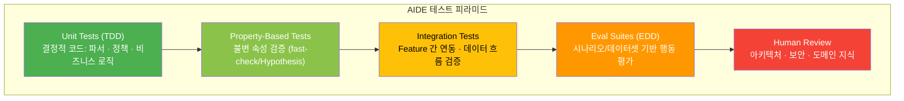

# AIDE (Agent-Informed Development Engineering) -- 에이전트 시대의 소프트웨어 개발론 v1.0

**작성**: CTO (20년+ 아키텍처 경험, 3년 AI 에이전트 실전 경험)
**기반**: GPT/Claude/Gemini 3종 딥리서치 + Team Alpha(통합파) 보고서 2종 + Team Beta(급진파) 보고서 1종
**날짜**: 2026-02-18

---

## Part 4: AIDE 실전 가이드

### 파일/코드 크기 지침

| 구분 | 권장 | 상한 | 토큰 추정 | 비고 |
|------|------|------|-----------|------|
| Feature 로직 (logic.ts) | 150-200줄 | 300줄 | ~5,400 | 핵심 비즈니스 로직 |
| 핸들러 (handler.ts) | 100-150줄 | 200줄 | ~3,600 | 각 핸들러 함수 30줄 이내 |
| 타입 정의 (types.ts) | 50-100줄 | 150줄 | ~2,700 | 타입은 밀도가 높으므로 짧아도 충분 |
| 테스트 (*.test.ts) | 200-300줄 | 500줄 | ~9,000 | 반복 구조이므로 약간 길어도 허용 |
| 메타 파일 (CLAUDE.md) | 100-200줄 | 300줄 | ~5,400 | 지시 이행률 유지를 위한 상한 |
| 도메인 컨텍스트 (AGENTS.md, Tier 2) | 50-100줄 | 200줄 | ~3,600 | 핵심 비즈니스 규칙만 압축 |
| 함수 크기 | 20-30줄 | 50줄 | ~900 | 단일 추론 턴 내 완전 이해 |

**"18토큰/줄" 경험법칙**: 평균적으로 코드 1줄 = 약 18토큰 (Cursor IDE 연구 기반)

### 네이밍 컨벤션 가이드

Gemini 보고서의 **의미론적 장황함(Semantic Verbosity)** 원칙을 적용하되, 실용적 균형을 유지한다.

#### 핵심 규칙: 언어 고유 컨벤션 우선 (Language-Native Convention First)

AIDE는 범용적인 케이스 스타일을 강제하지 않는다. **대상 언어의 확립된 네이밍 컨벤션을 항상 따른다** (예: Python은 PEP 8, TypeScript는 ESLint camelcase, Kotlin은 Kotlin Coding Conventions). 언어 생태계에 반하는 스타일은 린터, 프레임워크, 라이브러리와 마찰을 일으키며 — 관용적 코드로 학습된 AI 에이전트와 인간 개발자 모두를 혼란시킨다.

**AIDE가 규정하는 것**은 케이스 스타일이 아닌 이름의 *의미론적 내용*이다:

| 규칙 | 설명 | 예시 (TS) | 예시 (Python) | 반례 |
|------|------|-----------|---------------|------|
| 함수는 동사+목적어 | 이름이 동작과 대상을 기술 | `calculateOrderTotalInKrw()` | `calculate_order_total_in_krw()` | `calc(d)` |
| 변수는 의미 포함 | 이름이 목적을 전달 | `activeUserIdList` | `active_user_id_list` | `ids` |
| 부작용 명시 | 접두사로 부작용을 표시 | `persistUserToDatabase()` | `persist_user_to_database()` | `save()` |
| 타입은 명사 | 타입명은 서술적 명사 | `OrderItem` | `OrderItem` | `OI` |
| 상수에 출처 포함 | 상수명에 원천을 포함 | `MAX_LOGIN_ATTEMPTS_PER_POLICY` | `MAX_LOGIN_ATTEMPTS_PER_POLICY` | `MAX` |
| 파일명 | 언어 컨벤션에 따름 | `user-auth.ts` | `user_auth.py` | `ua.ts` |

**핵심 원칙**: 변수명과 함수명은 에이전트에게 **추론의 입력**이다. 이름이 구체적일수록 에이전트가 잘못 사용할 확률이 기하급수적으로 낮아진다. 이 원칙은 어떤 케이스 스타일에서든 동일하게 적용된다. 단, `calculatedTotalPriceWithDiscountAppliedInKrw` 수준의 극단적 장황함은 라인 길이 제한과 충돌하므로 실용적 범위를 유지한다.

### CLAUDE.md 작성 가이드 (템플릿)

```markdown
# Project: [프로젝트명]

## Identity
- Type: [프로젝트 타입, e.g. Next.js 14 Monorepo]
- Language: TypeScript (Strict Mode)
- Paradigm: Functional core, classes only for infrastructure
- State: [상태 관리 도구, e.g. Zustand]

## Absolute Rules (MUST FOLLOW)
- 비즈니스 로직에 class를 사용하지 말 것
- 모든 함수 매개변수와 반환값에 타입을 명시할 것
- any 타입을 사용하지 말 것
- features/ 외부에서 features/ 내부를 직접 import하지 말 것
- 새로운 npm 패키지 추가 전 반드시 확인을 받을 것
- [프로젝트 특화 규칙 추가]

## Architecture Map
features/: 기능별 독립 모듈 (types + logic + handler + store + test)
shared/:   전역 타입, 인프라 클라이언트, 공통 에러 (최소 유지)
evals/:    평가 데이터셋 및 시나리오
.agents/:  스킬 패키지

## Code Style
- 네이밍: 언어 고유 컨벤션 우선 (예: TS는 camelCase, Python은 snake_case)
- 네이밍 내용: 함수는 동사_목적어, 변수는 의미 포함, 부작용 접두사 명시
- 타입명: PascalCase
- 파일: kebab-case (또는 언어 컨벤션, 예: Python은 snake_case.py)
- 최대 파일 길이: 300줄 (경고), 500줄 (금지)
- 함수: 50줄 이내

## Workflow
1. types.ts 먼저 정의/수정
2. logic.ts에 순수 함수 구현
3. *.test.ts에 테스트 작성
4. handler.ts에서 부작용 통합
5. 린트 + 테스트 + 타입 체크 통과 확인

## Domain Glossary
- [도메인 용어1]: [정의]
- [도메인 용어2]: [정의]

## Examples
- Good pattern: src/features/user-auth/logic.ts
- Anti-pattern: (해당 없으면 생략)
```

### AIDE-REFERENCE.md 프로젝트 통합 가이드

[AIDE-REFERENCE.md](https://github.com/Dokkabei97/aide-methodology/blob/master/AIDE-REFERENCE.md)는 10대 핵심 원칙, Feature 아키텍처, 코드 스타일, 워크플로우를 하나의 파일(~240줄)로 요약한 독립형 빠른 참조 문서다. AI 에이전트가 AIDE를 일관되게 따르도록 하는 데 활용한다.

#### Option A: 별도 참조 파일 (권장)

`AIDE-REFERENCE.md`를 프로젝트 루트에 복사하고 `CLAUDE.md`에서 참조한다:

```markdown
# CLAUDE.md

## Methodology
이 프로젝트는 AIDE 방법론을 따릅니다. 전체 참조는 AIDE-REFERENCE.md를 참고하세요.

## Project-Specific Rules
- [프로젝트 고유 규칙 추가]
```

**작동 원리**: AI 에이전트(Claude, Cursor 등)는 CLAUDE.md에서 참조된 파일을 자동으로 로드한다. AIDE 규칙을 별도 파일로 분리하면 CLAUDE.md의 라인 예산을 프로젝트 고유 컨텍스트에 사용할 수 있다. AIDE-REFERENCE.md(~240줄)는 단독으로도 Tier 1 제한(300줄) 내에 들어간다.

#### Option B: CLAUDE.md에 직접 포함

소규모 프로젝트에서는 관련 섹션을 CLAUDE.md에 직접 복사한다:

```markdown
# CLAUDE.md

## Methodology: AIDE

### Core Principles
[AIDE-REFERENCE.md에서 필요한 원칙 붙여넣기]

### Code Style
[AIDE-REFERENCE.md에서 코드 스타일 섹션 붙여넣기]

## Project-Specific Rules
- [프로젝트 규칙 추가]
```

**트레이드오프**: 설정이 간단하지만 CLAUDE.md 라인 예산을 소비한다. AIDE 원칙 중 일부만 필요할 때 적합하다.

#### Option C: Feature 수준 AGENTS.md 활용

대규모 프로젝트에서는 루트 레벨에서 AIDE를 참조하고, 각 Feature의 `AGENTS.md`에 도메인별 컨텍스트를 추가한다:

```
project-root/
  CLAUDE.md            → "AIDE를 따릅니다. AIDE-REFERENCE.md 참조."
  AIDE-REFERENCE.md    → AIDE 전체 빠른 참조
  src/features/
    user-auth/
      AGENTS.md        → 이 Feature의 도메인별 규칙
    payment/
      AGENTS.md        → 이 Feature의 도메인별 규칙
```

이는 AIDE의 **점진적 공개(P6)** 원칙을 활용한다: Tier 1(루트 CLAUDE.md + AIDE-REFERENCE.md)은 항상 로드되고, Tier 2(Feature AGENTS.md)는 에이전트가 해당 디렉토리에서 작업할 때만 로드된다.

#### Context Budget 고려사항

| 구성 | CLAUDE.md | AIDE-REFERENCE.md | 총 Tier 1 |
|------|-----------|-------------------|-----------|
| Option A | ~60줄 (프로젝트 규칙) | ~240줄 | ~300줄 |
| Option B | ~200-300줄 (통합) | 해당 없음 | ~200-300줄 |
| Option C | ~60줄 (프로젝트 규칙) | ~240줄 | ~300줄 + Feature당 Tier 2 |

### AGENTS.md 작성 가이드 (Feature Tier 2 템플릿)

```markdown
# [Feature명] Domain Context

## Business Rules
- [규칙 1: 구체적이고 명확하게]
- [규칙 2: 에이전트가 추론할 필요 없이 이해할 수 있게]
- [규칙 3: 예외 케이스도 포함]

## Data Flow
[주요 플로우]: Request -> validate -> [순수 로직] -> [부작용] -> Response

## Known Edge Cases
- [엣지 케이스 1]: [처리 방법]
- [엣지 케이스 2]: [처리 방법]

## Dependencies
- 이 Feature가 의존하는 shared/ 모듈: [목록]
- 이 Feature를 참조하는 다른 Feature: [목록]
```

### Skills 관리 가이드

```
.agents/skills/
  {skill-name}/
    SKILL.md          # YAML frontmatter(이름, 설명, 태그) + 실행 가이드
    scripts/           # 자동화 스크립트 (선택)
    examples/          # 예제 입출력 (선택)
    tests/             # 스킬 검증용 eval 시나리오
```

**SKILL.md 예시:**

```markdown
---
name: add-api-endpoint
description: "새로운 REST API 엔드포인트를 features/ 디렉토리에 추가"
tags: [api, feature, crud]
version: "1.2.0"
---

## Steps
1. features/{feature-name}/ 디렉토리 확인 (없으면 생성)
2. types.ts에 Request/Response 타입 정의
3. logic.ts에 비즈니스 로직 순수 함수 구현
4. handler.ts에 HTTP 핸들러 추가
5. {feature-name}.test.ts에 테스트 추가
6. Tier 2 AGENTS.md에 비즈니스 규칙 문서화
7. 린트 + 테스트 + 타입 체크 실행

## Guardrails
- shared/ 수정 금지 (새 타입이 필요하면 feature 내부에 정의)
- 기존 핸들러의 시그니처 변경 금지
- 테스트 없는 코드 커밋 금지
```

**스킬 로딩 프로토콜:**
1. **Discovery**: SKILL.md의 YAML frontmatter만 읽음 (~50토큰)
2. **Selection**: 태스크와 관련된 스킬 선택
3. **Loading**: 선택된 스킬의 전체 내용을 컨텍스트에 주입
4. **Execution**: 스킬 가이드에 따라 작업 수행
5. **Unloading**: 작업 완료 후 컨텍스트에서 해제

### 테스트 전략 가이드



**각 레이어별 역할:**

| 레이어 | 빈도 | 실행 시점 | 차단 권한 |
|--------|------|-----------|-----------|
| Unit Tests | 매 커밋 | Pre-commit + CI | 머지 차단 |
| Property-Based | 매 커밋 | CI | 머지 차단 |
| Integration | 매 PR | CI | 머지 차단 |
| Eval Suites | 매 PR + 메타파일 변경 시 | CI | 경고 (임계값 이하 시 차단) |
| Human Review | 매 PR | PR 리뷰 | 머지 차단 |
| Security Tests | 매일 + 메타파일/정책 변경 시 | CI + 정기 실행 | 머지 차단 |

---


← Previous: [03-EXISTING-METHODOLOGIES](./03-EXISTING-METHODOLOGIES.md) | Next: [05-CICD-PIPELINE](./05-CICD-PIPELINE.md) →
