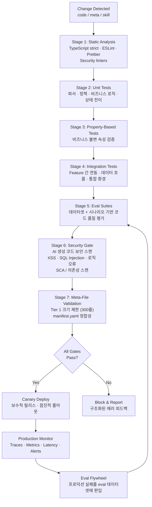

# AIDE (Agent-Informed Development Engineering) -- 에이전트 시대의 소프트웨어 개발론 v1.0

**작성**: CTO (20년+ 아키텍처 경험, 3년 AI 에이전트 실전 경험)
**기반**: GPT/Claude/Gemini 3종 딥리서치 + Team Alpha(통합파) 보고서 2종 + Team Beta(급진파) 보고서 1종
**날짜**: 2026-02-18

---

## Part 5: CI/CD 파이프라인

### AIDE CI/CD 다이어그램



### Eval Flywheel 개념

Eval Flywheel은 **프로덕션에서 발견된 실패를 자동으로 eval 데이터셋에 편입하여 회귀를 방지**하는 순환 개선 루프다:

1. **프로덕션 모니터링**: 로그/메트릭에서 에러/이상 동작 탐지
2. **실패 케이스 수집**: 해당 입력/컨텍스트/기대 결과를 구조화
3. **Eval 데이터셋 편입**: `evals/datasets/`에 새 테스트 케이스 추가
4. **CI에서 자동 실행**: 다음 배포부터 해당 케이스가 게이트에 포함
5. **점진적 품질 향상**: 시간이 지날수록 eval 데이터셋이 풍부해지고 회귀 방지력이 강화

```yaml
# evals/datasets/production-failures.yaml
- id: "PF-2026-0218-001"
  source: "production_log_abc123"
  discovered_at: "2026-02-18T10:30:00Z"
  scenario:
    feature: "cart"
    action: "장바구니 합계 계산에서 할인율 적용 오류"
    input:
      items:
        - unit_price: 10000
          quantity: 2
          discount_rate: 15
  expected_behavior:
    - "할인 적용 후 금액: 17000원"
    - "총액이 음수가 되면 안 됨"
  actual_behavior: "할인율을 100분율이 아닌 소수점으로 처리하여 금액 오류"
  severity: "high"
  fix_applied: "logic.ts의 calculate_item_price 함수 수정"
```

### 보안 게이트

보안 게이트는 CI/CD의 **Stage 6**에서 실행되며, 다음을 포함한다:

1. **AI 생성 코드 보안 스캔**: XSS, SQL Injection, 로직 오류 패턴 탐지 (ESLint security plugins, Semgrep 등)
2. **인증/인가 검증**: 모든 API 엔드포인트에 적절한 인증 미들웨어가 적용되었는지 확인
3. **SCA (Software Composition Analysis)**: npm 패키지, 외부 의존성의 취약점 스캔
4. **민감 데이터 노출 검사**: 로그, 응답에 민감 정보(비밀번호, 토큰, 개인정보)가 포함되지 않는지 확인

---


← Previous: [04-PRACTICAL-GUIDE](./04-PRACTICAL-GUIDE.md) | Next: [06-ADOPTION-GUIDE](./06-ADOPTION-GUIDE.md) →
