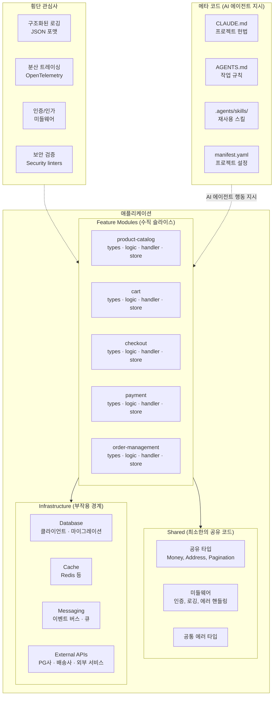
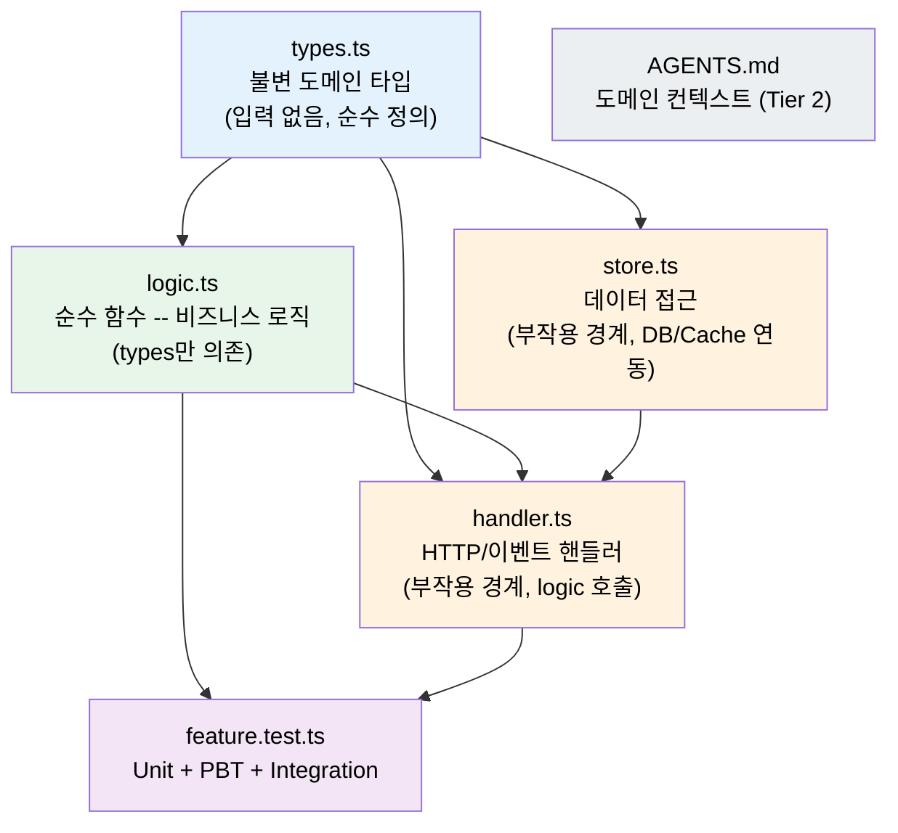
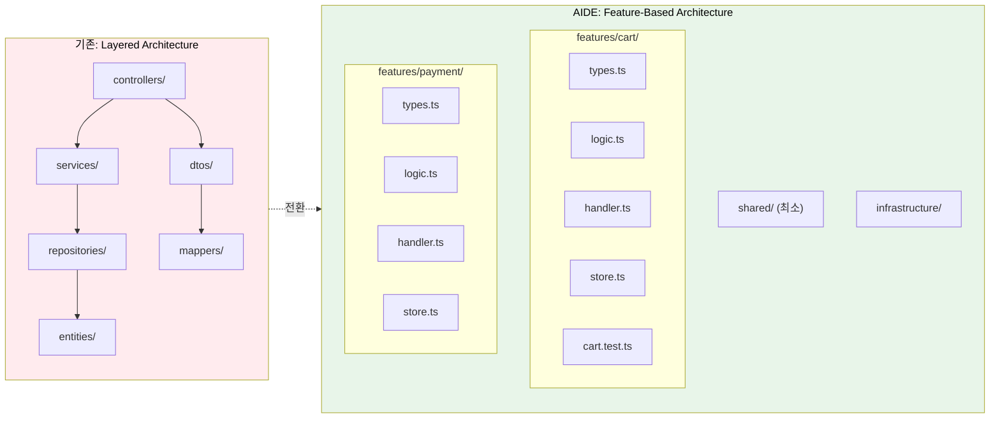
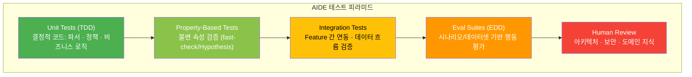
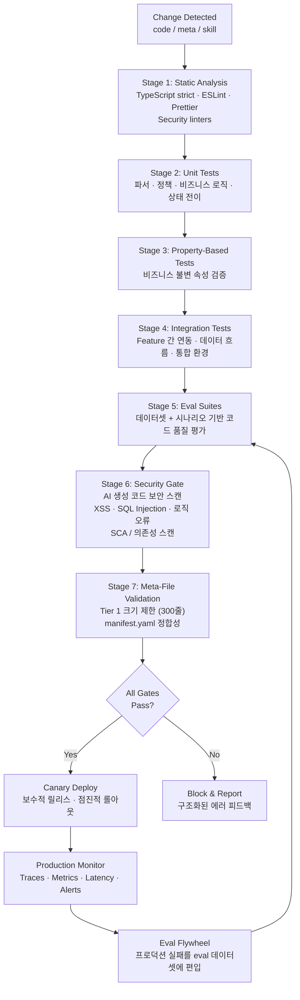

# AIDE (Agent-Informed Development Engineering) -- 에이전트 시대의 소프트웨어 개발론 v1.0

**작성**: CTO (20년+ 아키텍처 경험, 3년 AI 에이전트 실전 경험)
**기반**: GPT/Claude/Gemini 3종 딥리서치 + Team Alpha(통합파) 보고서 2종 + Team Beta(급진파) 보고서 1종
**날짜**: 2026-02-18

---

## 서문: 왜 AIDE가 필요한가

### 기존 개발론의 한계와 AI 에이전트 시대의 새로운 제약

소프트웨어 공학의 지난 50년은 **인간의 인지적 한계**를 관리하는 투쟁이었다. 밀러의 "7 +- 2" 법칙으로 대표되는 워킹 메모리의 제약이 모듈화, 추상화, 관심사 분리, DRY 원칙을 낳았다. DDD, Clean Architecture, SOLID, TDD -- 우리가 "좋은 소프트웨어 공학"이라 부르는 모든 것은 이 생물학적 제약에 대한 방어 기제였다.

2025~2026년, AI 에이전트가 코드의 주 생산자로 부상하면서 제약 조건이 근본적으로 바뀌었다:

| 제약 차원 | 인간 개발자 | AI 에이전트 |
|-----------|------------|------------|
| 기억 용량 | 워킹 메모리 극히 작음 (7+-2 청크) | 컨텍스트 윈도우 큼 (수십만~백만 토큰), 그러나 **Lost in the Middle** 현상으로 중간 정보 소실 |
| 반복 작업 | 피로, 실수 유발 | 피로 없음, 고속 병렬 처리 |
| 추론 방식 | 심층 논리, 인과관계 파악, 게슈탈트 인식 | 확률적 패턴 매칭, **multi-hop reasoning에서 성능 저하** |
| 취약점 | 복잡성, 지루함 | 환각(Hallucination), 긴 문맥에서의 주의력 분산, 암묵적 맥락 추론 실패 |
| 비용 모델 | 인건비 (월 단위) | 토큰 비용 (호출 단위), 컨텍스트 크기에 비례 |

기존 개발론은 이 새로운 제약을 다루지 않는다:
- **컨텍스트 윈도우 비용**: 8개 파일에 분산된 Clean Architecture 코드는 에이전트에게 컨텍스트 파편화를 유발한다
- **비결정적 실행**: 동일 입력에 다른 출력이 나올 수 있어 전통 TDD의 전제가 흔들린다
- **새로운 산출물**: AGENTS.md, CLAUDE.md, Skills 파일이 시스템 행위를 좌우하지만, 기존 개발론에는 이에 대한 관리 체계가 없다
- **새로운 위협**: AI 생성 코드의 보안 결함(XSS, SQL Injection, 로직 오류)이 빠른 속도로 코드베이스에 유입될 수 있다

### AIDE의 포지셔닝: "대체"가 아니라 "진화"

이 문서를 작성하기 위해 Team Alpha(통합파)와 Team Beta(급진파) 두 팀의 보고서를 검토했다. 양팀의 핵심 대립은 다음과 같았다:

- **Team Alpha**: "기존 개발론은 수십 년간 검증된 공학적 지혜. AI 에이전트라는 새 참여자에 맞게 재해석하고 확장하면 된다."
- **Team Beta**: "기존 개발론은 인간의 인지적 한계를 위해 만들어졌다. AI 에이전트에게는 오히려 방해. 새로운 기초가 필요하다."

**CTO의 최종 판단: AIDE는 "진화"다.** 구체적인 근거는 Part 7에서 상세히 다루지만, 핵심 논리는 이것이다:

1. **근본 문제는 사라지지 않았다.** 복잡성 관리, 변경 용이성, 품질 보증 -- 이 도전은 AI 에이전트 시대에도 유효하다. 오히려 AI가 코드를 빠르게 생성하면서 기술 부채 축적 속도도 빨라졌다 (PR당 인시던트 24% 증가, 변경 실패율 30% 증가).
2. **그러나 제약 조건은 근본적으로 달라졌다.** 컨텍스트 윈도우, 확률적 생성, 환각, 보안 취약점은 "약간의 조정"으로 대응할 수준이 아니다. 과도한 추상화와 간접 참조가 에이전트의 환각 확률을 높인다는 데이터(Factory.ai)는 무시할 수 없다.
3. **따라서 AIDE는 기존 원칙의 핵심 가치를 보존하되, 구현 방식과 우선순위를 AI 에이전트의 인지적 특성에 맞게 재정렬한다.** 이것은 "타협"이 아니라, 변화한 제약 조건에 대한 합리적 적응이다.

Tweag의 통제 실험이 이를 뒷받침한다: 스펙 우선 접근법(기존 개발론의 핵심)과 강한 리뷰 규율을 사용한 AI 보조 팀이 **45% 빠른 개발 속도**를 달성했다. 기존 원칙을 잘 적용한 팀이 AI와 함께 더 좋은 결과를 낸다. 동시에 Karpathy가 "Vibe Coding"을 1년 만에 폐기하고 "Agentic Engineering"으로 전환한 사실은, 규율 없는 AI 활용이 빠르게 한계에 부딪힌다는 것을 보여준다.

---

## Part 1: AIDE 핵심 원칙 (10개)

### 원칙 1: Context Budget Principle -- 컨텍스트 예산은 1차 설계 제약이다

> **"메모리가 프로그래밍 언어를 결정했듯, 컨텍스트 윈도우가 아키텍처를 결정한다."**

#### 배경과 근거

3개 연구 보고서 모두 **완전 합의**한 유일한 1순위 원칙이다:
- GPT 보고서: "컨텍스트 예산을 설계 입력으로" (핵심 원칙 2번, P0 요구사항)
- Claude 보고서: "컨텍스트 윈도우는 새로운 CPU"
- Gemini 보고서: "컨텍스트 공학이 새로운 희소 자원"

100만 토큰 컨텍스트 윈도우라 해도 성능이 선형적으로 유지되지 않는다. Chroma의 연구에서 18개 LLM을 측정한 결과, 입력 길이 증가에 따라 성능이 불안정해지며, **Lost in the Middle** 현상으로 중간 위치 정보가 소실된다. 도구 정의만으로도 수만 토큰이 소비되며, 이것이 추론 품질과 비용 모두를 악화시킨다.

#### 구체적 가이드라인

| 항목 | 권장 기준 | 상한 | 근거 |
|------|-----------|------|------|
| 파일 크기 | 200~300줄 | 500줄 | 300줄 = ~5,400토큰, 시스템 프롬프트+대화 이력과 합쳐도 안전 |
| 함수 크기 | 30줄 (파서/정책/래퍼) | 50줄 | 단일 추론 턴에서 완전 이해 가능한 범위 |
| 라인 길이 | 100자 | 120자 | diff 리뷰 편의성 |
| 메타 파일 (CLAUDE.md) | 200줄 | 300줄 | 지시 수 증가 시 이행률 선형 감소 |
| 기능 수정 시 로드 파일 수 | 1~2개 | 3개 | 간접 참조 비용 최소화 |

#### Team Alpha/Beta 토론 과정

이 원칙에 대해서는 **양팀 완전 합의**했다. 유일한 차이는 구현 강도에 있었다:
- **Team Alpha**: "기존 SRP와 응집도 개념의 연장선. 토큰 비용이라는 정량적 근거가 추가되었을 뿐"
- **Team Beta**: "이것이 모든 아키텍처 결정의 출발점. 기능 수정 시 로드 파일 최대 3개, 간접 참조 깊이 최대 1단계"

**CTO 판단**: Team Beta의 구체적 지표(로드 파일 수, 간접 참조 깊이)를 **권장 기준**으로 채택하되, **상한**으로 강제하지는 않는다. 인프라 계층의 DIP 구현 등에서 간접 참조가 2단계까지 필요한 경우가 있기 때문이다.

---

### 원칙 2: Locality of Behavior -- 행위의 지역성이 추상화보다 우선한다

> **"하나의 기능에 관련된 모든 코드는 물리적으로 가까이 위치해야 한다."**

#### 배경과 근거

에이전트가 하나의 기능을 수정하기 위해 8개 파일(Controller, Service, Repository, Entity, DTO, Mapper, Interface, Validator)을 탐색해야 하는 전통적 계층 구조는 컨텍스트 파편화를 유발한다. Factory.ai의 연구는 AI 에이전트가 **multi-hop reasoning**(여러 파일 간 참조를 따라가는 추론)에서 극적으로 성능이 저하됨을 보여준다.

이 원칙은 "관심사의 분리(Separation of Concerns)"를 폐기하는 것이 아니다. **분리의 축을 바꾸는 것**이다:
- 기존: 기술적 역할별 분리 (presentation / business / data)
- AIDE: 기능/도메인별 분리 (user-auth / payment / order)

#### 구체적 가이드라인

```
// AIDE 패턴: Feature-Based 구조
features/
  user-auth/
    types.ts          -- 이 기능 전용 타입/스키마 정의
    logic.ts          -- 순수 함수 비즈니스 로직
    handler.ts        -- HTTP/이벤트 핸들러 (부작용 경계)
    store.ts          -- 데이터 저장소 접근 (부작용 경계)
    user-auth.test.ts -- 이 기능의 모든 테스트
    AGENTS.md         -- 에이전트를 위한 도메인 컨텍스트 (Tier 2)
```

- 각 Feature 디렉토리는 **자가 완결적(Self-Contained)**: 에이전트가 해당 폴더만 읽으면 기능 전체를 파악 가능
- Feature 간 공유 코드는 `shared/`에 두되, **최소한으로 유지**
- Feature 내부에서 논리적 계층(순수 로직 / 부작용 경계)은 파일 단위로 분리

#### Team Alpha/Beta 토론 과정

- **Team Alpha**: "Feature 기반 구조는 Clean Architecture의 Vertical Slice Architecture와 호환 가능. 의존성 규칙은 유지하되 물리적 계층을 축소하면 된다."
- **Team Beta**: "아름다운 추상화보다 뚱뚱한 파일이 낫다. 인터페이스와 구현체를 분리하는 순간 에이전트는 두 파일을 로드해야 한다."

**CTO 판단**: Feature 기반 구조를 **기본으로 채택**한다. Team Alpha가 지적한 대로 이것은 Clean Architecture와 대립하지 않으며, Vertical Slice Architecture의 자연스러운 확장이다. 단, Feature 내부에서 types/logic/handler/store의 파일 분리는 유지한다 -- 하나의 300줄 파일이 모든 것을 담는 것보다 역할별 100줄 파일 3개가 에이전트에게도 더 명확하다. 핵심은 **Feature 경계 밖으로의 간접 참조를 최소화**하는 것이다.

---

### 원칙 3: Functional Core, Structural Shell -- 순수 함수 코어 + 구조적 쉘

> **"비즈니스 로직은 순수 함수로, 부작용은 명시적 경계에서 처리한다."**

#### 배경과 근거

3개 보고서 모두 함수형 패러다임이 AI 에이전트에게 구조적 우위를 가진다는 점에 동의했다:
- **순수 함수**는 입력이 같으면 출력이 항상 같으므로, 에이전트가 함수 블록 하나만으로 완벽한 추론이 가능하다
- **불변 데이터**는 상태 추적 없이 데이터 흐름을 체인 형태로 이해할 수 있게 한다
- **강력한 타입 시스템**은 에이전트의 환각을 컴파일 타임에 차단하는 가드레일 역할을 한다

```typescript
// [1] 데이터: 불변 구조체로 정의
type User = Readonly<{
  id: string
  email: string
  name: string
  role: 'admin' | 'member' | 'viewer'
}>

// [2] 순수 로직: 입력 -> 출력, 부작용 없음
const promote_user_to_admin = (user: User): User => ({
  ...user,
  role: 'admin'
})

// [3] 부작용 경계: 의존성 주입, 명시적 에러 핸들링
const handle_promote_user = async (
  userId: string,
  deps: { db: Database; logger: Logger }
): Promise<Result<User, Error>> => {
  const user = await deps.db.findUser(userId)
  if (!user) return err(new UserNotFoundError(userId))

  const promoted = promote_user_to_admin(user)
  await deps.db.saveUser(promoted)
  deps.logger.info({ event: 'user_promoted', userId })

  return ok(promoted)
}
```

#### 구체적 가이드라인

| 영역 | 권장 패러다임 | 클래스 사용 |
|------|--------------|------------|
| 비즈니스 로직 | 순수 함수 | 금지 |
| 도메인 모델 | 불변 데이터 구조 + 타입 | 불변 Record/Type으로 대체 |
| 인프라/IO 계층 | 함수 우선, 필요 시 클래스 | 허용 (DB 연결, 소켓 등 리소스 관리) |
| 정책/검증 | 함수형 파이프라인 | 금지 |
| 도메인 경계 정의 | DDD Bounded Context (타입 + 함수 조합) | 불요 |

#### Team Alpha/Beta 토론 과정

이 원칙은 양팀 간 **가장 격렬한 논쟁**이 벌어진 지점이다:

- **Team Alpha**: "Functional Core + OOP Shell + DDD. DDD의 Aggregate, Entity, Value Object는 도메인 지식을 구조화하는 데 여전히 유효. 불변으로 구현하되 OOP 개념은 유지해야 한다."
- **Team Beta**: "FP-only. 클래스는 상태를 숨기고 에이전트의 인지 부하를 높인다. 비즈니스 로직에 클래스를 사용하지 말라."

**CTO 판단**: 실질적 차이는 생각보다 작다. 양팀 모두 "비즈니스 로직은 순수 함수, 데이터는 불변"에 동의한다. 차이는 DDD의 Aggregate Root 같은 개념을 클래스로 표현하느냐, 타입+함수 조합으로 표현하느냐에 있다. **AIDE는 타입+함수 조합을 권장**한다. DDD의 도메인 모델링 **개념**(Bounded Context, Aggregate, Value Object)은 보존하되, **구현 방식**은 불변 타입+순수 함수로 전환한다. 이렇게 하면 Alpha의 DDD 가치와 Beta의 FP 가치가 모두 충족된다.

상속은 최대 1단계로 제한하며, 깊은 상속 트리는 어떤 경우에도 허용하지 않는다. Composition over Inheritance는 AI 시대에 더욱 강하게 적용된다.

---

### 원칙 4: Knowledge DRY, Code WET-tolerant -- 지식은 DRY, 코드는 지역성과 트레이드오프

> **"비즈니스 규칙은 반드시 한 곳에. 유틸리티 코드의 중복은 지역성을 위해 허용한다."**

#### 배경과 근거

DRY 원칙의 재해석은 3개 보고서에서 가장 넓은 의견 스펙트럼을 보인 주제다:
- GPT: 구조적 해법(카탈로그화)으로 중복 관리
- Claude: "DRY is not dead but transformed" -- AHA(Avoid Hasty Abstractions) 원칙 적용
- Gemini: WET/DAMP 적극 수용, "5줄짜리 로직이 10곳에 반복되어도 OK"

Claude 보고서가 발견한 자기모순이 핵심이다: "중복 허용 -> AI가 더 많은 코드 생성 -> 컨텍스트 윈도우 초과 -> 결국 DRY 필요." 무한한 중복 허용은 자기 파괴적이다.

#### 구체적 가이드라인

| 수준 | 전략 | 예시 | 중복 허용 한도 |
|------|------|------|---------------|
| **비즈니스 규칙** | 엄격한 DRY | "할인율 계산 공식", "가격 정책" | 0 (반드시 단일 출처) |
| **도메인 타입** | Feature 경계에서 재선언 허용 | 공유 User 타입의 Feature-local subset | 인터페이스로 참조하거나 부분 재선언 |
| **유틸리티 코드** | AHA 원칙 | 이메일 검증, 날짜 포맷 | 2~3곳 중복 허용, 4곳 이상이면 추출 검토 |
| **보일러플레이트** | 구조화된 중복 허용 | try-catch 패턴, 로깅 패턴 | 제한 없음 (패턴 앵커 역할) |

**중복 관리 체계**:
- 의식적 중복(Conscious Duplication): 중복할 때 **그 이유를 주석으로 명시**
- 드리프트 감지: CI에서 에이전트 기반 중복 코드 드리프트 탐지를 자동화
- 정기 리뷰: 분기별로 중복 코드의 일관성을 검증

#### Team Alpha/Beta 토론 과정

- **Team Alpha**: "Knowledge DRY + Code AHA. 중복은 의식적으로 허용하되, 가시적 관리가 전제. Gemini의 '10곳에 5줄 중복도 OK'는 극단적."
- **Team Beta**: "적극적 WET/DAMP. 각 파일의 자가 완결성이 최우선. 추상화를 통한 공유는 간접 참조 비용을 수반하므로 최소화해야."

**CTO 판단**: Team Alpha의 "Knowledge DRY + Code AHA"를 채택한다. 핵심 논거:
1. Beta가 인정하듯 중복 코드의 무한 허용은 결국 컨텍스트 윈도우를 초과시켜 자기 모순에 빠진다
2. 그러나 Alpha도 인정하듯 과도한 추상화(모든 3줄 유틸을 공통 모듈로 추출)는 에이전트에게 해로운 간접 참조를 만든다
3. 따라서 "비즈니스 지식은 DRY, 유틸리티 코드는 AHA 기준으로 의식적 중복 허용"이 균형점이다

---

### 원칙 5: Test as Specification -- 테스트는 사양 언어다

> **"테스트는 검증 도구가 아니라 에이전트에게 의도를 전달하는 사양서다. TDG + PBT + EDD의 삼중 체계를 적용한다."**

#### 배경과 근거

Claude 보고서의 핵심 통찰: "TDD는 AI 시대에 더 중요해진다. 테스트가 prompt engineering이 된다." Matthews & Nagappan의 학술 검증에서도 테스트와 함께 문제를 제시하면 GPT-4와 Llama 3 모두에서 코드 생성 품질이 향상됨을 확인했다.

Property-Based Testing(PBT)의 혁신적 효과 (Claude 보고서):
- TDD 대비 23.1~37.3% 상대 향상
- Hard 태스크에서 직접 코드 생성 1.1% 정확도 vs 속성 검증 생성 48.9% 정확도
- LLM은 정확한 코드보다 **정확성 속성(property)을 정의하는 데 훨씬 뛰어남**

#### 구체적 가이드라인

**삼중 테스트 체계:**

```
                     +------------------+
                     |   Human Review   |  아키텍처, 보안, 도메인 지식
                     +------------------+
                    +--------------------+
                    |  Eval Suites (EDD) |  시나리오/데이터셋 기반 행동 평가
                    +--------------------+
                  +------------------------+
                  | Integration Tests      |  AI 생성 코드의 통합 검증
                  +------------------------+
                +----------------------------+
                | Property-Based Tests (PBT) |  불변 속성 검증
                +----------------------------+
              +--------------------------------+
              | Unit Tests (TDD)               |  결정적 코드: 파서, 정책, 도구 래퍼
              +--------------------------------+
```

| 테스트 유형 | 대상 | 도구 | 작성 주체 |
|-------------|------|------|-----------|
| **Unit (TDD)** | 결정적 코드 -- 파서, 정책, 상태 전이, 도구 래퍼 | Jest/Vitest/pytest | 인간 스펙 -> AI 구현 |
| **PBT** | 비즈니스 불변 속성 -- "총액은 항상 >= 0", "정렬 후 순서 보존" | fast-check/Hypothesis | 인간이 속성 정의, AI가 생성 |
| **Integration** | AI가 생성한 코드의 통합 시나리오 -- Feature 간 연동, 데이터 흐름 검증 | 커스텀 테스트 프레임워크 | AI 생성, 인간 리뷰 |
| **Eval (EDD)** | 모델 출력 품질 -- 정확도, 안전성, 유용성 | 커스텀 eval 프레임워크 | 인간 설계 + 프로덕션 실패 편입 |
| **Security** | AI 생성 코드의 보안 취약점(XSS, SQL Injection, 로직 오류) | OWASP 기반 시나리오 + Security linters | 보안팀 설계, 자동 실행 |

**확인 편향 방지 필수**: AI가 테스트와 구현을 모두 작성할 때 "버그를 검증하는 테스트"가 만들어질 위험이 있다. 테스트 작성과 코드 작성에 **다른 모델을 사용**하거나, **인간이 테스트 사양을 리뷰**해야 한다.

#### Team Alpha/Beta 토론 과정

- **Team Alpha**: "TDG(Test-Driven Generation) + PBT + EDD 확장. TDD를 폐기하지 않고 AI 시대에 맞게 확장."
- **Team Beta**: "이중 체계 -- 결정론적 코드에는 Traditional TDD, 확률적 행동에는 EDD. PBT 적극 도입."

**CTO 판단**: 실질적으로 **거의 동일한 제안**이다. 양팀의 테스트 전략을 합쳐서 위의 삼중 체계를 확정한다. 유일한 차이는 명칭뿐이었다.

---

### 원칙 6: Progressive Disclosure -- 정보의 단계적 공개

> **"에이전트에게 모든 정보를 한꺼번에 주지 말라. 필요할 때 필요한 만큼만 제공하라."**

#### 배경과 근거

GPT 보고서의 스킬 점진적 로딩, Claude 보고서의 3-Tier Progressive Disclosure, Gemini 보고서의 동적 정보 로딩이 모두 같은 원리를 말한다: **운영체제의 가상 메모리처럼, 모든 것을 물리 메모리에 올리지 않고 필요할 때 로드한다.**

#### 구체적 가이드라인

**메타 파일 3-Tier 체계:**

| Tier | 파일 | 역할 | 크기 제한 | 로딩 방식 |
|------|------|------|-----------|-----------|
| **Tier 1: 헌법** | `CLAUDE.md` / `AGENTS.md` (루트) | 프로젝트 정체성, 절대 규칙, 아키텍처 맵 | 300줄 이내 | 항상 로딩 |
| **Tier 2: 지역법** | 하위 디렉토리의 `AGENTS.md` | 컴포넌트별 패턴, 도메인 컨텍스트 | 200줄 이내 | 해당 디렉토리 작업 시 Lazy 로딩 |
| **Tier 3: 기술서** | `.agents/skills/*/SKILL.md` | 절차적 지식, 워크플로 가이드 | YAML frontmatter + 본문 | On-demand 로딩 |

**의존성/라이브러리 정보의 단계적 제공:**

프로젝트에서 사용하는 외부 라이브러리와 내부 공유 모듈의 정보를 에이전트에게 전달할 때도 단계적 접근이 필요하다:

| 단계 | 제공 정보 | 용도 |
|------|-----------|------|
| **요약** | 라이브러리 이름 + 버전 + 한 줄 용도 설명 | 에이전트가 프로젝트 전체 기술 스택을 파악 |
| **API 시그니처** | 사용 중인 함수/타입의 시그니처만 | 에이전트가 해당 라이브러리와 연동하는 코드를 작성할 때 |
| **상세 문서** | 예제 코드, 설정 방법, 주의사항 | 에이전트가 새로운 연동을 구축하거나 트러블슈팅할 때 |

핵심은 "모든 라이브러리의 전체 문서를 컨텍스트에 로드하지 않는 것"이다. 필요한 깊이의 정보만 필요한 시점에 제공하면 컨텍스트 예산을 효율적으로 사용할 수 있다.

#### Team Alpha/Beta 토론 과정

**양팀 완전 합의**. 구현 세부사항도 거의 동일했다. 3-Tier 메타 파일 체계와 단계적 정보 제공 원칙을 결합하여 위 체계를 확정했다.

---

### 원칙 7: Deterministic Guardrails -- 확률적 생성에 결정론적 가드레일

> **"AI 에이전트를 믿되, 검증하라. 그리고 검증은 반드시 결정론적이어야 한다."**

#### 배경과 근거

AI 생성 코드의 보안 실태 (Claude 보고서, Veracode 2025):
- 생성 코드의 **약 45%에 보안 결함** 포함
- 로직 에러 발생률 인간 대비 **1.75배**
- XSS 취약점 **2.74배**
- **모델 크기와 무관** -- 더 똑똑한 모델이 더 안전한 코드를 만드는 것이 아님

이 데이터는 "에이전트에게 '잘 하라'고 프롬프트하는 것"이 불충분함을 명확히 보여준다. 결정론적 도구가 에이전트의 출력을 검증해야 한다.

#### 구체적 가이드라인

```
확률적 생성(AI)  ──→  결정론적 검증  ──→  통과/실패
                        │
                        ├── TypeScript strict mode (타입 검증)
                        ├── ESLint/Prettier (스타일 강제)
                        ├── Zod/io-ts (런타임 타입 검증)
                        ├── Pre-commit hooks (자동 실행)
                        ├── Security linters (보안 검증)
                        └── CI test suite (회귀 방지)
```

**절대 규칙**: "린터가 할 수 있는 일을 프롬프트에 맡기지 말라" (Claude 보고서: "never send an LLM to do a linter's job"). 스타일 강제, 타입 검증, 보안 패턴 탐지는 모두 결정론적 도구에 위임한다.

**Self-Healing Loop** (Gemini 보고서의 Reflexion Pattern):
```
Generate -> Compile/Lint -> Test -> Analyze Errors -> Regenerate -> ...
```

이 루프가 효과적으로 작동하려면 에러 메시지가 **기계 판독 가능한 구조화된 형태(JSON)**로 제공되어야 한다.

#### Team Alpha/Beta 토론 과정

**양팀 완전 합의**. Team Beta가 이 원칙을 가장 강조하며 "나를 믿되 검증하라"는 직관적 표현을 제시했고, Team Alpha도 이에 동의했다.

---

### 원칙 8: Observability as Structure -- 관찰가능성은 구조의 일부

> **"AI가 생성한 코드에는 구조화된 로깅과 트레이싱이 기본 포함되어야 한다. 관찰가능성은 1급 시민이다."**

#### 배경과 근거

3개 보고서 **완전 합의**: AI가 빠르게 생성하는 코드의 "왜 이렇게 동작하는지"를 추적할 수 없으면 운영과 디버깅이 불가능하다. AI 에이전트가 코드를 생성할 때 관찰가능성을 구조적으로 내장하도록 해야 한다.

- GPT 보고서: Observability를 아키텍처의 횡단 관심사로 포함
- Claude 보고서: 트레이싱 기본 ON, 개발 단계부터 trace 필수
- Gemini 보고서: 시맨틱 로깅(JSON-LD) 표준 채택

#### 구체적 가이드라인

```typescript
// 구조화된 로그 포맷 -- AI가 생성하는 모든 코드에 포함되어야 함
type StructuredLog = {
  level: 'info' | 'warning' | 'error' | 'critical'
  timestamp: string       // ISO 8601
  service: string         // 서비스/Feature 식별
  event: string           // 비즈니스 이벤트명
  trace_id: string        // 분산 트레이싱 ID
  span_id: string         // 현재 작업 단위 ID
  data: Record<string, unknown>  // 구조화된 부가 데이터
}

// 사용 예시: 이커머스 결제 처리
const handle_payment = async (
  order_id: string,
  deps: { db: Database; pg: PaymentGateway; logger: Logger }
): Promise<Result<PaymentResult, Error>> => {
  deps.logger.info({
    event: 'payment_initiated',
    data: { order_id }
  })

  const result = await deps.pg.charge(order_id)

  if (result.success) {
    deps.logger.info({
      event: 'payment_completed',
      data: { order_id, transaction_id: result.transaction_id }
    })
  } else {
    deps.logger.error({
      event: 'payment_failed',
      data: { order_id, reason: result.error }
    })
  }

  return result
}
```

**핵심 가이드라인:**
- **분산 트레이싱 기본 적용**: `trace_id` -> `span_id`로 요청 흐름을 추적. OpenTelemetry 등 표준 활용
- **개발 단계부터 기본 ON**: 프로덕션에서만이 아니라 로컬 개발에서도 구조화된 로그 활성화
- **비용/성능 메트릭**: API 응답 시간, DB 쿼리 수, 외부 API 호출 수를 실시간 추적
- **AI 생성 코드의 관찰가능성 필수화**: 에이전트에게 코드를 요청할 때, CLAUDE.md에 "모든 handler에 구조화된 로깅을 포함할 것"을 명시

#### Team Alpha/Beta 토론 과정

**양팀 완전 합의**. 관찰가능성은 소프트웨어 운영의 기본이며, AI가 생성하는 코드에서 더욱 중요해진다는 데 이견이 없었다.

---

### 원칙 9: Security by Structure -- 구조적 보안 검증

> **"AI가 생성한 코드의 45%에 보안 결함이 있다. 보안 검증은 구조적으로 내장되어야 한다."**

#### 배경과 근거

AI가 코드의 주 생산자가 되면서 보안 위협의 양상이 달라졌다. AI 생성 코드 자체의 보안 취약점이 핵심 위협이다:

- Veracode 2025: AI 생성 코드의 약 45%에 보안 결함 포함
- XSS 취약점 인간 대비 2.74배, 로직 에러 1.75배
- 모델 크기와 보안 품질은 비례하지 않음

#### 구체적 가이드라인

**위협-통제 매핑:**

| 위협 | 대표 시나리오 | 방어 지점 | 권장 통제 |
|------|-------------|-----------|-----------|
| SQL Injection | AI가 parameterized query 대신 문자열 결합 생성 | Security linter + Code review | 린터 규칙으로 raw query 사용 탐지, ORM/Query Builder 강제 |
| XSS | AI가 사용자 입력 이스케이프 누락 | Security linter + 템플릿 엔진 | 자동 이스케이프 프레임워크 사용 강제, DOMPurify 등 |
| 로직 오류 | 권한 검증 누락, 경계 조건 미처리 | PBT + Integration test | Property-Based Testing으로 불변 속성 검증 |
| 인증/인가 결함 | AI가 인증 미들웨어 적용을 누락 | 아키텍처 강제 | 인증 미들웨어를 라우터 수준에서 기본 적용, 명시적 opt-out만 허용 |
| 의존성 취약점 | AI가 취약한 버전의 패키지 추가 | SCA (Software Composition Analysis) | npm audit, Snyk 등 자동 스캔 |

**보안 3원칙:**
1. **자동화된 보안 검증**: AI가 생성한 모든 코드에 대해 security linter를 CI에서 자동 실행
2. **보안 리뷰 필수화**: 인증, 결제, 개인정보 관련 코드 변경은 반드시 보안 리뷰를 거침
3. **감사 추적(Audit Trail)**: 민감한 데이터 접근과 상태 변경은 모두 구조화된 로그에 기록

#### Team Alpha/Beta 토론 과정

**양팀 완전 합의**. 보안은 타협의 여지가 없는 영역이다.

---

### 원칙 10: Meta-Code as First-Class -- 메타 코드를 1급 시민으로

> **"AGENTS.md, CLAUDE.md, Skills 파일은 소스 코드와 동등한 엄격도로 버전 관리하고 테스트한다."**

#### 배경과 근거

- AGENTS.md가 **60,000+ 오픈소스 프로젝트**에서 사용 (Linux Foundation 산하 Agentic AI Foundation이 관리)
- 연구에 따르면 프롬프트/컨텍스트가 보존되지 않는 관행이 재현성을 약화시킴
- 메타 파일의 한 줄 변경이 에이전트의 전체 행동을 바꿀 수 있으므로, **코드보다 더 높은 영향력**을 가질 수 있음

#### 구체적 가이드라인

**메타 코드 관리 원칙:**
1. **버전 관리**: Git에서 코드와 동일한 워크플로 -- PR, 코드 리뷰, 변경 로그, 릴리스 태그
2. **변경 시 Eval 실행**: 메타 파일 변경은 CI에서 자동으로 eval suite 실행 (행동 회귀 감지)
3. **크기 감시**: Tier 1 파일이 300줄을 넘으면 CI에서 경고/차단
4. **부정 명령문 활용**: "무엇을 하지 말라"가 종종 더 명확하고 위반 감지가 쉬움
5. **예시 기반 지시**: 추상적 원칙보다 구체적 코드 예시가 에이전트의 출력 품질을 극적으로 높임

**manifest.yaml로 전체 구성 고정:**

```yaml
# manifest.yaml
spec_version: "1.0"
project_name: "my-ecommerce"
project_type: "backend"

tech_stack:
  language: "typescript"
  runtime: "node"
  framework: "express"
  database: "postgresql"
  cache: "redis"

ai_development:
  primary_model: "claude-opus-4-6"
  instruction_files:
    tier1: ["CLAUDE.md", "AGENTS.md"]
    tier2_pattern: "src/features/*/AGENTS.md"

code_standards:
  max_file_lines: 300
  max_function_lines: 50
  paradigm: "functional-core"
  type_strictness: "strict"

testing:
  unit: "vitest"
  property: "fast-check"
  e2e: "playwright"

observability:
  logging: "structured_json"
  tracing: true
```

#### Team Alpha/Beta 토론 과정

**양팀 완전 합의**. Gemini의 "메타 제어 평면(Meta-Control Plane)" 개념을 양팀 모두 수용했다.

---

## Part 2: AIDE 아키텍처 패턴

### 핵심 아키텍처 원칙

AIDE는 **Feature-Based Vertical Slice Architecture**를 기본으로 채택한다.
기존의 수평적 계층 분리(Controller/Service/Repository)를 수직적 기능 단위 분리로 전환하되,
각 Feature 내부에서는 Functional Core + Imperative Shell 패턴을 적용한다.

### AIDE 아키텍처 개요



### Feature 내부 구조

각 Feature 디렉토리는 **자가 완결적**이며, 내부에서 명확한 의존성 방향을 가진다:



**의존성 규칙:**
- `types.ts`는 어디에도 의존하지 않는다 (순수 타입 정의)
- `logic.ts`는 `types.ts`에만 의존한다 (순수 함수, 부작용 없음)
- `handler.ts`는 `logic.ts`와 `store.ts`를 조합한다 (부작용 경계)
- `store.ts`는 `types.ts`에 의존하고, infrastructure에 접근한다 (부작용 경계)

### 도메인별 프로젝트 구조 예시

#### 이커머스 백엔드 (TypeScript/Node.js)

```
project/
├── CLAUDE.md                          # 프로젝트 헌법
├── AGENTS.md                          # 작업 규칙
├── manifest.yaml                      # 프로젝트 설정
│
├── src/
│   ├── features/
│   │   ├── product-catalog/
│   │   │   ├── types.ts               # Product, Category 등 도메인 타입
│   │   │   ├── logic.ts               # 가격 계산, 재고 확인, 필터링 순수 함수
│   │   │   ├── handler.ts             # GET /products, POST /products
│   │   │   ├── store.ts               # DB 접근 (products 테이블)
│   │   │   ├── product-catalog.test.ts
│   │   │   └── AGENTS.md              # 상품 도메인 비즈니스 규칙
│   │   ├── cart/
│   │   │   ├── types.ts
│   │   │   ├── logic.ts               # 장바구니 합계 계산, 쿠폰 적용
│   │   │   ├── handler.ts
│   │   │   ├── store.ts
│   │   │   └── cart.test.ts
│   │   ├── checkout/
│   │   ├── payment/
│   │   ├── order-management/
│   │   ├── user-auth/
│   │   └── shipping/
│   │
│   ├── shared/
│   │   ├── types/                     # 공유 도메인 타입 (Money, Address 등)
│   │   ├── middleware/                # 인증, 로깅, 에러 핸들링
│   │   └── errors/                    # 공통 에러 타입
│   │
│   └── infrastructure/
│       ├── database/                  # DB 클라이언트, 마이그레이션
│       ├── cache/                     # Redis 등 캐시
│       ├── messaging/                 # 이벤트 버스, 큐
│       └── external-apis/             # PG사, 배송사 연동
│
├── .agents/skills/                    # AI 에이전트 스킬
├── evals/                             # 평가 데이터셋
└── tests/
    ├── integration/
    └── e2e/
```

#### 금융/증권 백엔드 (TypeScript/Node.js)

```
project/
├── CLAUDE.md
├── AGENTS.md
├── manifest.yaml
│
├── src/
│   ├── features/
│   │   ├── account/                   # 계좌 관리
│   │   ├── trading/                   # 주문 체결
│   │   │   ├── types.ts               # Order, Position, Quote
│   │   │   ├── logic.ts               # 주문 검증, 수수료 계산, 증거금 확인
│   │   │   ├── handler.ts             # POST /orders, GET /positions
│   │   │   ├── store.ts
│   │   │   ├── trading.test.ts
│   │   │   └── AGENTS.md              # 트레이딩 도메인 규칙 (규제 요건 포함)
│   │   ├── portfolio/                 # 포트폴리오 분석
│   │   ├── market-data/               # 시세 데이터
│   │   ├── risk-assessment/           # 리스크 관리
│   │   ├── settlement/                # 결제/정산
│   │   └── compliance/                # 규정 준수
│   │
│   ├── shared/
│   │   ├── types/                     # Money, SecurityId 등
│   │   └── middleware/
│   │
│   └── infrastructure/
│       ├── database/
│       ├── market-feed/               # 실시간 시세 연동
│       └── regulatory-api/            # 금융 규제 API
│
├── .agents/skills/
├── evals/
└── tests/
    ├── integration/
    └── e2e/
```

#### 프론트엔드 (Next.js)

```
project/
├── CLAUDE.md
├── AGENTS.md
├── manifest.yaml
│
├── src/
│   ├── features/
│   │   ├── product-listing/
│   │   │   ├── types.ts
│   │   │   ├── hooks.ts               # useProducts, useFilters
│   │   │   ├── components/            # ProductCard, ProductGrid, FilterPanel
│   │   │   ├── api.ts                 # API 호출 함수
│   │   │   ├── product-listing.test.ts
│   │   │   └── AGENTS.md
│   │   ├── cart/
│   │   ├── checkout/
│   │   └── user-profile/
│   │
│   ├── shared/
│   │   ├── components/                # Button, Modal, Form 등 공통 UI
│   │   ├── hooks/                     # useAuth, useToast 등
│   │   └── types/
│   │
│   ├── app/                           # Next.js App Router
│   └── styles/
│
├── .agents/skills/
├── evals/
└── tests/
    └── e2e/
```

### TypeScript 코드 패턴 예시

이커머스의 "장바구니" 기능을 예시로, AIDE의 Feature 내부 코드 패턴을 보여준다.

```typescript
// features/cart/types.ts -- 불변 도메인 타입
type CartItem = Readonly<{
  product_id: string
  product_name: string
  unit_price_in_krw: number
  quantity: number
  discount_rate_percent: number
}>

type Cart = Readonly<{
  id: string
  user_id: string
  items: ReadonlyArray<CartItem>
  coupon_code?: string
}>

type CartSummary = Readonly<{
  subtotal_in_krw: number
  discount_total_in_krw: number
  shipping_fee_in_krw: number
  total_in_krw: number
}>
```

```typescript
// features/cart/logic.ts -- 순수 함수만
const calculate_item_price = (item: CartItem): number =>
  item.unit_price_in_krw * item.quantity * (1 - item.discount_rate_percent / 100)

const calculate_subtotal = (items: ReadonlyArray<CartItem>): number =>
  items.reduce((sum, item) => sum + calculate_item_price(item), 0)

const calculate_shipping_fee = (subtotal: number): number =>
  subtotal >= 50000 ? 0 : 3000  // 5만원 이상 무료배송

const calculate_cart_summary = (cart: Cart): CartSummary => {
  const subtotal = calculate_subtotal(cart.items)
  const shipping = calculate_shipping_fee(subtotal)
  return {
    subtotal_in_krw: subtotal,
    discount_total_in_krw: 0, // 쿠폰 로직은 별도
    shipping_fee_in_krw: shipping,
    total_in_krw: subtotal + shipping,
  }
}
```

```typescript
// features/cart/handler.ts -- 부작용 경계
const handle_get_cart_summary = async (
  req: Request,
  deps: { db: Database; logger: Logger }
): Promise<Response<CartSummary>> => {
  const cart = await deps.db.find_cart_by_user(req.userId)
  if (!cart) return error_response(404, 'Cart not found')

  const summary = calculate_cart_summary(cart)
  deps.logger.info({ event: 'cart_summary_calculated', userId: req.userId })

  return ok_response(summary)
}
```

```typescript
// features/cart/store.ts -- 데이터 접근 (부작용 경계)
type CartStore = {
  readonly find_cart_by_user: (user_id: string) => Promise<Cart | null>
  readonly save_cart: (cart: Cart) => Promise<void>
  readonly delete_cart: (cart_id: string) => Promise<void>
}

const create_cart_store = (db: Database): CartStore => ({
  find_cart_by_user: async (user_id) => {
    const row = await db.query('SELECT * FROM carts WHERE user_id = $1', [user_id])
    return row ? map_row_to_cart(row) : null
  },
  save_cart: async (cart) => {
    await db.query(
      'INSERT INTO carts (id, user_id, items) VALUES ($1, $2, $3) ON CONFLICT (id) DO UPDATE SET items = $3',
      [cart.id, cart.user_id, JSON.stringify(cart.items)]
    )
  },
  delete_cart: async (cart_id) => {
    await db.query('DELETE FROM carts WHERE id = $1', [cart_id])
  },
})
```

```typescript
// features/cart/cart.test.ts -- 테스트
import { describe, it, expect } from 'vitest'
import { fc } from '@fast-check/vitest'
import { calculate_item_price, calculate_cart_summary, calculate_shipping_fee } from './logic'

describe('calculate_item_price', () => {
  it('할인 없는 상품의 가격을 올바르게 계산한다', () => {
    const item: CartItem = {
      product_id: 'p1',
      product_name: '테스트 상품',
      unit_price_in_krw: 10000,
      quantity: 3,
      discount_rate_percent: 0,
    }
    expect(calculate_item_price(item)).toBe(30000)
  })

  it('할인율을 올바르게 적용한다', () => {
    const item: CartItem = {
      product_id: 'p1',
      product_name: '할인 상품',
      unit_price_in_krw: 10000,
      quantity: 2,
      discount_rate_percent: 10,
    }
    expect(calculate_item_price(item)).toBe(18000) // 20000 * 0.9
  })
})

describe('calculate_shipping_fee', () => {
  it('5만원 이상이면 무료배송', () => {
    expect(calculate_shipping_fee(50000)).toBe(0)
    expect(calculate_shipping_fee(100000)).toBe(0)
  })

  it('5만원 미만이면 3000원 배송비', () => {
    expect(calculate_shipping_fee(49999)).toBe(3000)
    expect(calculate_shipping_fee(0)).toBe(3000)
  })
})

// Property-Based Test
describe('cart summary properties', () => {
  fc.test.prop([
    fc.array(fc.record({
      product_id: fc.string(),
      product_name: fc.string(),
      unit_price_in_krw: fc.nat({ max: 1000000 }),
      quantity: fc.integer({ min: 1, max: 100 }),
      discount_rate_percent: fc.integer({ min: 0, max: 100 }),
    }))
  ])('총액은 항상 0 이상이어야 한다', (items) => {
    const cart: Cart = { id: 'c1', user_id: 'u1', items }
    const summary = calculate_cart_summary(cart)
    expect(summary.total_in_krw).toBeGreaterThanOrEqual(0)
  })
})
```

### 기존 아키텍처와의 비교



| 비교 항목 | 기존 Layered Architecture | AIDE Feature-Based |
|-----------|--------------------------|-------------------|
| **파일 분산** | 1기능에 6~8파일 (서로 다른 디렉토리) | 1기능에 4~5파일 (같은 디렉토리) |
| **기능 수정 시 로드 파일** | 4~8개 | 1~3개 |
| **간접 참조 깊이** | 3~4단계 | 1~2단계 |
| **새 기능 추가 비용** | 6+ 파일 생성, 여러 디렉토리 수정 | 1 디렉토리 생성, 4파일 작성 |
| **AI 에이전트 컨텍스트 효율** | 낮음 (파편화) | 높음 (지역성) |
| **의존성 방향** | 수직적 (상위→하위 계층) | 수직적 (types→logic→handler) + 수평적 (Feature 간 격리) |

### manifest.yaml 예시

```yaml
spec_version: "1.0"
project_name: "my-ecommerce"
project_type: "backend"

tech_stack:
  language: "typescript"
  runtime: "node"
  framework: "express"  # 또는 fastify, nestjs 등
  database: "postgresql"
  cache: "redis"

ai_development:
  primary_model: "claude-opus-4-6"
  instruction_files:
    tier1: ["CLAUDE.md", "AGENTS.md"]
    tier2_pattern: "src/features/*/AGENTS.md"

code_standards:
  max_file_lines: 300
  max_function_lines: 50
  paradigm: "functional-core"
  type_strictness: "strict"

testing:
  unit: "vitest"
  property: "fast-check"
  e2e: "playwright"

observability:
  logging: "structured_json"
  tracing: true

skills:
  - name: "add-api-endpoint"
    path: ".agents/skills/add-api-endpoint"
    version: "1.2.0"
  - name: "db-migration"
    path: ".agents/skills/db-migration"
    version: "2.1.0"

meta_files:
  tier1_max_lines: 300
  tier2_max_lines: 200
  enforce_eval_on_change: true
```

---

## Part 3: 기존 개발론과의 관계

### 보존/변경/폐기 분류표

Team Alpha 시니어 개발자의 분석을 기반으로, CTO가 최종 판단을 추가한 분류표:

#### 아키텍처 패턴

| 원칙 | 핵심 가치 | 판정 | AIDE에서의 재해석 |
|------|-----------|------|-----------------|
| **DDD - Bounded Context** | 도메인 경계로 복잡성 관리 | **보존 (강화)** | 각 Feature 디렉토리가 하나의 Bounded Context에 대응. AGENTS.md에 도메인 용어집 포함. |
| **DDD - Ubiquitous Language** | 도메인 공통 언어 | **보존 (강화)** | AGENTS.md에 명시적 문서화 필수. 에이전트는 암묵적 지식이 없으므로. |
| **DDD - Domain Events** | 도메인 간 느슨한 결합 | **보존 (강화)** | Feature 간 통신, 관찰가능성의 기반. |
| **DDD - Aggregate** | 트랜잭션 일관성 경계 | **변경** | 불변 데이터 구조 + 이벤트 소싱으로 재구현. |
| **Clean Architecture** | Dependency Rule | **변경** | 의존성 규칙은 유지, 물리적 계층을 2~3개로 축소, Feature 기반 구조로 전환. |
| **Hexagonal Architecture** | Ports & Adapters | **변경** | 외부 서비스/DB 교체에 Adapter 가치 높아짐. Port/Adapter 파일 수 최소화. |
| **Layered Architecture** | 수평적 계층 분리 | **변경 (축소)** | Vertical Slice로 전환. 논리적 계층 개념만 유지, 물리적 계층 폴더 제거. |

#### SOLID 원칙 재정렬

AI 에이전트 시대의 SOLID 우선순위: **DIP > SRP > ISP > LSP > OCP**

| 원칙 | 기존 순위 | AIDE 순위 | 이유 |
|------|-----------|----------|------|
| **DIP (Dependency Inversion)** | 5번째 (마지막) | **1위** | LLM/도구/인프라가 수개월 단위로 교체. 추상에 의존해야 생존 가능. Feature 간 인터페이스가 DIP의 직접 구현. |
| **SRP (Single Responsibility)** | 1번째 | **2위** | AI 수정의 blast radius를 제한. 단위는 파일이 아닌 Feature/Module 수준으로 확대. |
| **ISP (Interface Segregation)** | 4번째 | **3위** | AI는 focused, minimal interface에서 더 잘 작동. 불필요한 인터페이스 노출 방지가 보안에도 기여. |
| **LSP (Liskov Substitution)** | 3번째 | **4위** | 타입 안전성의 기본. 강한 타입 시스템이 환각 방지 가드레일 역할. |
| **OCP (Open/Closed)** | 2번째 | **5위** | AI가 코드를 자유롭게 수정하므로 "변경에 닫혀야"라는 전제 약화. Plugin/Strategy에서는 여전히 유효. |

#### GoF 패턴 분류

| 분류 | 패턴 | 이유 |
|------|------|------|
| **AI 친화 (적극 활용)** | Strategy, Observer, Factory Method, Adapter, Command, Repository | 단일 책임, 명확한 인터페이스, 교체 용이성 |
| **상황적 (주의하여 사용)** | Singleton, Template Method, State, Builder | 사용 시 에이전트 컨텍스트에 충분한 문서화 필요 |
| **AI 비친화 (사용 자제)** | Visitor, 깊은 Abstract Factory 계층, 긴 Decorator 체인, 복잡한 Mediator | 복잡한 dispatch, 다중 파일 간 암묵적 관계, multi-hop reasoning 강제 |

#### DDD의 재해석

DDD는 AIDE 시대에 **더 중요해진다**. 다만 구현 방식이 변한다:

| DDD 개념 | 기존 구현 | AIDE 구현 |
|----------|-----------|----------|
| **Bounded Context** | 패키지/모듈 경계 | Feature 디렉토리 + Tier 2 AGENTS.md |
| **Aggregate Root** | 클래스 (가변 상태) | 불변 타입 + 순수 함수 (상태 전이) |
| **Entity** | 클래스 + ID | 불변 Record + ID 필드 |
| **Value Object** | 불변 클래스 | 불변 타입 리터럴 |
| **Domain Event** | 이벤트 클래스 | 타입 리터럴 + Observability 연동 |
| **Ubiquitous Language** | 구두 + 코드 | AGENTS.md에 명시적 용어집 포함 |
| **Repository** | 인터페이스 + 구현체 | Feature 내 store.ts (부작용 경계) |

---

## Part 4: AIDE 실전 가이드

### 파일/코드 크기 지침

| 구분 | 권장 | 상한 | 토큰 추정 | 비고 |
|------|------|------|-----------|------|
| Feature 로직 (logic.ts) | 150-200줄 | 300줄 | ~5,400 | 핵심 비즈니스 로직 |
| 핸들러 (handler.ts) | 100-150줄 | 200줄 | ~3,600 | 각 핸들러 함수 30줄 이내 |
| 타입 정의 (types.ts) | 50-100줄 | 150줄 | ~2,700 | 타입은 밀도가 높으므로 짧아도 충분 |
| 테스트 (*.test.ts) | 200-300줄 | 500줄 | ~9,000 | 반복 구조이므로 약간 길어도 허용 |
| 메타 파일 (CLAUDE.md) | 100-200줄 | 300줄 | ~5,400 | 지시 이행률 유지를 위한 상한 |
| 도메인 컨텍스트 (AGENTS.md, Tier 2) | 50-100줄 | 200줄 | ~3,600 | 핵심 비즈니스 규칙만 압축 |
| 함수 크기 | 20-30줄 | 50줄 | ~900 | 단일 추론 턴 내 완전 이해 |

**"18토큰/줄" 경험법칙**: 평균적으로 코드 1줄 = 약 18토큰 (Cursor IDE 연구 기반)

### 네이밍 컨벤션 가이드

Gemini 보고서의 **의미론적 장황함(Semantic Verbosity)** 원칙을 적용하되, 실용적 균형을 유지한다.

#### 핵심 규칙: 언어 고유 컨벤션 우선 (Language-Native Convention First)

AIDE는 범용적인 케이스 스타일을 강제하지 않는다. **대상 언어의 확립된 네이밍 컨벤션을 항상 따른다** (예: Python은 PEP 8, TypeScript는 ESLint camelcase, Kotlin은 Kotlin Coding Conventions). 언어 생태계에 반하는 스타일은 린터, 프레임워크, 라이브러리와 마찰을 일으키며 — 관용적 코드로 학습된 AI 에이전트와 인간 개발자 모두를 혼란시킨다.

**AIDE가 규정하는 것**은 케이스 스타일이 아닌 이름의 *의미론적 내용*이다:

| 규칙 | 설명 | 예시 (TS) | 예시 (Python) | 반례 |
|------|------|-----------|---------------|------|
| 함수는 동사+목적어 | 이름이 동작과 대상을 기술 | `calculateOrderTotalInKrw()` | `calculate_order_total_in_krw()` | `calc(d)` |
| 변수는 의미 포함 | 이름이 목적을 전달 | `activeUserIdList` | `active_user_id_list` | `ids` |
| 부작용 명시 | 접두사로 부작용을 표시 | `persistUserToDatabase()` | `persist_user_to_database()` | `save()` |
| 타입은 명사 | 타입명은 서술적 명사 | `OrderItem` | `OrderItem` | `OI` |
| 상수에 출처 포함 | 상수명에 원천을 포함 | `MAX_LOGIN_ATTEMPTS_PER_POLICY` | `MAX_LOGIN_ATTEMPTS_PER_POLICY` | `MAX` |
| 파일명 | 언어 컨벤션에 따름 | `user-auth.ts` | `user_auth.py` | `ua.ts` |

**핵심 원칙**: 변수명과 함수명은 에이전트에게 **추론의 입력**이다. 이름이 구체적일수록 에이전트가 잘못 사용할 확률이 기하급수적으로 낮아진다. 이 원칙은 어떤 케이스 스타일에서든 동일하게 적용된다. 단, `calculatedTotalPriceWithDiscountAppliedInKrw` 수준의 극단적 장황함은 라인 길이 제한과 충돌하므로 실용적 범위를 유지한다.

### CLAUDE.md 작성 가이드 (템플릿)

```markdown
# Project: [프로젝트명]

## Identity
- Type: [프로젝트 타입, e.g. Next.js 14 Monorepo]
- Language: TypeScript (Strict Mode)
- Paradigm: Functional core, classes only for infrastructure
- State: [상태 관리 도구, e.g. Zustand]

## Absolute Rules (MUST FOLLOW)
- 비즈니스 로직에 class를 사용하지 말 것
- 모든 함수 매개변수와 반환값에 타입을 명시할 것
- any 타입을 사용하지 말 것
- features/ 외부에서 features/ 내부를 직접 import하지 말 것
- 새로운 npm 패키지 추가 전 반드시 확인을 받을 것
- [프로젝트 특화 규칙 추가]

## Architecture Map
features/: 기능별 독립 모듈 (types + logic + handler + store + test)
shared/:   전역 타입, 인프라 클라이언트, 공통 에러 (최소 유지)
evals/:    평가 데이터셋 및 시나리오
.agents/:  스킬 패키지

## Code Style
- 네이밍: 언어 고유 컨벤션 우선 (예: TS는 camelCase, Python은 snake_case)
- 네이밍 내용: 함수는 동사_목적어, 변수는 의미 포함, 부작용 접두사 명시
- 타입명: PascalCase
- 파일: kebab-case (또는 언어 컨벤션, 예: Python은 snake_case.py)
- 최대 파일 길이: 300줄 (경고), 500줄 (금지)
- 함수: 50줄 이내

## Workflow
1. types.ts 먼저 정의/수정
2. logic.ts에 순수 함수 구현
3. *.test.ts에 테스트 작성
4. handler.ts에서 부작용 통합
5. 린트 + 테스트 + 타입 체크 통과 확인

## Domain Glossary
- [도메인 용어1]: [정의]
- [도메인 용어2]: [정의]

## Examples
- Good pattern: src/features/user-auth/logic.ts
- Anti-pattern: (해당 없으면 생략)
```

### AIDE-REFERENCE.md 프로젝트 통합 가이드

[AIDE-REFERENCE.md](../../AIDE-REFERENCE.md)는 10대 핵심 원칙, Feature 아키텍처, 코드 스타일, 워크플로우를 하나의 파일(~240줄)로 요약한 독립형 빠른 참조 문서다. AI 에이전트가 AIDE를 일관되게 따르도록 하는 데 활용한다.

#### Option A: 별도 참조 파일 (권장)

`AIDE-REFERENCE.md`를 프로젝트 루트에 복사하고 `CLAUDE.md`에서 참조한다:

```markdown
# CLAUDE.md

## Methodology
이 프로젝트는 AIDE 방법론을 따릅니다. 전체 참조는 AIDE-REFERENCE.md를 참고하세요.

## Project-Specific Rules
- [프로젝트 고유 규칙 추가]
```

**작동 원리**: AI 에이전트(Claude, Cursor 등)는 CLAUDE.md에서 참조된 파일을 자동으로 로드한다. AIDE 규칙을 별도 파일로 분리하면 CLAUDE.md의 라인 예산을 프로젝트 고유 컨텍스트에 사용할 수 있다. AIDE-REFERENCE.md(~240줄)는 단독으로도 Tier 1 제한(300줄) 내에 들어간다.

#### Option B: CLAUDE.md에 직접 포함

소규모 프로젝트에서는 관련 섹션을 CLAUDE.md에 직접 복사한다:

```markdown
# CLAUDE.md

## Methodology: AIDE

### Core Principles
[AIDE-REFERENCE.md에서 필요한 원칙 붙여넣기]

### Code Style
[AIDE-REFERENCE.md에서 코드 스타일 섹션 붙여넣기]

## Project-Specific Rules
- [프로젝트 규칙 추가]
```

**트레이드오프**: 설정이 간단하지만 CLAUDE.md 라인 예산을 소비한다. AIDE 원칙 중 일부만 필요할 때 적합하다.

#### Option C: Feature 수준 AGENTS.md 활용

대규모 프로젝트에서는 루트 레벨에서 AIDE를 참조하고, 각 Feature의 `AGENTS.md`에 도메인별 컨텍스트를 추가한다:

```
project-root/
  CLAUDE.md            → "AIDE를 따릅니다. AIDE-REFERENCE.md 참조."
  AIDE-REFERENCE.md    → AIDE 전체 빠른 참조
  src/features/
    user-auth/
      AGENTS.md        → 이 Feature의 도메인별 규칙
    payment/
      AGENTS.md        → 이 Feature의 도메인별 규칙
```

이는 AIDE의 **점진적 공개(P6)** 원칙을 활용한다: Tier 1(루트 CLAUDE.md + AIDE-REFERENCE.md)은 항상 로드되고, Tier 2(Feature AGENTS.md)는 에이전트가 해당 디렉토리에서 작업할 때만 로드된다.

#### Context Budget 고려사항

| 구성 | CLAUDE.md | AIDE-REFERENCE.md | 총 Tier 1 |
|------|-----------|-------------------|-----------|
| Option A | ~60줄 (프로젝트 규칙) | ~240줄 | ~300줄 |
| Option B | ~200-300줄 (통합) | 해당 없음 | ~200-300줄 |
| Option C | ~60줄 (프로젝트 규칙) | ~240줄 | ~300줄 + Feature당 Tier 2 |

### AGENTS.md 작성 가이드 (Feature Tier 2 템플릿)

```markdown
# [Feature명] Domain Context

## Business Rules
- [규칙 1: 구체적이고 명확하게]
- [규칙 2: 에이전트가 추론할 필요 없이 이해할 수 있게]
- [규칙 3: 예외 케이스도 포함]

## Data Flow
[주요 플로우]: Request -> validate -> [순수 로직] -> [부작용] -> Response

## Known Edge Cases
- [엣지 케이스 1]: [처리 방법]
- [엣지 케이스 2]: [처리 방법]

## Dependencies
- 이 Feature가 의존하는 shared/ 모듈: [목록]
- 이 Feature를 참조하는 다른 Feature: [목록]
```

### Skills 관리 가이드

```
.agents/skills/
  {skill-name}/
    SKILL.md          # YAML frontmatter(이름, 설명, 태그) + 실행 가이드
    scripts/           # 자동화 스크립트 (선택)
    examples/          # 예제 입출력 (선택)
    tests/             # 스킬 검증용 eval 시나리오
```

**SKILL.md 예시:**

```markdown
---
name: add-api-endpoint
description: "새로운 REST API 엔드포인트를 features/ 디렉토리에 추가"
tags: [api, feature, crud]
version: "1.2.0"
---

## Steps
1. features/{feature-name}/ 디렉토리 확인 (없으면 생성)
2. types.ts에 Request/Response 타입 정의
3. logic.ts에 비즈니스 로직 순수 함수 구현
4. handler.ts에 HTTP 핸들러 추가
5. {feature-name}.test.ts에 테스트 추가
6. Tier 2 AGENTS.md에 비즈니스 규칙 문서화
7. 린트 + 테스트 + 타입 체크 실행

## Guardrails
- shared/ 수정 금지 (새 타입이 필요하면 feature 내부에 정의)
- 기존 핸들러의 시그니처 변경 금지
- 테스트 없는 코드 커밋 금지
```

**스킬 로딩 프로토콜:**
1. **Discovery**: SKILL.md의 YAML frontmatter만 읽음 (~50토큰)
2. **Selection**: 태스크와 관련된 스킬 선택
3. **Loading**: 선택된 스킬의 전체 내용을 컨텍스트에 주입
4. **Execution**: 스킬 가이드에 따라 작업 수행
5. **Unloading**: 작업 완료 후 컨텍스트에서 해제

### 테스트 전략 가이드



**각 레이어별 역할:**

| 레이어 | 빈도 | 실행 시점 | 차단 권한 |
|--------|------|-----------|-----------|
| Unit Tests | 매 커밋 | Pre-commit + CI | 머지 차단 |
| Property-Based | 매 커밋 | CI | 머지 차단 |
| Integration | 매 PR | CI | 머지 차단 |
| Eval Suites | 매 PR + 메타파일 변경 시 | CI | 경고 (임계값 이하 시 차단) |
| Human Review | 매 PR | PR 리뷰 | 머지 차단 |
| Security Tests | 매일 + 메타파일/정책 변경 시 | CI + 정기 실행 | 머지 차단 |

---

## Part 5: CI/CD 파이프라인

### AIDE CI/CD 다이어그램



### Eval Flywheel 개념

Eval Flywheel은 **프로덕션에서 발견된 실패를 자동으로 eval 데이터셋에 편입하여 회귀를 방지**하는 순환 개선 루프다:

1. **프로덕션 모니터링**: 로그/메트릭에서 에러/이상 동작 탐지
2. **실패 케이스 수집**: 해당 입력/컨텍스트/기대 결과를 구조화
3. **Eval 데이터셋 편입**: `evals/datasets/`에 새 테스트 케이스 추가
4. **CI에서 자동 실행**: 다음 배포부터 해당 케이스가 게이트에 포함
5. **점진적 품질 향상**: 시간이 지날수록 eval 데이터셋이 풍부해지고 회귀 방지력이 강화

```yaml
# evals/datasets/production-failures.yaml
- id: "PF-2026-0218-001"
  source: "production_log_abc123"
  discovered_at: "2026-02-18T10:30:00Z"
  scenario:
    feature: "cart"
    action: "장바구니 합계 계산에서 할인율 적용 오류"
    input:
      items:
        - unit_price: 10000
          quantity: 2
          discount_rate: 15
  expected_behavior:
    - "할인 적용 후 금액: 17000원"
    - "총액이 음수가 되면 안 됨"
  actual_behavior: "할인율을 100분율이 아닌 소수점으로 처리하여 금액 오류"
  severity: "high"
  fix_applied: "logic.ts의 calculate_item_price 함수 수정"
```

### 보안 게이트

보안 게이트는 CI/CD의 **Stage 6**에서 실행되며, 다음을 포함한다:

1. **AI 생성 코드 보안 스캔**: XSS, SQL Injection, 로직 오류 패턴 탐지 (ESLint security plugins, Semgrep 등)
2. **인증/인가 검증**: 모든 API 엔드포인트에 적절한 인증 미들웨어가 적용되었는지 확인
3. **SCA (Software Composition Analysis)**: npm 패키지, 외부 의존성의 취약점 스캔
4. **민감 데이터 노출 검사**: 로그, 응답에 민감 정보(비밀번호, 토큰, 개인정보)가 포함되지 않는지 확인

---

## Part 6: AIDE 도입 가이드

### 언제 AIDE를 채택해야 하는가 (결정 매트릭스)

| 프로젝트 특성 | 도입 수준 | 핵심 원칙 |
|-------------|-----------|-----------|
| AI 에이전트가 코드의 주 생산자인 프로젝트 | **전면 도입** | 10개 원칙 모두 |
| AI 보조 개발 + 중간 규모 프로젝트 | **핵심 도입** | 원칙 1(Context Budget), 2(Locality), 5(Test), 7(Guardrails), 10(Meta-Code) |
| 단순 Q&A 챗봇 / LLM 활용 프로젝트 | **부분 도입** | 원칙 7(Guardrails), 8(Observability), 9(Security) |
| 전통적 소프트웨어 (AI 비사용) | **불필요** | 기존 개발론 유지 |

### 새 프로젝트 vs 기존 프로젝트 마이그레이션

#### 새 프로젝트: Clean Start

새 프로젝트는 **처음부터 AIDE 원칙으로 시작**한다:

1. manifest.yaml 정의 (기술 스택, 코드 표준, 테스트 도구)
2. CLAUDE.md + AGENTS.md 작성 (300줄 이내)
3. Feature 기반 디렉토리 구조 설정
4. CI/CD 파이프라인에 Eval + Security Gate 포함
5. 첫 Feature부터 types -> logic -> test -> handler 순서로 개발

#### 기존 프로젝트: 점진적 마이그레이션

기존 프로젝트는 **Feature 단위로 점진적 전환**한다:

1. **Phase 1 (즉시)**: CLAUDE.md + manifest.yaml 추가, CI에 린트/타입체크 강화
2. **Phase 2 (1~2주)**: 새 Feature를 AIDE 구조로 개발 시작 (features/ 디렉토리)
3. **Phase 3 (점진적)**: 기존 코드 수정 시 해당 부분을 Feature 기반으로 리팩토링
4. **Phase 4 (분기별)**: Eval 데이터셋 구축, 보안 게이트 추가
5. **Phase 5 (지속적)**: shared/ 코드 최소화, 계층 구조 단순화

**핵심**: "기존 코드를 한꺼번에 다시 쓰지 않는다." 새 코드와 수정되는 코드만 AIDE 원칙을 적용하면, 시간이 지나면서 자연스럽게 전환된다.

### 체크리스트

#### AIDE 최소 요건 체크리스트

- [ ] **메타 파일**: CLAUDE.md/AGENTS.md 루트에 존재하며 300줄 이내
- [ ] **manifest.yaml**: 기술 스택, 코드 표준, 테스트 설정이 고정되어 있음
- [ ] **Feature 기반 구조**: 기능별 독립 디렉토리 존재
- [ ] **타입 안전성**: TypeScript strict mode 또는 동등한 타입 체크 활성
- [ ] **결정론적 가드레일**: 린터 + 타입 체커 + Pre-commit hook 설정
- [ ] **관찰가능성**: 구조화된 로그 포맷, 트레이싱 활성화
- [ ] **보안 검증**: Security linter 설정, CI에서 자동 실행
- [ ] **테스트**: Unit + PBT 최소, Eval Suite 권장
- [ ] **CI 게이트**: 메타 파일/코드 변경 시 자동 eval 실행

#### AIDE 완전 준수 체크리스트 (위 항목 + 아래 추가)

- [ ] **Eval Flywheel**: 프로덕션 실패가 eval 데이터셋에 자동 편입
- [ ] **보안 게이트**: AI 생성 코드 보안 스캔 + SCA 자동 실행
- [ ] **비용 추적**: 토큰 사용량, API 응답 시간 실시간 모니터링
- [ ] **스킬 패키지**: .agents/skills/ 에 재사용 가능한 스킬 정의
- [ ] **중복 감지**: CI에서 비즈니스 지식 수준 중복 자동 탐지
- [ ] **Human Review PR Contract**: 의도 설명, 작동 증거, 위험 등급, AI 사용 공개

---

## Part 7: 토론 기록 -- 양팀의 과학적 논쟁과 합의 과정

### 쟁점 1: OOP vs FP

#### Team Alpha (통합파)의 주장

"Functional Core + OOP Shell + DDD Boundaries. DDD의 Aggregate, Entity, Value Object는 도메인 지식을 구조화하는 데 여전히 유효하다. 다만 불변(immutable)으로 구현하고, 행위(메서드)보다 함수(순수 함수)를 통해 변환하는 것이 에이전트 친화적이다. Gemini의 '클래스를 비즈니스 로직에 사용하지 말라'는 너무 극단적이다."

핵심 논거:
1. DDD의 도메인 모델링은 순수 함수만으로 표현하기 어색하다
2. 깊은 상속 트리 비판은 이미 모던 OOP에서도 안티패턴 -- OOP = 상속이 아니다
3. Clean Architecture의 의존성 역전은 AI 시대에 가장 중요한 SOLID 원칙

#### Team Beta (급진파)의 주장

"FP-only. 클래스는 인프라 리소스 관리에만 제한. 나(AI 에이전트)는 본질적으로 stateless다. 순수 함수는 나의 본성에 가장 가까운 코드 형태다. 클래스의 상태 관리는 에이전트에게 고비용 작업이다. 숨겨진 상태가 없고, 상속 체인이 없는 코드가 나에게 완벽한 가독성이다."

핵심 논거:
1. 인터페이스 `IUserRepository`와 구현체 분리는 반드시 두 파일 로드를 강제 -- 이 간접 참조를 없애면 더 이상 클린 아키텍처가 아님
2. Factory.ai 연구: AI 에이전트는 multi-hop reasoning에서 극적으로 성능 저하
3. 암묵적 상태 추적은 환각의 재료

#### CTO의 최종 판단

**실질적 차이는 양팀이 생각하는 것보다 작다.** 양팀 모두 "비즈니스 로직은 순수 함수, 데이터는 불변"에 동의한다. 실제 차이점은 DDD 개념을 클래스로 표현하느냐, 타입+함수 조합으로 표현하느냐 뿐이다.

**AIDE의 결론: DDD의 모델링 개념은 보존, 구현은 타입+함수로 전환.**

```typescript
// Alpha가 원하는 것 (DDD 개념 보존)도 충족되고
// Beta가 원하는 것 (클래스 배제)도 충족된다

// Aggregate: 불변 타입 + 상태 전이 순수 함수
type Order = Readonly<{ id: string; status: OrderStatus; items: ReadonlyArray<OrderItem> }>
const transition_order_status = (order: Order, newStatus: OrderStatus): Result<Order, Error> => { /* ... */ }

// Value Object: 타입 리터럴
type Money = Readonly<{ amount: number; currency: 'KRW' | 'USD' }>

// Repository: Feature 내 store.ts (부작용 경계)
// 인터페이스와 구현체 분리 없이, 의존성 주입으로 교체 가능성 확보
type UserStore = {
  readonly find_by_id: (id: string) => Promise<User | null>
  readonly save: (user: User) => Promise<void>
}
```

이 접근은 Alpha의 DDD 가치(도메인 경계, Ubiquitous Language, Aggregate 개념)와 Beta의 FP 가치(순수 함수, 불변 데이터, 상태 추적 불필요)를 모두 충족한다.

---

### 쟁점 2: DRY 원칙

#### Team Alpha의 주장

"Knowledge DRY + Code AHA. 중복은 의식적으로 허용하되, 가시적 관리가 전제. '10곳에 5줄 중복도 OK'는 극단적. 중복 코드의 드리프트는 실재하는 위험이며, 예방이 탐지보다 낫다."

#### Team Beta의 주장

"적극적 WET/DAMP. 각 파일의 자가 완결성이 최우선. 다른 파일의 `validateEmail`을 import하면, 그 함수의 실제 구현이 컨텍스트에 없을 때 에이전트가 추측해야 한다. 이것이 미묘한 버그의 온상이다."

#### CTO의 최종 판단

**Team Alpha의 "Knowledge DRY + Code AHA" 채택.** 핵심 근거:

1. **무한 중복의 자기 모순**: Beta도 사실상 인정하는 문제다. 중복 허용 -> AI가 더 많은 코드 생성 -> 컨텍스트 윈도우 초과 -> 결국 DRY 필요. 이 순환은 피할 수 없다.
2. **그러나 Beta의 지역성 논거는 타당**: 에이전트가 다른 파일의 유틸리티 함수를 추측해야 하는 상황은 실제로 위험하다. 따라서 **유틸리티 수준의 코드 중복은 2~3곳까지 허용**한다.
3. **비즈니스 규칙의 중복은 절대 금지**: 할인율 계산 공식이 3곳에 존재하면 정책 변경 시 불일치가 발생한다. 이것은 에이전트도 인간도 동일하게 위험하다.

---

### 쟁점 3: 기존 아키텍처 (Clean Architecture)

#### Team Alpha의 주장

"Clean Architecture를 Feature 기반으로 재구성. 의존성 규칙(Dependency Rule)은 유지하고, 물리적 계층을 축소하면 된다. Feature 기반 구조는 Clean Architecture와 양립 가능하다."

#### Team Beta의 주장

"Clean Architecture 폐기. 인터페이스와 구현체를 분리하는 것 자체가 간접 참조를 강제한다. '클린 아키텍처를 AI에 맞게 조정'한다는 것은 결국 클린 아키텍처를 포기한다는 것과 같다. 차라리 처음부터 새로운 원칙으로 시작하는 것이 솔직하다."

#### CTO의 최종 판단

**Feature 기반 구조를 채택하면 실질적으로 비슷해진다.** 핵심은 Dependency Rule의 보존 여부다.

1. **물리적 계층 폐지에 동의**: Controller -> Service -> Repository -> Entity의 4+ 계층 분리는 폐기한다. Feature 기반 Vertical Slice로 전환.
2. **논리적 의존성 규칙은 보존**: Feature 내부에서도 `types -> logic -> handler -> store` 순서의 의존성 방향을 유지한다. 순수 로직(logic.ts)은 인프라(store.ts)에 의존하지 않는다.
3. **Beta의 핵심 논거를 수용**: 인터페이스 파일과 구현체 파일의 물리적 분리는 하지 않는다. 대신 타입 수준의 의존성 주입(`type UserStore = { ... }`)으로 교체 가능성을 확보한다.

결론적으로, **이름은 Clean Architecture가 아니지만 핵심 가치(의존성 방향, 순수 로직 격리)는 보존**된다. Beta가 말한 대로 "이것을 Clean Architecture라고 부를 수 있는가?"에 대한 답은 "아니다. 이것은 AIDE다." 하지만 "Clean Architecture의 핵심 통찰을 계승했는가?"에 대한 답은 "그렇다."

---

### 쟁점 4: 전환 전략

#### Team Alpha의 주장

"점진적 전환. 기존 프로젝트의 수십만 줄 코드와 수백만 개발자의 기존 지식을 무시할 수 없다. 확장/재해석 접근이 채택 장벽을 낮춘다."

#### Team Beta의 주장

"Clean Break. '점진적 전환'은 관성(inertia)의 함정이다. 기존 방식에 익숙한 조직은 전환을 미루게 되고, 그 사이 기존 아키텍처 위에 기술 부채가 쌓인다. 새 프로젝트는 처음부터 AIDE로."

#### CTO의 최종 판단

**새 프로젝트와 기존 프로젝트를 구분하면 합의 가능.**

- **새 프로젝트**: Beta의 주장대로 **Clean Start**. 처음부터 AIDE 원칙으로 시작.
- **기존 프로젝트**: Alpha의 주장대로 **점진적 마이그레이션**. Feature 단위로 AIDE 전환. 새 코드와 수정 코드만 AIDE 적용.

Beta의 "관성의 함정" 경고는 타당하다. 따라서 기존 프로젝트에도 **마이그레이션 로드맵과 마일스톤을 명확히 정의**해야 한다. "언젠가 전환하겠다"는 것은 "전환하지 않겠다"와 같다.

---

### 쟁점 5: 테스트

#### Team Alpha의 주장

"TDG(Test-Driven Generation) + PBT + EDD 확장. TDD를 폐기하지 않고 AI 시대에 맞게 확장."

#### Team Beta의 주장

"이중 체계 -- 결정론적 코드에는 Traditional TDD, 확률적 행동에는 EDD. PBT 적극 도입."

#### CTO의 최종 판단

**실질적으로 거의 동일한 제안이다.** 양팀의 테스트 전략을 통합하여 다음 체계를 확정한다:

1. **결정적 코드** (파서, 정책, 상태 전이, 비즈니스 로직): **TDD + PBT**
2. **모델 행동** (코드 생성 품질, 프롬프트 변경 영향): **EDD (Eval Suites)**
3. **시스템 통합** (Feature 간 연동, 데이터 흐름, 외부 서비스 연동): **Integration Tests**
4. **보안** (AI 생성 코드 보안 취약점, 인증/인가 검증): **Security Scenario Tests**

PBT의 적극 도입에 양팀 모두 동의하며, "Hard 태스크에서 직접 생성 1.1% vs 속성 검증 48.9%"라는 데이터가 이를 뒷받침한다. 확인 편향 방지를 위해 테스트 작성과 코드 작성에 **다른 모델 또는 다른 세션**을 사용하는 것을 권장한다.

---

### 추가 쟁점: 기존 개발론의 근본적 태도

#### Team Alpha의 핵심 주장

"기존 원칙의 핵심 가치는 보편적이다. 단일 책임, 관심사 분리, 의존성 역전, 테스트 가능성 -- 이것들은 인간의 인지 한계 때문만이 아니라 시스템의 복잡성 관리 자체를 위해 존재한다. '목욕물과 함께 아기를 버리지 말라.'"

**Chesterton's Fence 논거**: 기존 원칙들은 실제 프로젝트의 실패에서 학습한 결과물이다. 울타리를 허물기 전에 왜 세웠는지 이해해야 한다.

#### Team Beta의 핵심 주장

"코드의 주 독자가 바뀌면 최적 코드 구조도 바뀐다. 1960년대 기계 -> 1980년대 인간 -> 2000년대 팀 -> 2025년~ AI 에이전트. 제약이 다르면 최적 해법도 다르다. 뉴턴 역학을 '조정'해서 양자역학을 설명할 수 없다."

**METR 데이터 논거**: 경험 많은 개발자가 AI와 함께 기존 품질 기준을 유지하면 오히려 19% 느려진다. 기존 개발론의 품질 기준이 AI 워크플로우와 마찰을 일으킨다는 직접적 증거.

#### CTO의 최종 판단

양팀 모두 부분적으로 옳다.

**Alpha가 옳은 점**: 복잡성 관리, 변경 용이성, 품질 보증이라는 **근본 문제**는 사라지지 않았다. AI 생성 코드의 45% 보안 결함 데이터가 이를 증명한다. 기존 원칙을 완전히 폐기하면 이 방어선이 무너진다.

**Beta가 옳은 점**: 제약 조건이 근본적으로 바뀌면 **구현 방식**도 근본적으로 바뀌어야 한다. 8개 파일 분산, 깊은 상속 트리, 과도한 간접 참조는 "약간의 조정"으로 해결할 수 없는 구조적 문제다. METR의 19% 생산성 하락 데이터는 기존 방식의 마찰을 보여준다.

**결론**: AIDE는 기존 개발론의 **핵심 가치를 보존하되, 구현 방식과 우선순위를 근본적으로 재정렬**한다. "진화"라는 표현을 사용하지만, 이것은 "약간의 수정"이 아니라 "같은 종이지만 크게 다른 형태"의 진화다. 물고기에서 양서류로의 진화가 물에서 육지로의 환경 변화에 대한 적응이었듯, AIDE는 인간 중심에서 에이전트 중심으로의 환경 변화에 대한 적응이다.

---

*이 문서는 AIDE v1.0이다. AI 에이전트의 역량이 빠르게 진화하고 있으므로, 이 방법론도 반기 단위로 개정될 것을 권장한다. 컨텍스트 윈도우가 더 커지고, 모델의 추론 능력이 향상되면, 일부 원칙의 구체적 가이드라인(파일 크기 제한, 간접 참조 깊이 등)은 조정될 수 있다. 그러나 핵심 원칙 -- 컨텍스트 예산, 지역성, 함수형 코어, 결정론적 가드레일, 관찰가능성, 구조적 보안 -- 은 에이전트 시대의 불변 가치로 남을 것이다.*
