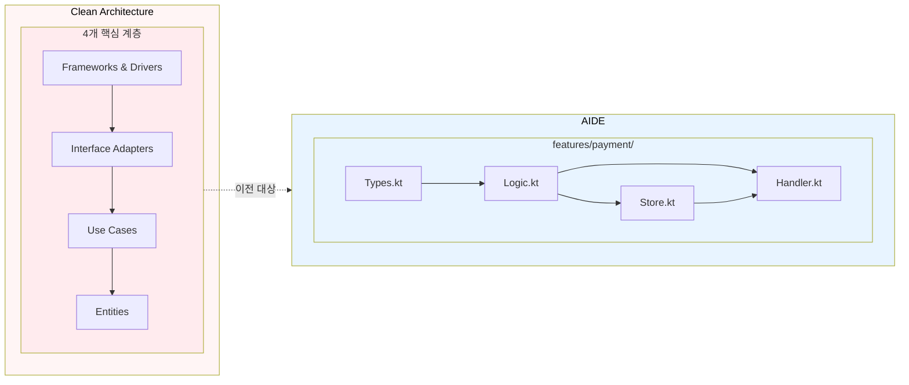
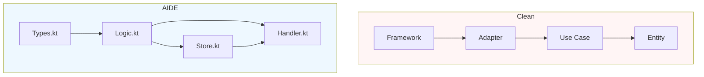

# AIDE와 Clean Architecture 비교

## 1) 개요

Clean Architecture는 복잡도를 관리하기 위해 정책 중심의 계층 분리를 강조하고, AIDE는 핵심 불변성을 유지하면서 이를 Feature 단위의 물리적 구조로 단축한다.

Clean Architecture는 네이티브로 아래를 지향한다.

- `entities`, `use cases`, `interface adapters`, `frameworks` 간의 개념적 계층을 둔다.
- 상위 계층이 하위 계층에만 의존하도록 한다.

AIDE는 같은 불변성을 유지하되, 작업 맥락을 줄이기 위해 물리 계층 수를 줄여 Feature 경계 중심으로 재배치한다.

본 문서는 AIDE의 10개 원칙 중 특히 다음 두 원칙을 비교 축으로 사용한다.

- `Context Budget Principle`
- `Locality of Behavior`

## 2) 핵심 철학 비교

| 축 | Clean Architecture | AIDE |
|---|---|---|
| 기본 경계 | 개념 계층: `entities`, `use-cases`, `interface-adapters`, `frameworks` | Feature 소유권 경계: `features/<도메인>/` |
| 의존성 규칙 | 외부 계층에서 내부로만 의존 | Feature 내부에서 내부로만 의존 + Feature 간 최소 교차 의존 |
| 인지 단위 | 계층 + 유스케이스 | Feature Slice + 행동 그룹 |
| 변경 비용 | 여러 디렉토리 동시 수정이 잦음 | 일반적으로 한 Feature 폴더 내부 수정으로 수렴 |
| AI/에이전트 맥락 | 파일 분산이 커 컨텍스트 로딩 비용이 커짐 | 관련 파일이 적어 맥락 전환 비용이 낮음 |
| 원칙 압축 | 프레임워크 유출 방지 | 동일 원칙에 더해 물리적 분산 비용 축소 |
| 핵심 가치 | 핵심 규칙을 인프라로부터 분리 | 핵심 가치 보존 + 배치 구조 최적화 |

### Context Budget Principle 비교

- Clean Architecture는 누수 방지에 초점을 두지만, 각 변경 요청이 물리적으로 어디에 집중되는지는 별개로 둔다.
- AIDE는 feature 단위로 필요한 파일 집합을 줄이기 위해 변경 맥락 자체를 축소한다.
- 보통 한 기능 작업에서 필요한 파일이 `Types.kt`, `Logic.kt`, 그리고 상황에 따라 `Store.kt`, `Handler.kt`로 제한되는 쪽이 더 자주 발생한다.

### Locality of Behavior 비교

- Clean Architecture는 사용 사례 중심으로 국소성을 확보하려 하지만, 어댑터 경계가 여러 폴더에 흩어질 수 있다.
- AIDE는 같은 Feature 내부에서 입력/출력 변환과 핵심 로직을 묶어 물리적 국소성을 보장한다.
- AI가 한 기능을 수정할 때 필요한 참조가 줄어들어 반복 작업이 빨라진다.

## 3) 구조 비교



- Clean는 계층을 분명히 드러내어 무결성을 확보한다.
- AIDE는 동일 무결성을 유지하면서도 실제 작업 위치를 feature 폴더로 집약한다.

## 4) 의존성 방향 비교



### AIDE가 Clean의 핵심 의존성 규칙을 보존하는 이유

- `Logic.kt`가 프레임워크나 영구저장소 클라이언트를 직접 가져오지 않도록 설계할 때, 핵심 로직은 여전히 안정적이다.
- `Handler.kt`와 `Store.kt`가 외부 세부사항을 감싸므로 바깥 변화가 들어와도 로직이 흔들리지 않는다.

## 5) 장단점 비교표

| 항목 | AIDE 강점 | AIDE 단점 |
|---|---|---|
| 의존성 무결성 | Layered 설계 가치를 유지하며 파일 수를 줄임 | 팀 내 규칙 준수 습관이 부족하면 경계가 무너질 수 있음 |
| 핵심 로직 격리 | logic 단위가 테스트하기 쉬움 | 초기 마이그레이션 비용은 존재 |
| 개발 속도 | 변경 단위가 작아 AI/개발자 생산성 상승 | 새 팀원이 Feature 내부 규칙을 익혀야 함 |
| 진화성 | Feature 단위 성장에 유리 | 대규모 규칙 감사는 별도 문서/도구 보완 필요 |
| 대규모 리팩토링 | 점진적 전환이 쉬움 | 규칙 위반 탐지 자동화 필요 |

### Clean 4개 계층을 AIDE로 매핑

| Clean 계층 | AIDE에서의 대응 |
|---|---|
| Frameworks & Drivers | `Handler.kt` (HTTP/event 경계) |
| Interface Adapters | `Store.kt` + feature 내부 소규모 변환 함수 |
| Use Cases | `Logic.kt` |
| Entities | `Types.kt` + 불변/규칙 유틸 |

## 6) Kotlin 예시

### Clean Architecture 방식

```kotlin
// src/main/kotlin/com/example/clean/cart/domain/model/CartAggregate.kt
package com.example.clean.cart.domain.model

data class CartLineItem(
  val productId: String,
  val name: String,
  val unitPriceKRW: Long,
  val quantity: Int,
)

data class Cart(
  val id: String,
  val userId: String,
  val items: List<CartLineItem>,
) {
  fun totalInKRW(): Long = items.sumOf { it.unitPriceKRW * it.quantity.toLong() }
}

data class PricePolicy(
  val discountRatePercent: Int,
)

data class CartFinalPriceResult(
  val cartId: String,
  val totalInKRW: Long,
)

// src/main/kotlin/com/example/clean/cart/application/port/CartRepository.kt
package com.example.clean.cart.application.port

import com.example.clean.cart.domain.model.Cart

interface CartRepository {
  fun findById(cartId: String): Cart?
  fun save(cart: Cart)
}

// src/main/kotlin/com/example/clean/cart/application/usecase/CalculateFinalPriceUseCase.kt
package com.example.clean.cart.application.usecase

import com.example.clean.cart.application.port.CartRepository
import com.example.clean.cart.domain.model.Cart
import com.example.clean.cart.domain.model.CartFinalPriceResult
import com.example.clean.cart.domain.model.PricePolicy

interface CalculateFinalPriceUseCase {
  fun calculate(cartId: String, pricePolicy: PricePolicy): CartFinalPriceResult
}

class CalculateFinalPriceService(
  private val cartRepository: CartRepository,
) : CalculateFinalPriceUseCase {
  override fun calculate(cartId: String, pricePolicy: PricePolicy): CartFinalPriceResult {
    val cart: Cart = cartRepository.findById(cartId)
      ?: throw IllegalArgumentException("Cart not found: $cartId")

    val subtotal = cart.totalInKRW()
    val discount = subtotal * pricePolicy.discountRatePercent / 100
    return CartFinalPriceResult(
      cartId = cart.id,
      totalInKRW = maxOf(0L, subtotal - discount),
    )
  }
}

// src/main/kotlin/com/example/clean/cart/adapter/out/persistence/JdbcCartRepository.kt
package com.example.clean.cart.adapter.out.persistence

import com.example.clean.cart.application.port.CartRepository
import com.example.clean.cart.domain.model.Cart
import org.springframework.stereotype.Repository

@Repository
class JdbcCartRepository : CartRepository {
  override fun findById(cartId: String): Cart? {
    // TODO: replace with Jpa/JdbcTemplate implementation
    return null
  }

  override fun save(cart: Cart) {
    // TODO: implement persistence write
  }
}

// src/main/kotlin/com/example/clean/cart/adapter/in/web/CartController.kt
package com.example.clean.cart.adapter.`in`.web

import com.example.clean.cart.application.usecase.CalculateFinalPriceService
import com.example.clean.cart.domain.model.CartFinalPriceResult
import com.example.clean.cart.domain.model.PricePolicy
import jakarta.validation.constraints.Max
import jakarta.validation.constraints.Min
import org.springframework.http.ResponseEntity
import org.springframework.validation.annotation.Validated
import org.springframework.web.bind.annotation.GetMapping
import org.springframework.web.bind.annotation.PathVariable
import org.springframework.web.bind.annotation.RequestMapping
import org.springframework.web.bind.annotation.RequestParam
import org.springframework.web.bind.annotation.RestController

@RestController
@RequestMapping("/carts")
@Validated
class CartController(
  private val calculateFinalPriceService: CalculateFinalPriceService,
) {
  @GetMapping("/{cartId}/final-price")
  fun handle(
    @PathVariable cartId: String,
    @RequestParam(defaultValue = "15")
    @Min(0)
    @Max(100)
    discountRatePercent: Int,
  ): ResponseEntity<CartFinalPriceResult> {
    val response = calculateFinalPriceService.calculate(
      cartId = cartId,
      pricePolicy = PricePolicy(discountRatePercent),
    )
    return ResponseEntity.ok(response)
  }
}
```

### AIDE Feature Slice 대응

```kotlin
// src/main/kotlin/com/example/aaa/cart/features/cart/types.kt
package com.example.aaa.cart.features.cart

import jakarta.validation.constraints.Max
import jakarta.validation.constraints.Min
import jakarta.validation.constraints.NotBlank

data class CartLineItem(
  val productId: String,
  val name: String,
  val unitPriceKRW: Long,
  val quantity: Int,
)

data class Cart(
  val id: String,
  val userId: String,
  val items: List<CartLineItem>,
)

data class PricePolicy(
  val discountRatePercent: Int,
)

data class CalculateFinalPriceRequest(
  @field:NotBlank
  val cartId: String,
  @Min(0)
  @Max(100)
  val discountRatePercent: Int = 15,
)

data class FinalPriceResponse(
  val cartId: String,
  val totalInKRW: Long,
)

data class FinalPriceEnvelope(
  val requestId: String,
  val result: FinalPriceResponse,
)

sealed interface CartError {
  data class CartNotFound(val cartId: String) : CartError
  data class InvalidPolicy(val discountRatePercent: Int) : CartError
}

interface CartStorePort {
  fun findById(cartId: String): Cart
  fun save(cart: Cart)
}

fun cartTotal(cart: Cart): Long = cart.items.sumOf { it.unitPriceKRW * it.quantity.toLong() }

fun calculateFinalPrice(cart: Cart, policy: PricePolicy): Long {
  val subtotal = cartTotal(cart)
  val discount = subtotal * policy.discountRatePercent / 100
  return maxOf(0L, subtotal - discount)
}

fun buildFinalPrice(
  cartId: String,
  policy: PricePolicy,
  store: CartStorePort,
): FinalPriceResponse {
  val cart = store.findById(cartId)
  return FinalPriceResponse(
    cartId = cart.id,
    totalInKRW = calculateFinalPrice(cart, policy),
  )
}

// src/main/kotlin/com/example/aaa/cart/features/cart/store.kt
package com.example.aaa.cart.features.cart

import org.springframework.stereotype.Repository
import java.util.concurrent.ConcurrentHashMap

@Repository
class CartStore : CartStorePort {
  private val carts = ConcurrentHashMap<String, Cart>()

  override fun findById(cartId: String): Cart {
    return carts[cartId] ?: throw IllegalArgumentException("cart not found: $cartId")
  }

  override fun save(cart: Cart) {
    carts[cart.id] = cart
  }
}

// src/main/kotlin/com/example/aaa/cart/features/cart/handler.kt
package com.example.aaa.cart.features.cart

import jakarta.validation.Valid
import org.springframework.http.ResponseEntity
import org.springframework.validation.annotation.Validated
import org.springframework.web.bind.annotation.GetMapping
import org.springframework.web.bind.annotation.PathVariable
import org.springframework.web.bind.annotation.RequestMapping
import org.springframework.web.bind.annotation.RequestParam
import org.springframework.web.bind.annotation.RestController

@RestController
@RequestMapping("/features/cart")
@Validated
class CartHandler(
  private val cartStore: CartStore,
) {
  @GetMapping("/{cartId}/final-price")
  fun handle(
    @PathVariable cartId: String,
    @RequestParam(defaultValue = "15")
    @Valid
    request: CalculateFinalPriceRequest,
  ): ResponseEntity<FinalPriceEnvelope> {
    val command = request.copy(cartId = cartId)
    val result = buildFinalPrice(
      cartId = command.cartId,
      policy = PricePolicy(command.discountRatePercent),
      store = cartStore,
    )

    val response = FinalPriceEnvelope(
      requestId = "req-$cartId",
      result = result,
    )
    return ResponseEntity.ok(response)
  }
}
```

## 7) 마이그레이션 가이드

1. 기존 Clean 구조에서 도메인별 사용 흐름을 기능 단위 목록으로 정리한다.
2. `features/<name>/` 디렉토리를 만들고 use-case를 먼저 `Logic.kt`로 이동한다.
3. 도메인 타입을 `Types.kt`로 통합하고 외부 매핑 코드를 줄인다.
4. 리포지터리/어댑터 코드는 `Store.kt`, 입구 어댑터 코드는 `Handler.kt`로 이동한다.
5. `Logic.kt`부터 단위 테스트를 먼저 작성해 동작 불변성을 확보한다.
6. 통합 테스트는 `Handler.kt` + `Store.kt` 경계에서 점진적으로 전환한다.
7. 모든 기능이 안정적으로 동작하면 기존 layer 디렉토리 정리를 시작한다.
8. AGENTS/가이드에 의존성 규칙과 Feature 경계를 명시한다.

### 마이그레이션 체크포인트

- **A단계(안전)**: 한 기능만 AIDE로 병행 운영
- **B단계(안정)**: 계약 변경 없이 동일 동작
- **C단계(최적화)**: 해당 도메인 layer 폴더 제거
- **D단계(완료)**: 신규 기능은 feature-first로만 설계

## 8) 결론

AIDE는 Clean Architecture의 핵심 가치인 “의존성 규칙”과 “비즈니스 로직 격리”를 버리지 않고, 물리적 레이어 수를 줄여 변화 비용을 낮춘 변형 방식이다.

특히 AI 에이전트 기반 개발에서 AIDE의 장점은 더 적은 컨텍스트로 동일한 의사결정을 더 빠르게 수행할 수 있다는 점이다.
