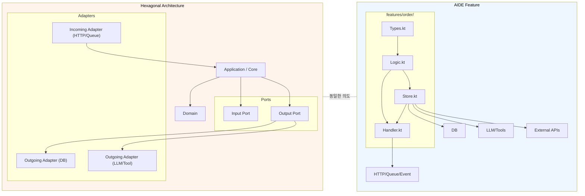

# AIDE와 Hexagonal Architecture(Ports & Adapters) 비교

## 1) 개요

Hexagonal Architecture(Ports & Adapters)는 핵심 비즈니스 로직을 중심으로 두고, 외부 시스템은 Port와 Adapter로 연결한다.

AIDE는 이 핵심 철학을 유지하면서도 각 Feature 내부에서 다음 두 파일로 adapter 역할을 흡수한다.

- `Store.kt` (상태 저장·외부 실행부)
- `Handler.kt` (입구, 이벤트/프로토콜 적응부)

AI 시대에는 LLM/도구/DB 교체가 잦아져서, 외부 결합 지점을 작게 유지하는 설계가 더욱 중요해졌다.

## 2) 핵심 철학 비교

| 축 | Hexagonal Architecture | AIDE |
|---|---|---|
| 핵심 아이디어 | 핵심 로직을 외부 시스템으로부터 분리 | 핵심 로직을 Feature 경계 안에 분리 + 외부 결합은 경계 파일로 봉인 |
| Port 개념 | 명시적 인터페이스로 진입/출력 채널을 정의 | Feature 내부에서 types/logic의 계약으로 표현 |
| Adapter 위치 | adapter 디렉토리 분리 | `Handler.kt`, `Store.kt`로 기능 내 집약 |
| 의존성 방향 | Port가 인프라 대체를 허용 | Feature 단일 진입/출구 구조로 더 짧은 의존성 경로 |
| AI 시대 적합성 | 잘 유지하면 강함 | 외부 변경이 feature-local로 수렴하여 더 빠름 |

### AIDE의 Context Budget / Locality 관점

- 하나의 기능 변경 시 핵심 로직을 이해하기 위한 파일 수가 줄어든다.
- Input/Output adapter는 기능 경계로 흡수되어 컨텍스트 예산이 절약된다.
- 외부 교체성은 유지되며, 핵심 logic는 거의 손대지 않고 처리 가능하다.

### 차이점

- Hexagonal은 입력/출력 포트를 모듈 구조로 드러내는 데 익숙한 패턴을 쓴다.
- AIDE는 같은 원칙을 유지하면서도 더 작은 Feature 단위로 포트 경계를 실질적으로 배치한다.

## 3) 구조 비교



## 4) Port/Adapter와 AIDE 내부 구조 비교

### Hexagonal에서의 의미

- **Input Port**: 외부 요청을 use case로 연결하는 추상 인터페이스.
- **Output Port**: 로직이 외부 영속성/도구/통신에 접근할 수 있게 하는 추상 인터페이스.
- **Adapter**: 추상 인터페이스를 실제 라이브러리/드라이버와 연결.

### AIDE에서의 대응

- **입력 쪽 적응** → `Handler.kt`
  - 요청 스키마 파싱
  - 응답/에러 매핑
  - 런타임 프로토콜 번역
- **출력 쪽 적응** → `Store.kt`
  - DB/LLM/외부 API 호출을 처리
  - anti-corruption mapping 수행
  - 외부 시스템 형식 변환

### LLM/Tool/DB 교체가 잦은 AI 시대에서의 강점

외부 인프라가 바뀔 때 AIDE는 다음이 빨라진다.

- 핵심 `Logic.kt`는 그대로 유지한다.
- 바뀐 바인딩은 `Store.kt` 또는 `Handler.kt` 내부에서만 반영한다.
- 통합 테스트 범위가 얇아지고, 회귀 위험 구간이 줄어든다.

결과적으로 Port/Adapter 개념은 삭제되는 것이 아니라, 더 작고 feature-local한 방식으로 흡수된다.

## 5) Kotlin 예시

### Hexagonal 고전 구성

```kotlin
// src/main/kotlin/com/example/hexagonal/order/domain/model/Order.kt
package com.example.hexagonal.order.domain.model

data class PlaceOrderCommand(
  val orderId: String,
  val cartId: String,
)

data class PlaceOrderResult(
  val invoiceId: String,
)

data class OrderSnapshot(
  val orderId: String,
  val cartId: String,
  val summary: String,
)

// src/main/kotlin/com/example/hexagonal/order/application/port/OrderPorts.kt
package com.example.hexagonal.order.application.port

import com.example.hexagonal.order.domain.model.OrderSnapshot

interface LLMPort {
  fun summarize(text: String): String
}

interface OrderRepositoryPort {
  fun save(order: OrderSnapshot)
}

interface PlaceOrderUseCase {
  fun execute(command: com.example.hexagonal.order.domain.model.PlaceOrderCommand): com.example.hexagonal.order.domain.model.PlaceOrderResult
}

// src/main/kotlin/com/example/hexagonal/order/application/usecase/PlaceOrderService.kt
package com.example.hexagonal.order.application.usecase

import com.example.hexagonal.order.application.port.LLMPort
import com.example.hexagonal.order.application.port.OrderRepositoryPort
import com.example.hexagonal.order.application.port.PlaceOrderUseCase
import com.example.hexagonal.order.domain.model.OrderSnapshot
import com.example.hexagonal.order.domain.model.PlaceOrderCommand
import com.example.hexagonal.order.domain.model.PlaceOrderResult
import org.springframework.stereotype.Service

@Service
class PlaceOrderService(
  private val llmPort: LLMPort,
  private val orderRepository: OrderRepositoryPort,
) : PlaceOrderUseCase {
  override fun execute(command: PlaceOrderCommand): PlaceOrderResult {
    val summary = llmPort.summarize("order=${command.orderId}")
    orderRepository.save(
      OrderSnapshot(
        orderId = command.orderId,
        cartId = command.cartId,
        summary = summary,
      ),
    )
    return PlaceOrderResult(invoiceId = "inv-${command.orderId}")
  }
}

// src/main/kotlin/com/example/hexagonal/order/adapter/out/db/OrderRepositoryAdapter.kt
package com.example.hexagonal.order.adapter.out.db

import com.example.hexagonal.order.application.port.OrderRepositoryPort
import com.example.hexagonal.order.domain.model.OrderSnapshot
import org.springframework.stereotype.Repository

@Repository
class OrderRepositoryAdapter : OrderRepositoryPort {
  override fun save(order: OrderSnapshot) {
    // TODO: replace with persistence logic
  }
}

// src/main/kotlin/com/example/hexagonal/order/adapter/out/llm/OpenAILLMAdapter.kt
package com.example.hexagonal.order.adapter.out.llm

import com.example.hexagonal.order.application.port.LLMPort
import org.springframework.stereotype.Component

@Component
class OpenAILLMAdapter : LLMPort {
  override fun summarize(text: String): String = "summary: $text"
}

// src/main/kotlin/com/example/hexagonal/order/adapter/in/web/PlaceOrderController.kt
package com.example.hexagonal.order.adapter.`in`.web

import com.example.hexagonal.order.application.usecase.PlaceOrderService
import com.example.hexagonal.order.domain.model.PlaceOrderCommand
import com.example.hexagonal.order.domain.model.PlaceOrderResult
import jakarta.validation.constraints.NotBlank
import org.springframework.http.ResponseEntity
import org.springframework.web.bind.annotation.PostMapping
import org.springframework.web.bind.annotation.RequestBody
import org.springframework.web.bind.annotation.RequestMapping
import org.springframework.web.bind.annotation.RestController

@RestController
@RequestMapping("/orders")
class PlaceOrderController(
  private val placeOrderService: PlaceOrderService,
) {
  @PostMapping
  fun placeOrder(@RequestBody request: PlaceOrderRequest): ResponseEntity<PlaceOrderResult> {
    return ResponseEntity.ok(placeOrderService.execute(request.toCommand()))
  }
}

data class PlaceOrderRequest(
  @field:NotBlank
  val orderId: String,
  @field:NotBlank
  val cartId: String,
) {
  fun toCommand() = PlaceOrderCommand(orderId = orderId, cartId = cartId)
}
```

### AIDE 대응

```kotlin
// src/main/kotlin/com/example/aaa/order/features/order/types.kt
package com.example.aaa.order.features.order

import jakarta.validation.constraints.NotBlank

data class OrderCommand(
  val orderId: String,
  val cartId: String,
)

data class PlaceOrderInvoice(
  val invoiceId: String,
)

data class PersistedOrder(
  val orderId: String,
  val cartId: String,
  val summary: String,
)

sealed interface OrderPortError {
  data class InvalidInput(val reason: String) : OrderPortError
}

interface OrderPorts {
  fun summarize(text: String): String
  fun save(input: PersistedOrder)
}

fun placeOrderUseCase(command: OrderCommand, ports: OrderPorts): PlaceOrderInvoice {
  val summary = ports.summarize("order=${command.orderId}")
  ports.save(
    PersistedOrder(
      orderId = command.orderId,
      cartId = command.cartId,
      summary = summary,
    ),
  )
  return PlaceOrderInvoice(invoiceId = "inv-${command.orderId}")
}

// src/main/kotlin/com/example/aaa/order/features/order/store.kt
package com.example.aaa.order.features.order

import org.springframework.stereotype.Repository
import java.time.Instant

@Repository
class OrderStore : OrderPorts {
  private val rows = mutableListOf<PersistedOrder>()

  override fun summarize(text: String): String = "summary: $text"

  override fun save(input: PersistedOrder) {
    rows.add(input.copy(summary = "${input.summary} @ ${Instant.now()}"))
  }
}

// src/main/kotlin/com/example/aaa/order/features/order/handler.kt
package com.example.aaa.order.features.order

import jakarta.validation.Valid
import org.springframework.http.ResponseEntity
import org.springframework.web.bind.annotation.PostMapping
import org.springframework.web.bind.annotation.RequestBody
import org.springframework.web.bind.annotation.RequestMapping
import org.springframework.web.bind.annotation.RestController

@RestController
@RequestMapping("/features/orders")
class OrderHandler(
  private val orderStore: OrderStore,
) {
  @PostMapping
  fun handle(@Valid @RequestBody request: PlaceOrderRequest): ResponseEntity<PlaceOrderInvoice> {
    val invoice = placeOrderUseCase(
      request.toDomainCommand(),
      orderStore,
    )
    return ResponseEntity.ok(invoice)
  }
}

data class PlaceOrderRequest(
  @field:NotBlank
  val orderId: String,
  @field:NotBlank
  val cartId: String,
) {
  fun toDomainCommand() = OrderCommand(orderId = orderId, cartId = cartId)
}
```

## 6) 마이그레이션 가이드

1. 기존 hexagonal 프로젝트에서 port 목록을 먼저 정리한다.
2. feature로 전환할 단위를 고른 뒤, 도메인 계약을 `Types.kt`로 정리한다.
3. use case를 `Logic.kt`로 이동하고 순수도메인 성격을 유지한다.
4. 외부 입출력 연동은 `Store.kt`에 집중한다.
5. API/이벤트 진입 코드는 `Handler.kt`로 한 번에 이동한다.
6. 포트 모듈 import를 점진적으로 feature contracts로 대체한다.
7. `handler/store` 경계 위주 테스트를 붙여 품질을 확보한다.

### AI 교체 시나리오 중심 체크

- LLM provider 교체: `Store.kt` 생성 로직만 바꾸면 됨.
- Tool 스키마 변경: `Store.kt`와 `Handler.kt`의 변환부 조정.
- DB driver 변경: `Store.kt`의 저장부만 조정.

## 7) 결론

Hexagonal Architecture와 AIDE는 충돌하지 않는다. AIDE는 Hexagonal의 Port/Adapter 사상을 `features` 경계 내부로 재배치하여, 자주 바뀌는 AI/Tool/DB 환경에서 변경 지점을 더 작게 만든다.

즉, 포트와 어댑터의 가치는 사라지는 것이 아니라, AIDE에서 더 자주, 더 빨리 재구성되는 형태로 강화된다.
