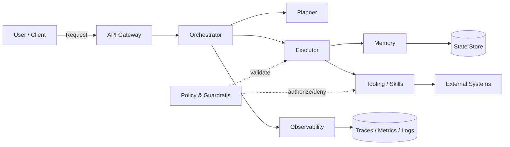

<!-- Translated from Korean original by AI agent (Codex gpt-5.3-codex-spark) -->
# AIDE: Deep Research Report for Designing Agent-Informed Development Engineering

## Executive Summary

An AI Agent-based system, because the model decides control flow (including tool invocation, file manipulation, and external system access) and performs long-running, multi-step work, has fundamentally different engineering risks and operational overhead than traditional applications (request-response oriented, deterministic execution, relatively short transactions). In real industry surveys, production adoption of agents is accelerating quickly (for example, in a 2024 survey, "production use" responses are in the majority), and the biggest bottlenecks are performance/quality (accuracy, hallucination, reliability), while safety/compliance concerns are more pronounced as company size grows. citeturn6view0turn12view2turn13view3 In production, agents tend to rely more on controllable short phases (for example, within about 10 steps) and human review/supervision than on fully autonomous long execution. citeturn8view0turn7view4

Therefore, this report proposes **AIDE (Agent-Informed Development Engineering)**, which respects the structural separation offered by existing engineering approaches (DDD/Clean Architecture/TDD) while treating agent-specific constraints—such as Context Window, token cost of tool definitions, non-determinism, new deliverables like prompt/skill/policy files, prompt injection, and excessive delegation—as first-class concerns. The core is to: (a) **design context/state/tool/policy/observability as central architectural components**, (b) **elevate evaluation, tracing, and simulation to be first-class citizens alongside testing**, and (c) **version-control and operate AGENTS.md/CLAUDE.md/skills as "agent context files."** citeturn7view0turn7view2turn14view4turn8view2turn15view1

**10 Key Principles**
1. **Controlled execution by default**: Design short steps, explicit breakpoints, and human-in-the-loop as defaults. citeturn7view4turn8view0
2. **Treat context budget as a design input**: Prompt, tool definitions, and intermediate outputs consume context and are treated as primary cost/latency causes. citeturn14view2turn15view2
3. **Treat "prompt/skill/policy" as code**: apply review, versioning, release notes, and regression tests. citeturn14view4turn7view1turn7view0
4. **Observability as architecture, not option**: Trace/log/metric replay are fixed runtime interfaces. citeturn15view1turn4search2turn5search3
5. **Evaluation-driven engineering (EED)**: Define and verify quality by scenario- and dataset-based evaluation, not only unit tests. citeturn8view2turn2search2
6. **Security/isolation/audit as AIDE layers**: Design with excessive delegation and prompt injection assumed. citeturn13view3turn8view4turn13view0
7. **Treat non-determinism as environmental property, not bug**: handle reproducibility as best effort and capture regressions through statistical/eval controls. citeturn16view0turn8view2
8. **Separate multi-agent concerns as orchestration problem**: standardize role/message/state-sharing protocols. citeturn0search0turn7view3
9. **Adopt standard protocols/context files**: reduce integration cost and lock-in via MCP, AGENTS.md, and similar. citeturn12view4turn12view2turn7view0
10. **Production safety as continuous hardening loop**: repeatedly detect attack/error patterns and redeploy defenses. citeturn8view4turn13view4

## Core Requirements and Design Constraints of AI Agents

The design constraints of agents begin with model invocation (cost/latency/non-determinism), extend to context window limits, and further to externalized state/memory, secure authorization for tool calls, and observability (Trace/Log/Eval). Especially, as tools/integrations increase, **tool definitions themselves become dominant context consumers**, and **intermediate results amplify token/latency costs**, as confirmed by industry findings. citeturn14view2turn15view2turn13view3 When context exceeds limit, API-level truncation or request failure (400) can occur, so **context budget management (summary/compression/progressive skill loading)** becomes an architectural requirement. citeturn15view2turn7view1turn7view0

The following table summarizes core requirements for designing AIDE by priority (P0~P2). Unspecified items are marked as **Not specified**.

| Requirement | Priority | Failure/Incident Pattern | Key Design Constraint | Recommended AIDE Mechanism (summary) | Validation/Acceptance Criteria (Example) |
|---|---:|---|---|---|---|
| Context length/token budget | P0 | "Critical instructions/policies are dropped", inference fails and cost spikes due to excessive tool definitions | When context limit is exceeded, truncation or 400 failures are possible citeturn15view2turn14view2 | Progressive skill loading, summarization/compaction, tool cataloging, externalized conversation state | Turn/turn token caps, P95 token usage; threshold **Not specified** |
| State management & long-running execution | P0 | Loss of context after restart, inability to recover/failover during long-running tasks | Need restart/recovery/resume for long-running workloads citeturn7view4 | Checkpointing, durable execution, state store (events/snapshots) | Resume-after-interruption success rate; threshold **Not specified** |
| Multi-agent collaboration | P0 | Role conflicts, duplicate work, unclear ownership, cost explosion | Requires orchestration patterns and role/message conventions citeturn0search0turn7view3 | Orchestrator-led flow, role-based agents (Planner/Executor/Reviewer, etc.), shared state and lease/lock control | Lower duplicate work rate; consistency of consensus; threshold **Not specified** |
| Async/concurrency | P0 | End-to-end latency spikes from I/O waits and tool latency | Concurrent tool calling support options citeturn15view2 | Async executor, tool-call fanout/fanin, work queue | P95 latency, concurrency; threshold **Not specified** |
| Security/Privacy | P0 | Prompt injection, privilege misuse, data leakage | Standard threats include Prompt Injection and Excessive Agency citeturn13view3turn8view4turn13view0 | Policy engine (allowlist/denylist), least-privilege tools, audit log, data minimization | Security tests (injection scenarios) pass; threshold **Not specified** |
| Cost (tokens/API/tool calls) | P0 | Unpredictable spend, infinite loops/tool abuse, DoS | LLM DoS and cost risk are included in OWASP guidance citeturn13view3turn16view3turn14view2 | Step budget, token budget, caching, circuit breakers, response summarization | Spend target within daily/monthly budgets; threshold **Not specified** |
| Observability/logging/debugging | P0 | Inability to reason about why an action occurred; no reproducibility/regression analysis | Requires tracing/visualization for complex behavior citeturn7view4turn15view1turn5search3 | Standard trace schema, event capture, state transition logs, replay | Trace coverage; MTTR for debugging; threshold **Not specified** |
| Reproducibility | P1 | Outcome drift on identical inputs; hard-to-test regressions | Seed can improve reproducibility but complete guarantees are impossible due environment variation citeturn16view0turn15view2 | Fixed parameters + seed, statistical evaluation, system/model version recording | Regression detection precision/recall; threshold **Not specified** |
| Versioning (model/prompt/skill) | P1 | Unclear which prompt/skill produced output | Context files rise as new deliverables citeturn14view4turn7view0turn7view1 | Version pin AGENTS.md/CLAUDE.md/skills, release tags, change logs | Change history/compatibility rules; threshold **Not specified** |
| Supply chain/dependency (tool/model/connector) | P1 | External tool/server vulnerabilities propagate to full agent privileges | Supply-chain risks are explicitly in OWASP Top 10 citeturn13view3 | Connector sandboxing, signing/verification, explicit privilege scope specs | SCA/vulnerability scanning; threshold **Not specified** |

**Section summary and key recommendation**: In AIDE, requirements should be modeled first as constraints (budget/security/observability), not features. In particular, context budget, long-lived state, authorization/audit, and evaluation/tracing should be treated as P0 priorities; designing dependent concerns around these four axes stabilizes cost and risk most quickly. citeturn7view4turn13view3turn8view2turn14view2

## AIDE Architecture Pattern Proposals

AIDE does not trap a model into one layer; instead, it decomposes the interactions around state/tool/policy/observability generated by model calls into **standardized components**. This approach (a) elevates LangGraph’s emphasis on durable execution, human-in-the-loop, memory, and debugging to architectural level citeturn7view4, (b) separates multi-agent conversation programming from AutoGen as orchestration layer citeturn0search0turn17view2, and (c) makes the practical observation that at higher tool/integration scale, tool definitions and intermediates become context pressure points the foundation of architecture design. citeturn14view2turn15view2

### Recommended AIDE Layer and Component Definitions

- **Kernel**: runtime commonalities (model client, policy evaluation, state persistence, execution context/budget)
- **Orchestrator**: work decomposition, role assignment, step control, Human-in-the-Loop, failure recovery (workflow/graph)
- **Planner**: plan generation (goal -> sub-tasks), risk/budget-aware planning (including tool/policy selection)
- **Executor**: plan execution (tool calls, parsing, result summarization, state updates), concurrency/async management
- **Memory**: short-term working state + long-term memory (session/profile/knowledge)
- **Tooling**: tool catalog, skills (workflow packages), connectors (MCP/function call), sandboxing
- **Policy & Guardrails**: authorization, data minimization, output validation, tool approval (excessive delegation prevention) citeturn13view3turn8view4
- **Observability**: trace/span, event logs, cost/latency metrics, replay (reproduction) citeturn15view1turn4search2turn5search3

### AIDE Data/Message Flow Diagram (mermaid)



The core of AIDE is that the **Orchestrator owns control**, while Planner/Executor provide reasoning, and Policy/Observability form a fixed bounding structure. Tool integrations can expand through protocols like MCP, but as integration count grows, tool definitions and intermediate results consume context budget, making progressive loading and summarization strategies mandatory. citeturn12view4turn14view2turn7view1

### Recommended Interface Specifications

AIDE recommends standardizing the following six interfaces regardless of implementation language.

- `IPlanner.plan(goal, state, budget)->Plan`
- `IExecutor.step(plan_step, state, budget)->StepResult`
- `IMemory.read(scope, query)->ContextChunk[]`, `IMemory.write(events)->ack`
- `IToolRegistry.list(meta_only=True)->ToolMeta[]`, `IToolInvoker.call(name,args,authz_ctx)->ToolResult`
- `IPolicy.evaluate(action_ctx)->(allow/deny, obligations)`
- `IObservability.emit(event/span/metric)->void`

This aligns with OpenAI Agents SDK’s stated priorities around tools, handoff, streaming, and full trace retention citeturn15view0turn15view1, and is compatible with LangGraph’s emphasis on durable execution and human-in-the-loop. citeturn7view4

### Recommended Async/Concurrency Model

- **Actor/Queue based**: enqueue work by `(run_id, step_id)` and let Executor consume
- **Parallel tool call fanout/fanin**: since APIs can support parallel tool calls (for example, `parallel_tool_calls`) citeturn15view2, allow parallel execution only for tools classified as safe
- **Streaming + checkpointing**: stream partial responses while periodically committing state (long-running execution safety) citeturn7view4turn15view2

### Error and rollback strategy

Agents are continuously exposed to network, rate-limit, and external system errors. Therefore AIDE provides platform-level recovery, not model-prompt-only recovery: (a) retries/backoff, (b) circuit breakers, (c) idempotency for tool calls, and (d) compensating transactions. Especially, official guidance for rate limiting recommends exponential backoff with random jitter. citeturn16view1turn16view2turn8view3

### Test strategy (TDD/simulation/integration)

AIDE keeps TDD for **deterministic code** and makes eval-driven engineering (EED) the default for **model behavior**.

- **Unit Testing (TDD)**: parsers, policy engine, state transition, tool wrappers (authorization/validation), prompt template rendering
- **Simulation Testing**: validate step budget/loop behavior using a tool-environment simulator that mocks external systems
- **Integration + Evaluation (Evals)**: OpenAI describes Evals construction as similar to BDD, with task definition -> input set -> output assessment and improvement. citeturn8view2
- **Production regression prevention**: industry research also reports that production agents depend heavily on human evaluation, with reliability as top priority. citeturn8view0turn6view0

**Section summary and key recommendation**: AIDE is not “smarter prompts”; it is a **controllable execution structure**. Standardizing Orchestrator/Policy/Observability preserves stability, auditability, and cost control even when model/prompt changes.

## Code/File/Skill Management Recommendations

In agent development, “code” no longer means source code only. Research in 2025~2026 shows **AI context files such as AGENTS.md/CLAUDE.md are spreading as new software deliverables**, and practices that fail to preserve prompt/context harm reproducibility; hence versioned context files become critical. citeturn14view4 Tooling and skills should also use progressive disclosure: metadata first, then full content loaded only when needed, to preserve context efficiency. citeturn7view1turn14view0turn14view2

### Recommended File Set (AGENTS.md, CLAUDE.md, skills)

- **AGENTS.md**: entity["company","OpenAI","ai company"] Codex reads AGENTS.md before starting work, merges files from tree root to subdirectories with child overriding parent, and provides project-level context limits and override-file handling rules (example: default 32KiB limit).
- **CLAUDE.md**: entity["company","Anthropic","ai company"] Claude Code reads root CLAUDE.md at session start and applies coding standards, architectural decisions, and checklists while supporting MCP hooks and multi-agent operations. citeturn7view2turn12view4turn14view1
- **skills directory**: OpenAI skills are directory-based packages based on `SKILL.md` (with YAML frontmatter), loading metadata first and then complete instructions as needed; Anthropic likewise describes skills as folder-packaged guidance with progressive disclosure as core principle. citeturn7view1turn14view0

### Recommended Repository Structure (sample)

```text
repo/
  AGENTS.md
  CLAUDE.md
  agents/
    kernel/
    orchestrator/
    planner/
    executor/
    memory/
    tooling/
    policy/
    observability/
    manifest.yaml
  prompts/
    system/
    tasks/
  .agents/
    skills/
      search_assistant/
        SKILL.md
        scripts/
  evals/
    datasets/
    scenarios/
```

### Boilerplate Minimization Rules (operational)

1. **Separate tools/skills as catalog + runner**: the model only chooses what to do; Tooling standardizes execution (validation, authorization, logging). citeturn13view3turn15view1
2. **Distribute skills by folder**: package repeatable workflows as skills instead of inline prompt text; this allows metadata-based auto selection and explicit invocation. citeturn7view1turn14view0
3. **Keep context files short and broadly applicable**: as context files grow, they consume token budget and increase conflict risk (AGENTS.md has explicit size limits). citeturn7view0turn14view2

### Functional vs OOP vs Hybrid: Recommendation Table for Agent Codebase

| Aspect | Functional | OOP | Hybrid (recommended) |
|---|---|---|---|
| State/memory modeling | Easier testing when state is passed explicitly as arguments | Increasing internal object state can make replay/snapshots harder | **Keep state in immutable data structures (functional), execution via object/DI (OOP)** |
| Tool invocation / authorization | Pure function wrappers simplify consistent validation logic | Polymorphism makes extending tool types easy | Tools via interfaces (OOP), validation/normalization in functional pipelines |
| Concurrency/async | Favors async pipeline composition | Shared-state concurrency needs locking discipline | Executor is async-based, state write-through with single-writer pattern |
| Observability | Easier to return events as function outputs | AOP/decorators simplify trace insertion | **Standard event model + decorator-based tracing** citeturn15view1turn5search3 |
| Refactoring/modularity | Small functional units are easy to split | Modeling domain concepts as objects improves readability | Planner/Policy as functional, Tool/Memory as OOP |
| Best fit | Parser/normalization/policy evaluation | Complex connectors/storage/clients | **Most AIDE components** |

### Concrete Rules (recommended baseline)

- Line length: 100~120 chars (if unspecified, recommend 100)
- Function size: target **within 50 lines for core logic** (30 lines for parser/policy/tool wrappers)
- File splitting: split above **300~500 lines** (unspecified)
- Prompt/skill/policy files: **must run eval on change** (CI gate) citeturn8view2turn2search2

### Example snippets (AGENTS.md + SKILL.md + AIDE interfaces)

```md
# AGENTS.md (repo root) — Agent operating agreement (summary)

## Objective
- Safe and reproducible agent execution (least privilege, audit logs, regression prevention)

## Work Rules
- Always present a "Plan" first, then summarize risk/cost/exposure before execution.
- External system changes (write/delete/payment) are prohibited by default (approval required).

## Test/Eval
- Changing prompts/, .agents/skills/, agents/policy/ requires running evals/scenarios.

---

# .agents/skills/search_assistant/SKILL.md (summary example)
---
name: search-assistant
description: "Use only when web/document search is needed. Request confirmation before using personal/confidential data."
---

## Steps
1) Generate search queries (max 3), 2) cross-validate with at least 2 sources, 3) summarize with evidence and citations

## Guardrails
- Cannot cite low-confidence sources as sole evidence
- Mask and report on detecting personal secrets/credentials
```

```python
# agents/kernel/interfaces.py (concept example; implementation language/framework agnostic)
from dataclasses import dataclass
from typing import Any, Dict, List, Literal, Optional, Protocol, Tuple

Priority = Literal["P0", "P1", "P2"]
Decision = Literal["allow", "deny"]

@dataclass(frozen=True)
class Budget:
    max_steps: int
    max_tokens: int
    max_tool_calls: int

@dataclass
class PlanStep:
    id: str
    intent: str
    tool: Optional[str] = None
    args: Optional[Dict[str, Any]] = None

@dataclass
class Plan:
    goal: str
    steps: List[PlanStep]

@dataclass
class StepResult:
    step_id: str
    status: Literal["ok", "error", "blocked"]
    output: Any
    events: List[Dict[str, Any]]

class IPlanner(Protocol):
    def plan(self, goal: str, state: Dict[str, Any], budget: Budget) -> Plan: ...

class IExecutor(Protocol):
    async def step(self, step: PlanStep, state: Dict[str, Any], budget: Budget) -> StepResult: ...

class IPolicy(Protocol):
    def evaluate(self, action: Dict[str, Any], state: Dict[str, Any]) -> Tuple[Decision, Dict[str, Any]]: ...

class IObservability(Protocol):
    def emit(self, event: Dict[str, Any]) -> None: ...
```

**Section summary and key recommendation**: AGENTS.md/CLAUDE.md/skills are not just documents but runtime components that determine execution quality and safety. So applying (1) strict versioning, (2) automatic eval on changes, and (3) progressive loading (context-budget saving) to them with code-level rigor is a core AIDE operating rule.

## Applied Cases (AIDE design examples)

Industry studies report that top use cases for agents are "research/summarization" and "personal productivity/assistant". AIDE designs these with different risk and budget profiles and handles multi-agent collaboration as a distinct coordination problem.

### Information Retrieval Assistant (RAG + tool-based)

- **Goal**: Web/document retrieval -> evidence citation -> summarization/organization
