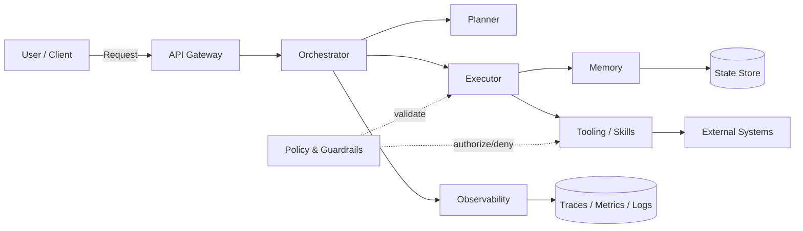

# AIDE: Agent-Informed Development Engineering 개발론 설계를 위한 심층 조사 보고서

## Executive Summary

AI Agent 기반 시스템은 “모델이 제어흐름(control flow)을 결정하고(tool 호출·파일 조작·외부 시스템 접근 포함) 장시간·다단계로 작업을 수행”한다는 점에서, 전통적 애플리케이션(요청-응답 중심, 결정적 실행, 비교적 짧은 트랜잭션)과 근본적으로 다른 공학적 위험과 운영 부담을 갖습니다. 실제 산업 조사에서도 에이전트의 프로덕션 도입은 빠르게 진행되지만(예: 2024년 설문에서 “프로덕션 사용” 응답이 과반), 가장 큰 병목은 성능/품질(정확도·환각·신뢰성)이며, 기업 규모가 클수록 안전/규정 준수 우려가 더 크게 나타납니다. citeturn6view0turn12view2turn13view3 또한 프로덕션에서의 에이전트는 “길게 자율 실행”하기보다는 통제 가능한 짧은 단계(예: 10스텝 이내)와 인간 평가·감독에 크게 의존하는 경향이 관찰됩니다. citeturn8view0turn7view4

따라서 본 보고서는 기존 개발론(DDD/클린 아키텍처/TDD 등)이 제공하는 “구조적 분리”를 존중하되, 에이전트 특유의 제약(컨텍스트 윈도우·도구 정의의 토큰 비용·비결정성·프롬프트/스킬/정책 파일이라는 새로운 산출물·프롬프트 인젝션 및 과도한 위임 등)을 1급(First-class)으로 다루는 **AIDE(Agent-Informed Development Engineering)** 개발론을 제안합니다. 핵심은 (a) **컨텍스트/상태/도구/정책/관찰가능성(Observability)을 아키텍처의 중심 컴포넌트로 설계**하고, (b) **평가(Evals)·트레이싱·시뮬레이션을 ‘테스트의 동급 시민’으로 승격**하며, (c) **AGENTS.md/CLAUDE.md/skills와 같은 “에이전트 컨텍스트 파일”을 버전 관리·운영**하는 것입니다. citeturn7view0turn7view2turn14view4turn8view2turn15view1

**핵심 원칙(10개)**  
1. **통제 가능한 실행을 기본값으로**: 짧은 스텝·명확한 중단점·휴먼 인 더 루프를 설계 기본으로 둔다. citeturn7view4turn8view0  
2. **컨텍스트 예산을 설계 입력으로**: 프롬프트·도구 정의·중간 결과가 컨텍스트를 잠식함을 비용/지연의 1차 원인으로 취급한다. citeturn14view2turn15view2  
3. **‘프롬프트/스킬/정책’도 코드처럼**: 리뷰·버전·릴리스 노트·회귀 테스트의 대상이다. citeturn14view4turn7view1turn7view0  
4. **관찰가능성은 옵션이 아니라 구조**: 트레이싱·로그·메트릭·리플레이를 런타임 표준 인터페이스로 고정한다. citeturn15view1turn4search2turn5search3  
5. **평가 주도 개발(EED: Eval-driven Engineering)**: 유닛 테스트만이 아니라 시나리오·데이터셋 기반 평가로 품질을 정의/검증한다. citeturn8view2turn2search2  
6. **권한·격리·감사를 AIDE의 계층으로**: 과도한 위임(Excessive Agency)과 프롬프트 인젝션을 전제로 설계한다. citeturn13view3turn8view4turn13view0  
7. **비결정성을 “버그”가 아닌 “환경 특성”으로**: 재현성은 ‘best effort’로 관리하고, 회귀는 통계적·평가 기반으로 잡는다. citeturn16view0turn8view2  
8. **멀티에이전시는 ‘조율(Orchestration) 문제’로 분리**: 역할/메시지/상태 공유 규약을 표준화한다. citeturn0search0turn7view3  
9. **표준 프로토콜·컨텍스트 파일을 채택**: MCP·AGENTS.md 등을 통해 통합 비용과 락인을 줄인다. citeturn12view4turn12view2turn7view0  
10. **프로덕션 안전성은 ‘지속적 하드닝’ 루프**: 공격/오류 패턴을 자동 탐지하고 방어를 반복 배포한다. citeturn8view4turn13view4  

## AI Agent의 핵심 요구사항과 설계 제약

에이전트 설계 제약은 “모델 호출(비용·지연·비결정성)”과 “컨텍스트 윈도우(길이 제한)”에서 시작해, “상태/기억의 외부화”, “도구 호출의 안전한 권한 체계”, “관찰가능성(Trace/Log/Eval)”로 확장됩니다. 특히 도구/연동이 늘어날수록 **도구 정의 자체가 컨텍스트를 과점유**하고, **중간 결과가 토큰·지연을 증폭**시키는 문제가 산업적으로 확인됩니다. citeturn14view2turn15view2turn13view3 또한 컨텍스트가 한도를 넘으면 API 레벨에서 “자동 절단(truncation)” 또는 “요청 실패(400)”가 발생할 수 있으므로, **컨텍스트 예산 관리(요약/압축/스킬의 점진적 로딩)**가 아키텍처 요구사항이 됩니다. citeturn15view2turn7view1turn7view0

다음 표는 AIDE 개발론을 설계하기 위한 핵심 요구사항을 우선순위(P0~P2)와 함께 정리한 것입니다. (미지정 항목은 **명시되지 않음**으로 표기)

| 요구사항(항목) | 우선순위 | 실패/장애 양상(대표 증상) | 설계 시 핵심 고려사항(제약) | AIDE 권장 메커니즘(요약) | 검증/수용 기준(예시) |
|---|---:|---|---|---|---|
| 컨텍스트 길이/토큰 예산 | P0 | “중요 지시/정책이 밀려 사라짐”, 도구 정의 과다로 추론 실패·비용 급증 | 컨텍스트 한도 초과 시 truncation 또는 400 실패 가능 citeturn15view2turn14view2 | 스킬 **점진적 로딩**, 요약/압축(Compaction), 도구 카탈로그화, 대화 상태 외부화 | 토큰/턴 상한, P95 토큰 사용량; 기준 **명시되지 않음** |
| 상태관리(State)·장기 실행 | P0 | 재시작 시 맥락 소실, 장시간 작업 중 실패/중단 복구 불가 | 장기 실행·장애 복구·재개 필요 citeturn7view4 | 체크포인트·durable execution, 상태 스토어(이벤트/스냅샷) | “중단 후 재개” 시나리오 통과율; 기준 **명시되지 않음** |
| 멀티에이전시 협업 | P0 | 역할 충돌, 동일 작업 중복, 책임 불명확, 비용 폭증 | 조율 패턴과 역할/메시지 규약 필요 citeturn0search0turn7view3 | Orchestrator 중심, 역할 기반 에이전트(Planner/Executor/Reviewer 등), 공유 상태·락/임대(lease) | 중복 작업률 감소; 합의 일관성; 기준 **명시되지 않음** |
| 비동기/동시성 | P0 | I/O 대기·툴 지연으로 엔드투엔드 지연 급증 | 병렬 툴 호출 지원 옵션 존재 citeturn15view2 | async executor, tool-call fanout/fanin, 워크 큐 | P95 지연, 병렬도; 기준 **명시되지 않음** |
| 보안·프라이버시 | P0 | 프롬프트 인젝션/권한 남용/데이터 유출 | Prompt Injection·Excessive Agency 등 표준 위협 citeturn13view3turn8view4turn13view0 | 정책 엔진(allowlist/denylist), 최소권한 툴, 감사 로그, 데이터 최소화 | 보안 테스트(인젝션 시나리오) 통과; 기준 **명시되지 않음** |
| 비용(토큰·API 호출·도구 호출) | P0 | 비용 예측 불가, 무제한 루프/툴 남용, DoS | LLM DoS·비용 리스크가 OWASP에도 포함 citeturn13view3turn16view3turn14view2 | step budget·token budget, 캐시, 회로차단기, 툴 결과 요약 | 월/일 예산 내 수행률; 기준 **명시되지 않음** |
| 관찰·로깅·디버깅 | P0 | “왜 그렇게 행동했는지” 추적 불가, 재현/회귀 분석 불가 | 트레이싱/시각화로 복잡 행위 파악 필요 citeturn7view4turn15view1turn5search3 | 표준 Trace 스키마, 이벤트 기록, 상태 전이 로그, 리플레이 | Trace 커버리지; 디버그 MTTR; 기준 **명시되지 않음** |
| 재현성 | P1 | 동일 입력에도 결과 변동, 테스트/회귀가 어려움 | seed 등으로 재현성 향상 가능하나 완전 보장 아님(환경 변화) citeturn16view0turn15view2 | 고정 파라미터+seed, 평가 기반 통계 검증, 시스템/모델 버전 기록 | 회귀 탐지 민감도/특이도; 기준 **명시되지 않음** |
| 버전관리(모델·프롬프트·스킬) | P1 | “어떤 지시/스킬로 생성됐는지” 추적 불가 | 컨텍스트 파일이 ‘신규 산출물’로 부상 citeturn14view4turn7view0turn7view1 | AGENTS.md/CLAUDE.md/skills 버전 고정, 릴리스 태그, 변경 로그 | 변경 이력/호환성 규칙; 기준 **명시되지 않음** |
| 공급망/의존성(툴·모델·커넥터) | P1 | 외부 툴/서버 취약점이 전체 에이전트 권한으로 확산 | Supply Chain 위험이 OWASP Top 10에 명시 citeturn13view3 | 커넥터 샌드박스, 서명/검증, “권한 범위” 명세 | SCA/취약점 스캔; 기준 **명시되지 않음** |

**섹션 요약 및 핵심 권장안**: AIDE 개발론에서 요구사항은 “기능”이 아니라 “제약 조건(예산·보안·관찰가능성)”으로 먼저 모델링해야 합니다. 특히 컨텍스트 예산·장기 상태·권한/감사·평가/트레이싱은 P0로 두고, 나머지는 이 네 축을 중심으로 종속 설계하는 것이 비용과 리스크를 가장 빠르게 안정화합니다. citeturn7view4turn13view3turn8view2turn14view2

## 아키텍처 패턴 제안(AIDE)

AIDE는 “모델”을 특정 계층으로 가두기보다는, **모델 호출을 중심으로 생기는 상태·도구·정책·관찰의 상호작용을 표준 컴포넌트**로 분해합니다. 이 접근은 (a) LangGraph가 강조하는 “장기·상태ful 실행/복구, 휴먼 인 더 루프, 메모리, 디버깅” 기능을 아키텍처 수준으로 끌어올리고 citeturn7view4, (b) AutoGen이 제시한 “다중 에이전트 대화 기반 프로그래밍(conversation programming)”을 조율 계층으로 분리하며 citeturn0search0turn17view2, (c) 도구/연동이 확장될수록 도구 정의·중간 결과가 컨텍스트를 압박한다는 실무 관찰을 설계의 출발점으로 삼습니다. citeturn14view2turn15view2

### AIDE의 계층·컴포넌트 정의(권장)

- **Kernel**: 런타임 공통(모델 클라이언트, 정책 평가, 상태 저장, 실행 컨텍스트/예산)  
- **Orchestrator**: 작업 분해·역할 배정·스텝 제어·휴먼 인 더 루프·장애 복구(워크플로/그래프)  
- **Planner**: 계획 생성(목표→서브태스크), 위험/예산 고려(툴/권한 선택 포함)  
- **Executor**: 계획 실행(툴 호출, 파싱, 결과 요약, 상태 업데이트), 동시성/비동기 관리  
- **Memory**: 단기 작업 메모리(working state) + 장기 메모리(세션/프로필/지식)  
- **Tooling**: 툴 카탈로그, 스킬(워크플로 패키지), 커넥터(MCP/함수 호출), 샌드박스  
- **Policy & Guardrails**: 권한/데이터 최소화/출력 검증/툴 승인(과도한 위임 방지) citeturn13view3turn8view4  
- **Observability**: trace/span, 이벤트 로그, 비용/지연 메트릭, 리플레이(재현) citeturn15view1turn4search2turn5search3  

### AIDE 데이터·메시지 흐름 다이어그램(mermaid)



AIDE의 핵심은 **Orchestrator가 “제어권(Control)”을 갖고**, Planner/Executor는 “지능(Reasoning)”을 제공하되, Policy/Observability가 그 주변을 고정된 구조로 감싼다는 점입니다. 여기서 “도구/연동”은 MCP 같은 표준 프로토콜을 통해 확장될 수 있으나, 연결이 늘수록 도구 정의/중간 결과가 컨텍스트 예산을 침식하므로 스킬/도구의 점진 로딩과 요약 전략이 필수입니다. citeturn12view4turn14view2turn7view1

### 인터페이스 규격(권장 스키마)

AIDE는 구현 언어와 무관하게 다음 6개 인터페이스를 “고정”하는 것을 권장합니다.

- `IPlanner.plan(goal, state, budget)->Plan`
- `IExecutor.step(plan_step, state, budget)->StepResult`
- `IMemory.read(scope, query)->ContextChunk[]`, `IMemory.write(events)->ack`
- `IToolRegistry.list(meta_only=True)->ToolMeta[]`, `IToolInvoker.call(name,args,authz_ctx)->ToolResult`
- `IPolicy.evaluate(action_ctx)->(allow/deny, obligations)`
- `IObservability.emit(event/span/metric)->void`

이 구성은 OpenAI Agents SDK가 “도구·핸드오프·스트리밍·전체 trace 보존”을 핵심 가치로 서술하는 방향과 정합적이며 citeturn15view0turn15view1, 장기 실행/복구와 휴먼 인 더 루프를 강조하는 LangGraph의 설계와도 호환됩니다. citeturn7view4

### 비동기·동시성 모델(권장)

- **Actor/Queue 기반**: `(run_id, step_id)` 단위로 작업을 큐에 넣고 Executor가 소비  
- **병렬 툴 호출 fanout/fanin**: API가 병렬 툴 호출을 지원하는 옵션이 존재하므로(예: `parallel_tool_calls`) citeturn15view2, “안전한 툴”에 한하여 병렬화를 허용  
- **스트리밍 + 중간 체크포인트**: 부분 응답 스트리밍과 동시에 상태를 주기적으로 커밋(장기 실행 안전성) citeturn7view4turn15view2  

### 에러·롤백 전략(권장)

에이전트는 네트워크/레이트리밋/외부 시스템 오류에 상시 노출됩니다. 따라서 AIDE는 “모델 프롬프트”에만 의존한 복구가 아니라, **플랫폼 레벨**에서 (a) 재시도/백오프, (b) 회로차단기, (c) 툴 호출의 멱등성(idempotency), (d) 보상 트랜잭션(compensation)을 제공합니다. 특히 레이트리밋은 공식 가이드에서도 지수 백오프(랜덤 지터 포함)를 권장합니다. citeturn16view1turn16view2turn8view3

### 테스트 전략(TDD/시뮬레이션/통합테스트)

AIDE는 **“결정적 코드”에는 TDD를 유지**하되, **“모델 행위”에는 평가 기반 개발(EED)**을 기본으로 둡니다.

- **유닛 테스트(TDD)**: 파서, 정책 엔진, 상태 전이, 툴 래퍼(권한/검증), 프롬프트 템플릿 렌더링  
- **시뮬레이션 테스트**: 외부 시스템을 모킹한 “도구-환경 시뮬레이터”에서 step budget/loop 검증  
- **통합+평가(Evals)**: OpenAI는 Evals 구축 절차를 “BDD와 유사”하다고 명시하며, 작업 정의→테스트 입력→결과 분석/개선을 제시합니다. citeturn8view2  
- **프로덕션 회귀 방지**: 실무 조사에서도 프로덕션 에이전트는 인간 평가 의존도가 높고, 신뢰성이 최우선 과제임이 보고됩니다. citeturn8view0turn6view0  

**섹션 요약 및 핵심 권장안**: AIDE의 설계 목표는 “더 똑똑한 프롬프트”가 아니라 “**통제 가능한 실행 구조**”입니다. Orchestrator·Policy·Observability를 고정 구조로 두면, 모델/프롬프트가 바뀌어도 시스템의 안정성·감사 가능성·비용 통제가 유지됩니다. citeturn7view4turn13view3turn15view1

## 코드·파일·스킬 관리 권장안

에이전트 개발에서 “코드”는 더 이상 소스코드만을 의미하지 않습니다. 실제로 2025~2026년 연구는 **AGENTS.md/CLAUDE.md 같은 AI 컨텍스트 파일이 ‘새로운 소프트웨어 산출물’로 확산**되고 있으며, 프롬프트/컨텍스트가 보존되지 않는 관행이 재현성을 약화시키므로 “버전된 컨텍스트 파일”이 중요하다고 분석합니다. citeturn14view4 또한 도구/스킬은 컨텍스트 효율성을 위해 “메타데이터만 먼저 읽고 필요할 때 전체를 로딩”하는 점진적 공개(Progressive Disclosure)가 표준화되는 방향입니다. citeturn7view1turn14view0turn14view2

### 권장 파일 체계(AGENTS.md, CLAUDE.md, skills)

- **AGENTS.md**: entity["company","OpenAI","ai company"] Codex는 작업 시작 전에 AGENTS.md를 읽고, 디렉터리 트리에서 발견한 파일을 “루트→하위” 순서로 합쳐 하위가 상위 지침을 덮어쓰도록 구성합니다. 또한 프로젝트 지침 합산 크기 상한(예: 기본 32KiB)과 override 파일 처리 규칙을 제공합니다. citeturn7view0  
- **CLAUDE.md**: entity["company","Anthropic","ai company"] Claude Code는 프로젝트 루트의 CLAUDE.md를 세션 시작 시 읽어 코딩 표준/아키텍처 결정/체크리스트 등을 적용하며, MCP 연동·훅(hooks)·복수 에이전트 운영을 지원합니다. citeturn7view2turn12view4turn14view1  
- **skills 디렉터리(스킬 패키지)**: OpenAI Codex의 스킬은 `SKILL.md`(YAML frontmatter 포함) 기반의 디렉터리이며, 메타데이터만 먼저 읽고 필요 시에만 전체 지시를 로딩합니다. Anthropic도 스킬을 “폴더로 패키징된 지시 집합”으로 정의하며, 점진적 공개를 핵심 원칙으로 제시합니다. citeturn7view1turn14view0  

### 권장 리포지토리 구조(샘플)

```text
repo/
  AGENTS.md
  CLAUDE.md
  agents/
    kernel/
    orchestrator/
    planner/
    executor/
    memory/
    tooling/
    policy/
    observability/
    manifest.yaml
  prompts/
    system/
    tasks/
  .agents/
    skills/
      search_assistant/
        SKILL.md
        scripts/
  evals/
    datasets/
    scenarios/
```

### 보일러플레이트 최소화 전략(실무형 규칙)

1. **도구/스킬을 “카탈로그 + 실행기”로 분리**: 모델은 “무엇을 할지”만 선택하고, 실행은 Tooling 계층에서 표준화(검증·권한·로깅 포함). citeturn13view3turn15view1  
2. **스킬은 “폴더 단위”로 배포/공유**: 반복되는 워크플로를 프롬프트 텍스트가 아닌 스킬로 패키징(메타데이터 기반 자동 선택/명시 호출). citeturn7view1turn14view0  
3. **컨텍스트 파일은 “짧고 보편적인 규칙” 위주**: 컨텍스트 파일이 커질수록 토큰 예산을 잠식하고 충돌이 늘어납니다(AGENTS.md는 크기 상한도 존재). citeturn7view0turn14view2  

### 함수형 vs OOP vs 혼합: 에이전트 코드베이스 권장 비교표

| 관점 | 함수형(Functional) | OOP | 혼합(Hybrid, 권장) |
|---|---|---|---|
| 상태/메모리 모델링 | 상태를 명시적 인자로 전달하면 테스트 용이 | 객체 내부 상태가 커지면 리플레이/스냅샷이 어려움 | **상태는 불변 구조(함수형), 실행기는 객체/DI(OOP)** |
| 툴 호출/권한 | 순수 함수 래퍼로 검증 로직 일관화 쉬움 | 폴리모피즘으로 툴 타입 확장 쉬움 | 툴은 인터페이스(OOP) + 검증/정규화는 함수형 파이프 |
| 동시성/비동기 | async 파이프 구성에 유리 | 동시 상태 공유 시 잠금 설계 필요 | Executor는 async 기반, 상태 저장은 단일 writer 패턴 |
| 관찰가능성 | 이벤트를 함수 종료값으로 반환하기 쉬움 | AOP/데코레이터로 트레이싱 삽입 쉬움 | **표준 이벤트 모델 + 데코레이터 트레이싱** citeturn15view1turn5search3 |
| 리팩토링/모듈성 | 작은 함수 단위 분해에 유리 | 도메인 개념을 객체로 고정할 때 이해 용이 | Planner/Policy는 함수형, Tool/Memory는 OOP |
| 권장 상황 | 파서/정규화/정책 평가 | 복잡한 커넥터/스토리지/클라이언트 | **대부분의 AIDE 컴포넌트에 최적** |

### 구체 규칙(권장 기준)

- 라인 길이: 100~120자(명시되지 않음이면 100 권장)  
- 함수 크기: “핵심 로직 50줄 이내”를 목표(파서/정책/툴 래퍼는 30줄 권장)  
- 파일 분할: **300~500줄 초과 시 분리**(명시되지 않음)  
- 프롬프트·스킬·정책 파일: **변경 시 반드시 eval 실행**(CI 게이트) citeturn8view2turn2search2  

### 예시 스니펫(AGENTS.md + SKILL.md + AIDE 인터페이스)

```md
# AGENTS.md (repo root) — 에이전트 운영 합의(요약)

## 목표
- 안전하고 재현 가능한 에이전트 실행(최소권한, 감사로그, 회귀방지)

## 작업 규칙
- "계획(Plan)"을 먼저 제시하고, 위험/비용/데이터 노출을 요약한 뒤 실행한다.
- 외부 시스템 변경(쓰기/삭제/결제)은 기본 금지(승인 필요).

## 테스트/평가
- prompts/, .agents/skills/, agents/policy/ 변경 시 반드시 evals/scenarios 실행.

---

# .agents/skills/search_assistant/SKILL.md (요약 예시)
---
name: search-assistant
description: "웹/문서 검색이 필요한 질문에서만 사용. 개인/비공개 데이터는 요청 전 확인."
---

## Steps
1) 검색 질의 생성(최대 3개), 2) 출처 2개 이상 교차검증, 3) 요약+근거 인용

## Guardrails
- 신뢰도 낮은 출처 단독 근거 금지
- 개인정보/비밀키 패턴 탐지 시 마스킹 후 보고
```

```python
# agents/kernel/interfaces.py (개념 예시; 구현 언어/프레임워크 무관)
from dataclasses import dataclass
from typing import Any, Dict, List, Literal, Optional, Protocol, Tuple

Priority = Literal["P0", "P1", "P2"]
Decision = Literal["allow", "deny"]

@dataclass(frozen=True)
class Budget:
    max_steps: int
    max_tokens: int
    max_tool_calls: int

@dataclass
class PlanStep:
    id: str
    intent: str
    tool: Optional[str] = None
    args: Optional[Dict[str, Any]] = None

@dataclass
class Plan:
    goal: str
    steps: List[PlanStep]

@dataclass
class StepResult:
    step_id: str
    status: Literal["ok", "error", "blocked"]
    output: Any
    events: List[Dict[str, Any]]

class IPlanner(Protocol):
    def plan(self, goal: str, state: Dict[str, Any], budget: Budget) -> Plan: ...

class IExecutor(Protocol):
    async def step(self, step: PlanStep, state: Dict[str, Any], budget: Budget) -> StepResult: ...

class IPolicy(Protocol):
    def evaluate(self, action: Dict[str, Any], state: Dict[str, Any]) -> Tuple[Decision, Dict[str, Any]]: ...

class IObservability(Protocol):
    def emit(self, event: Dict[str, Any]) -> None: ...

```

**섹션 요약 및 핵심 권장안**: AGENTS.md/CLAUDE.md/skills는 “문서”가 아니라 **실행 품질과 안전성을 좌우하는 런타임 구성요소**입니다. 따라서 (1) 버전관리, (2) 변경 시 자동 eval, (3) 점진 로딩(컨텍스트 예산 절약)이라는 3원칙을 코드와 동일한 엄격도로 적용하는 것이 AIDE의 기본 운영 규칙입니다. citeturn14view4turn7view0turn7view1turn14view2

## 적용 사례(AIDE 적용 설계 예시)

산업 조사에서 에이전트의 상위 활용 사례는 “리서치·요약”과 “개인 생산성/업무 보조”로 보고되며 citeturn6view1, AIDE는 이 두 범주와 멀티에이전시 협업을 각각 다른 위험/예산 프로파일로 다루도록 설계합니다.

### 정보검색 어시스턴트(RAG+툴 기반)

- **목표**: 웹/문서 검색 → 근거 인용 → 요약/정리  
- **AIDE 적용 포인트**
  - Tooling: 검색 툴을 **읽기 전용**으로 제한(쓰기/삭제 툴 미노출)  
  - Policy: 프롬프트 인젝션(특히 간접/indirect) 대비(외부 문서에 숨은 지시 무시) citeturn13view0turn8view4  
  - Observability: “검색 질의/클릭/출처”를 trace로 남겨 재현 가능성 강화 citeturn15view1turn5search3  
- **예상 이점**: 출처 기반 신뢰성, 회귀 탐지(특정 도메인/출처 편향)  
- **한계**: 외부 데이터 오염(간접 인젝션) 위험은 “완전 해결”이 아니라 지속 방어 대상 citeturn8view4turn13view3  

### 업무 자동화 에이전트(티켓/메일/캘린더/문서)

- **목표**: 작업 요청 → 계획 → 외부 시스템 조작(티켓 생성/업데이트 등)  
- **AIDE 적용 포인트**
  - MCP/커넥터: 표준 프로토콜로 연동 비용을 줄이되, 연결이 늘수록 권한·감사·컨텍스트 비용이 증가함을 전제 citeturn12view4turn14view2turn14view3  
  - Policy: “과도한 위임(Excessive Agency)” 방지(민감 작업은 승인 필요) citeturn13view3turn16view3  
  - Budget: step/token/tool-call budget을 강제하여 비용·루프 리스크를 관리 citeturn13view3turn14view2  
- **예상 이점**: 업무 처리시간 단축(워크플로 표준화), 감사 가능성(누가 무엇을 바꿨는지)  
- **한계**: 정책 설계가 부실하면 자동화가 “실수의 자동화”가 될 수 있음(특히 승인/검증 부재) citeturn13view3turn6view1  

### 멀티에이전시 협업 시나리오(Planner–Executor–Reviewer)

- **구성**: Planner(계획/예산), Executor(실행), Reviewer(검증/리라이터)  
- **AIDE 적용 포인트**
  - Orchestrator가 역할 간 “핸드오프”와 상태 스냅샷을 관리(재시도/리플레이 가능) citeturn15view0turn7view4  
  - 평가: Reviewer를 LLM-as-judge로만 두지 않고 규칙 기반·휴먼 리뷰를 혼합(산업적으로 인간 평가 의존이 높음) citeturn8view0turn2search2  
- **예상 이점**: 단일 모델의 오류를 상호 견제(품질 상승), 변경 영향이 역할 단위로 국소화  
- **한계**: 에이전트 수가 늘수록 비용과 복잡도가 선형 이상으로 증가 가능(조율/중복 문제) citeturn6view1turn0search0  

**섹션 요약 및 핵심 권장안**: “정보검색”은 읽기 전용·출처 관리 중심, “업무 자동화”는 권한/감사 중심, “멀티에이전트”는 조율/중복/평가 중심으로 위험 구조가 다릅니다. AIDE는 이 차이를 Orchestrator·Policy·Budget에서 강제하는 방식으로 구현해야 합니다. citeturn13view3turn6view1turn8view0

## 개발 워크플로우·CI/CD·버전관리(모델·프롬프트·스킬)

프로덕션 에이전트의 가장 큰 과제는 “신뢰성”이며, 많은 조직이 여전히 인간 평가에 크게 의존합니다. citeturn8view0turn6view0 따라서 AIDE의 CI/CD는 전통적인 테스트(유닛/통합)에 더해 **시나리오 기반 시뮬레이션**과 **데이터셋 기반 Evals**를 기본 게이트로 포함해야 합니다. OpenAI는 Evals 구축 과정을 BDD와 유사하다고 명시하고, 작업 정의→실행→분석/개선의 반복을 권장합니다. citeturn8view2turn2search5

### AIDE 권장 CI/CD 파이프라인(mermaid)

```mermaid
flowchart TB
  A[Change: code/prompt/skill/policy] --> B[Unit tests\n(parsers, policy, tool wrappers)]
  B --> C[Simulation\n(mock tools, step budget)]
  C --> D[Evals\n(datasets + scenario suites)]
  D --> E[Security checks\n(prompt injection suites, SCA)]
  E --> F[Canary deploy\n(budget caps, HITL)]
  F --> G[Prod monitor\n(traces, cost, alerts)]
  G --> H[Eval flywheel\n(add failures to datasets)]
  H --> D
```

### 로컬 개발·시뮬레이션 환경(권장)

- **로컬 “툴 시뮬레이터”**: 외부 시스템을 모킹하여 step/token/tool budget과 롤백을 반복 검증  
- **트레이싱 기본 ON**: 개발 단계부터 trace를 남겨 “왜 실패했는지”를 구조적으로 파악(Agents SDK도 tracing을 기본 활성화로 둠) citeturn15view1turn5search3  
- **레이트리밋/장애 대응 내장**: 지수 백오프, 사용자별 사용량 제한 같은 하드 가드를 기본 탑재 citeturn16view1turn16view2turn8view3  

### 모델·프롬프트·스킬 버전관리(권장 포맷)

- **manifest.yaml**에 “모델 ID/파라미터/정책 버전/스킬 버전/예산”을 고정  
- “재현성”은 seed/파라미터 고정으로 개선할 수 있으나, 완전 동일 출력은 보장하기 어렵기 때문에(특히 모델/서버 변경) 회귀는 Evals 중심으로 관리 citeturn16view0turn8view2turn15view2  

```yaml
# agents/manifest.yaml (권장 예시)
spec_version: "0.1"
agent_name: "aide-core"
model:
  provider: "openai"        # 명시되지 않음이면 "unspecified"
  model_id: "gpt-5.2"       # 예시
  temperature: 0.2
  seed: 42                  # best-effort 재현성
budgets:
  max_steps: 12
  max_tokens: 12000
  max_tool_calls: 24
policy:
  version: "2026.02.1"
skills:
  - name: "search-assistant"
    path: ".agents/skills/search_assistant"
    version: "1.3.0"
observability:
  tracing: true
  sampling_rate: 1.0
```

### 배포·모니터링·비용관리(권장)

- **Budget-based canary**: 초기에는 step/token/tool-call cap을 더 보수적으로 설정하고 점진 완화  
- **비용/지연을 제품 KPI로 승격**: 도구 정의/중간 결과가 토큰을 증폭시키므로(연동 확장 시 급격) 비용 대시보드를 기본으로 운영 citeturn14view2turn5search3  
- **평가 데이터셋의 지속 갱신**: 프로덕션 장애/오답/보안 이벤트를 곧바로 eval 데이터셋에 편입(“eval flywheel”) citeturn8view2turn8view4  

**섹션 요약 및 핵심 권장안**: AIDE의 CI/CD는 “코드 변경”이 아니라 **행동(behavior) 변경**을 통제해야 합니다. 따라서 prompts/skills/policy의 변경은 유닛 테스트만으로는 불충분하며, 시뮬레이션+Evals+보안 스위트가 동등한 게이트로 작동해야 합니다. citeturn8view2turn13view3turn8view0

## 보안·윤리·규정 준수

에이전트는 외부 컨텐츠/도구 출력에 의해 조종될 수 있으며, 이는 OWASP Top 10에서 Prompt Injection(LLM01), Insecure Output Handling(LLM02), Excessive Agency(LLM08) 등으로 명시됩니다. citeturn13view3turn16view3 특히 **간접 프롬프트 인젝션(Indirect Prompt Injection)**은 이메일/문서/웹페이지 등 “에이전트가 읽어오는 데이터 소스”에 숨겨진 지시가 모델의 행동을 납치하는 위협으로 정의되며, 연결된 데이터 소스가 늘수록 공격면이 확대됩니다. citeturn13view0turn12view4 이런 위험은 거버넌스·사전 테스트·사고 공개 등 라이프사이클 전반의 통제가 필요하다는 점에서 entity["organization","National Institute of Standards and Technology","us standards institute"]의 AI RMF 및 생성형 AI 프로파일이 강조하는 “조직적 위험관리” 범주와 직접 연결됩니다. citeturn2search3turn13view4

또한 에이전트 보안은 “한 번 해결”이 아니라 “지속적 하드닝” 문제로 다뤄지고 있습니다. 예컨대 브라우저 에이전트는 프롬프트 인젝션을 핵심 위협으로 보고 자동화된 레드팀/신속 대응 루프를 통해 지속 방어를 구축한다고 설명합니다. citeturn8view4turn4search22

### AIDE 보안 설계 지침(권장)

- **권한 최소화(Least privilege)**: 쓰기/삭제/결제 등 고위험 툴은 기본 비활성, 필요 시 승인 기반으로 제한(Excessive Agency 대응) citeturn13view3turn16view3  
- **격리(Sandboxing)·경계(Context boundary)**: 외부 컨텐츠(웹/문서)는 “데이터”로만 취급하고 “지시”로 승격하지 않도록 Policy 계층에서 강제(간접 인젝션 대응) citeturn13view0turn8view4  
- **출력 검증(Output handling)**: 모델 출력이 SQL/쉘/코드/URL 등 실행 가능한 형태로 이어질 때는 반드시 구조화/검증/이스케이프(LLM02) citeturn13view3  
- **감사 로깅(Audit logging)**: 누가/언제/무슨 툴을/어떤 권한으로 호출했는지, 어떤 데이터가 입력/출력되었는지 trace로 남김 citeturn15view1turn5search3  
- **데이터 최소화(Data minimization)**: 필요한 최소 범위만 호출·저장(민감정보는 마스킹/토큰화) citeturn13view3turn8view3  

### 위협-통제 매핑 표(AIDE 관점)

| 위협(OWASP/NIST 관점) | 대표 시나리오 | AIDE에서의 1차 방어 지점 | 권장 통제(구체) | 검증 방법 |
|---|---|---|---|---|
| Prompt Injection / Indirect PI | 웹페이지/문서에 숨은 지시로 툴 실행 유도 | Policy + Tooling | 외부 컨텐츠는 “untrusted”; 고위험 툴 승인; 지시-데이터 분리 | 인젝션 시나리오 테스트 citeturn13view0turn8view4 |
| Excessive Agency | “자동으로 결제/삭제/배포” 수행 | Policy + Orchestrator | default deny, 단계별 승인, step budget | 정책 회귀 테스트 citeturn13view3turn16view3 |
| Insecure Output Handling | 모델 출력이 코드 실행으로 직결 | Tooling | 구조화 출력, 샌드박스 실행, 이스케이프/검증 | 보안 통합 테스트 citeturn13view3 |
| Model/Cost DoS | 루프/고비용 요청으로 비용 폭증 | Kernel(Budget) | token/step/tool cap, 회로차단, 레이트리밋 대응 | 부하/비용 테스트 citeturn13view3turn16view1 |
| 공급망/커넥터 위험 | 취약 MCP 서버/플러그인으로 침투 | Tooling + SCA | 의존성 스캔, 권한 범위 명세, 서명/검증 | SCA/침투 테스트 citeturn13view3turn14view3 |

**섹션 요약 및 핵심 권장안**: 에이전트 보안의 본질은 “모델 프롬프트”가 아니라 “시스템 권한”입니다. AIDE는 Policy·Tooling·Observability를 통해 권한을 격리/검증/감사하고, 프롬프트 인젝션은 지속적 하드닝 루프로 관리해야 합니다. citeturn13view3turn8view4turn13view4

## 배경 및 문제정의, 비교·평가, 향후 연구·개선 과제와 체크리스트

**배경 및 문제정의**  
DDD, 클린 코드/클린·레이어드·헥사고날 아키텍처, TDD/리팩토링은 “변경 용이성(maintainability)”을 위한 핵심 원칙(경계/의존성/테스트)을 제공하지만, AI Agent에서는 다음과 같은 “새로운 불확실성 축”을 기본 가정으로 두지 않습니다.

첫째, **비결정적 실행과 행동 테스트의 문제**입니다. 기존 TDD는 입력→출력이 결정적이라는 전제에서 강력하지만, 에이전트는 모델/서버 환경 변화로 출력이 흔들릴 수 있어 seed 고정은 보조 수단일 뿐이며, 결국 데이터셋 기반 평가가 회귀 방지의 중심이 됩니다. citeturn16view0turn8view2turn8view0  
둘째, **컨텍스트 예산이 설계 한계로 작동**합니다. 전통 설계론의 “의존성 규칙”은 컨텍스트/토큰 비용을 직접 모델링하지 않지만, 에이전트는 도구 정의/중간 결과가 컨텍스트를 과점유해 비용과 실패를 유발합니다. citeturn14view2turn15view2turn7view0  
셋째, **새로운 산출물(AGENTS.md/CLAUDE.md/skills/정책 파일)**이 시스템 행위를 좌우합니다. 최근 연구는 이러한 컨텍스트 파일이 OSS에서 확산되고 “프롬프트/컨텍스트 보존”이 재현성에 중요함을 지적합니다. citeturn14view4turn7view0turn7view2  
넷째, **보안 위협 모델이 달라집니다**. OWASP Top 10은 Prompt Injection, Excessive Agency를 명시하며, 데이터 소스와 툴이 연결될수록 간접 인젝션 위험이 커진다고 설명합니다. citeturn13view3turn13view0  
다섯째, **운영 관행(트레이싱/관찰가능성/통제)**이 아키텍처의 일부가 됩니다. 에이전트는 “왜 그런 행동을 했는지”를 설명하기 위해 실행 경로 시각화/트레이싱이 필수라는 산업적 요구가 강하며, 여러 SDK/플랫폼이 이를 기본 기능으로 제공합니다. citeturn6view1turn15view1turn4search2turn5search3  

요약하면, 기존 개발론은 “코드 구조”에는 충분하지만, 에이전트에서는 **행동(behavior)**, **컨텍스트 예산**, **권한/감사**, **평가/관찰**이 동급의 설계 대상이 되므로 별도의 개발론(AIDE)이 필요합니다. citeturn6view0turn13view3turn8view0

**비교·평가(클린 아키텍처 vs AIDE)**

| 항목 | 클린/헥사고날 중심 접근(요약) | AIDE 접근(요약) | AIDE 채택 판단 기준 |
|---|---|---|---|
| 핵심 분리 축 | 도메인/유스케이스/인터페이스 | **제어(Orchestrator)/지능(Planner)/실행(Executor)/정책/관찰** | 툴 호출·장기 상태·자동화가 핵심이면 AIDE |
| 테스트 기본값 | 유닛/통합(TDD) | **유닛 + 시뮬레이션 + Evals(행동 기반)** citeturn8view2turn8view0 | “정답이 하나가 아닌 행동 품질”을 측정해야 하면 AIDE |
| 상태 모델 | 요청-응답/트랜잭션 | 장기 실행·체크포인트·리플레이 citeturn7view4 | 작업이 수분~수시간 지속되면 AIDE |
| 보안 모델 | 입력 검증/권한 체크(전통) | Prompt Injection·Excessive Agency를 전제로 설계 citeturn13view3turn8view4 | 외부 컨텐츠/연동이 많으면 AIDE |
| 운영/관찰 | APM/로그 중심 | **Trace/Eval/비용/상태 전이**가 표준 인터페이스 citeturn15view1turn5search3 | 디버깅·감사가 중요하면 AIDE |
| 비용 관리 | 주로 인프라/리소스 | 토큰/툴/스텝 예산을 제품 요구사항으로 | 비용 변동성이 큰 도구형 UX면 AIDE |

**도입 가이드(언제 AIDE를 채택할지)**  
- (강력 권장) 도구 호출/외부 시스템 변경이 핵심인 자동화 에이전트, 멀티에이전트 협업, 장기 실행 워크플로, 규제/감사 요구가 있는 도메인 citeturn13view3turn13view4turn7view4  
- (부분 적용) 단순 Q&A/요약형 챗봇이라도, 평가/관찰/컨텍스트 관리가 품질 병목이 되면 AIDE의 일부(Observability·Evals·Policy)부터 도입 citeturn6view1turn8view2  
- (명시적으로 불필요) 단일 턴·도구 없는 텍스트 생성(단, 향후 확장 가능성은 고려)

**향후 연구·개선 과제와 체크리스트**  
에이전트는 산업적으로 빠르게 도입 중이지만 “규모 확장과 신뢰성”이 지속 과제로 보고되며 citeturn6view0turn8view0, 보안 측면에서도 간접 인젝션 방어(예: MELON과 같은 방어 기법 연구)가 활발합니다. citeturn13view2 이를 반영해 AIDE의 향후 과제는 다음 우선순위를 권장합니다.

- **P0 연구 주제**: (a) 간접 프롬프트 인젝션 강건화, (b) 툴 호출 검증/정책 자동 생성, (c) 장기 실행의 상태 압축/요약(컨텍스트 관리), (d) 프로덕션 신뢰성 측정 방법론 citeturn8view0turn13view0turn14view2  
- **P1 벤치마크/실험 제안(측정 지표)**  
  - 응답 정확도/유용성(정답률, human/LLM judge 혼합) citeturn2search2turn8view0  
  - 비용(토큰·툴 호출 수·캐시 적중률), 지연(P50/P95), 실패 복구율(재시도/재개 성공률) citeturn14view2turn16view1turn7view4  
  - 유지보수 노력(프롬프트/스킬 변경 빈도, 회귀 발생률, MTTR) citeturn14view4turn15view1  
- **AIDE 체크리스트(최소)**  
  - [ ] Budget(step/token/tool) 강제, 루프/DoS 방지 citeturn13view3turn14view2  
  - [ ] Policy 계층에서 최소권한·승인·데이터 최소화·감사 로그 citeturn13view3turn13view4  
  - [ ] 관찰가능성(Trace) 기본 ON + 하향식(run_id→step_id) 상관관계 citeturn15view1turn5search3  
  - [ ] prompts/skills/policy 변경 시 자동 Evals(회귀 게이트) citeturn8view2turn2search2  
  - [ ] AGENTS.md/CLAUDE.md/skills 버전관리 및 변경 로그 citeturn7view0turn14view4turn7view2  

**섹션 요약 및 핵심 권장안**: AIDE는 기존 개발론을 “대체”하기보다, 그 위에 **행동·컨텍스트·권한·관찰·평가**라는 5개의 새로운 1급 설계 축을 추가합니다. AIDE 채택 여부는 “도구 권한·장기 상태·프로덕션 신뢰성”이 제품의 성패를 좌우하는지로 판단하는 것이 가장 실용적입니다. citeturn13view3turn8view0turn6view1turn7view4